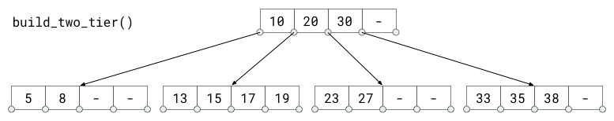

# CSCI 2270 – Data Structures - Assignment 5
## Overview

In this assignment you will implement a B-Tree, which is a self-balancing search tree. 

In most of the other self-balancing search trees (like AVL and Red-Black Trees), it is assumed that everything is in main memory. To understand the use of B-Trees, we must think of the huge amount of data that cannot fit in main memory. When the number of keys is high, the data is read from disk in the form of blocks. Disk access time is very high compared to the main memory access time. The main idea of using B-Trees is to reduce the number of disk accesses to get the data.


## Objectives
* Implement complex data structure and algorithms for maintaining an optimal tree for searching 
* Create a detailed implementation plan for B-Tree and additional code for testing  helper functions
* Understand the complexity of moving and traversing the data in this complex data structure


## Where to Start
After having accepted your assignment in GitHub Classroom, _clone_ your private repository to your development environment.  We recommend that you use JupyterHub as your coding environment.

You will need to run ```cmake``` from within the _build_ directory to create the rules for making the applications.  Next, run ```make``` to use those rules to actually build the executable from the source code.

There will be a local executable created that will localay run the same tests that will be used to grade your assignment.

Modify the given source code to provide the features described both in the document below and within the code.

# BTree
In this assignment you will implement a BTree Class.

Project has following folder tree:
```
.  
├── CMakeLists.txt  
├── CMakeLists.txt.in  
├── README.md  
├── app  
│   └── main.cpp  
├── build  
├── code  
│   ├── BTree.cpp  
│   └── BTree.h  
├── images
│   └── full-two-tier.png  
│   └── small.png 
│   └── thin-three-tier.png 
│   └── two-tier.png
└── tests  
    └── test_BTreeTestHelp.cpp  
    └── test_BTreeTestHelp.h  
    └── test_BTree.cpp  
```

| File | Descrition |
|---|---|
| CMakeLists.txt      | Ignore this file - rules to build the Makefile for this project (used by cmake)|
| CMakeLists.txt.in   | Ignore this file - more rules to build the Makefile for this project (used by cmake) |
| __README.md__           | __Readme file you are viewing here__ |
| app\                | Application folder  
| &nbsp;&nbsp;&nbsp;main.cpp            | Application main file for your personal tests. you  can use this executable to debug your own classes.  | 
| build\              | Build folder to build the project. your executables are gonna be here eventually.  |
| code\               | all your code should be in this folder.  |
| &nbsp;&nbsp;&nbsp;BTree.cpp      | BTree class source file  |
| &nbsp;&nbsp;&nbsp;BTree.h        | BTree class heather file  |
| images\             | images showing layout of test trees built by the test application  |
| tests\              | Tests folder  |
| &nbsp;&nbsp;&nbsp;test_BTreeTestHelp.cpp | Helper functions for creating data for testing your implemention   |
| &nbsp;&nbsp;&nbsp;test_BTreeTestHelp.h | Helper functions for creating data for testing your implemention   |
| &nbsp;&nbsp;&nbsp;test_BTree.cpp | Tests implemented for you / your personal tests  |

## About This Assignment

### Difficult on purpose
This programming assignment is really hard. That's by design! 
Because it is so difficult, if you try to just dive in and start hacking, 
you can be asuured that you won't be able to get all points possible.

You must approach the assignment by developing an overall strategy before coding anything.
With a careful plan of how you're going to work the problem, which functions need to be implemented first, 
what helper functions will be needed, and what algorithms will those functions use.
Once you have all these questions thought out, you can begin to implement and test your code.

I suggest that you begin testing your code by modifying the `main.cpp` code to make calls to your implementation.
Take a look at how the testing application creates the environment for a test of your program.
Create a known data structure format explicitly and use it test individual functions.  

For example, if you created a helper function for `get_height()` to return the number of tiers in the tree, you can test it by creating a BTree object, 
setting the root node to null, and calling the function to verify the return value is correct.
You can then explicitly create and add a root node.  Call the function and verify that the code returns the correct value.
Continue to add items to your tree data structure so that you know what the answer is suppose to be when the function is called.
See the BTreeTestHelp.cpp file to see how to build specific layouts for the data structure.

You'll need helper functions. It is up to you to determine what those should be, and how (or if) you test them individually. 
I strongly recommend writing tests for your helper functions before you even implement the functions themselves. 
That way you think through exactly what they should do, what happens if they're given a NULL input, or a leaf node, 
or an overly-full node, or whatever else might be conceivable in the situation.

### Look at the unit tests
The unit tests that come along with the assignment are meant to be read. 
There are little hints strewn throughout them. In particular, the print_tree function should be helpful. 
(Take a look at the [sanity check] unit test for help with that.)

### Look at the helper functions that are used by unit test
There are some routines that would be useful in creating your own tests for this assignment.  There are helper functions that create trees with known organizations. Take the `build_two-tier` function that will build a tree that looks like the the following:
 
Take a look at the code to build this tree.  You can clone the code to explicitly builds trees of your own.  Then you can use them to test different cases within your code.

There are other functions that create other tree layouts from simple to full and multi tier layouts.  See the `images` directory in the repository to view the different layouts.

### Some things to keep in mind:
The `insert` and `remove` functions must handle cases where adding or removing keys will grow or shrink the tree. 
In some cases you'll have to merge nodes and re-allocate keys; 
other times you'll have to need to split nodes and similarly shuffle keys around. 
Consider having logic to test the various situations in a function and the code handle each situation in their own functions.  Now you can set up a scenario to test each situation.

## Points
Like all the other assignments in this course, this one is worth 100 points. 
However, given the difficulty level, you can score up to 200 points (so yay extra credit).

Getting a 100/100 is super respectable. It shows that you have mastered many of the techniques for handling B-Trees.
Getting a 200/100 is possible, but to be totally honest not many students get there.


```
#ifndef BTREE_H__
#define BTREE_H__

#include <string>
#include <memory>
#include <vector>

using namespace std;

// The BTREE_ORDER definition sets the B-tree order (using the Knuth
// definition). This is the number of children the node can have. The
// number of keys is one less than this value.
#define BTREE_ORDER 5

// Note that the keys and children arrays are OVERSIZED to allow for
// some approaches to work, where nodes are allowed to temporarily
// have too many keys or children. You do not have to use the extra
// slots if you don't want to. Don't take this as a subtle hint that I
// want you to do it this way.
// 
// A valid btree node can have at most:
//   BTREE_ORDER-1 keys.
//   BTREE_ORDER children.
struct btree {
  // num_keys is the number of in keys array that are currently valid.
  int num_keys;

  // keys is an array of values. valid indexes are in [0..num_keys)
  int keys[BTREE_ORDER];

  // is_leaf is true if this is a leaf, false otherwise
  bool is_leaf;

  // children is an array of pointers to b-tree subtrees. valid
  // indexes are in [0..num_keys].
  shared_ptr<btree> children[BTREE_ORDER + 1];
};

class BTree {
public:
  // constructor, initialize class variables and pointers here if need.
  BTree();

  // deconstructor, if you are using shared_pointers you don't need to keep track of
  // freeing memory and you can leave this blank
  ~BTree();

  // insert adds the given key into a b-tree rooted at 'root'.  If the
  // key is already contained in the btree this should do nothing.
  // 
  // On exit: 
  // -- the 'root' pointer should refer to the root of the
  //    tree. (the root may change when we insert or remove)
  // -- the btree pointed to by 'root' is valid.
  void insert(shared_ptr<btree> root, int key);

  // remove deletes the given key from a b-tree rooted at 'root'. If the
  // key is not in the btree this should do nothing.
  //
  // On exit:
  // -- the 'root' pointer should refer to the root of the
  //    tree. (the root may change when we insert or delete)
  // -- the btree pointed to by 'root' is valid.
  void remove(shared_ptr<btree> root, int key);

  // find locates the node that either: (a) currently contains this key,
  // or (b) the node that would contain it if we were to try to insert
  // it.  Note that this always returns a non-null node.
  shared_ptr<btree> find(shared_ptr<btree> root, int key);

  // count_nodes returns the number of nodes referenced by this
  // btree. If this node is NULL, count_nodes returns zero; if it is a
  // root, it returns 1; otherwise it returns 1 plus however many nodes
  // are accessable via any valid child links.
  int count_nodes(shared_ptr<btree> root);

  // count_keys returns the total number of keys stored in this
  // btree. If the root node is null it returns zero; otherwise it
  // returns the number of keys in the root plus however many keys are
  // contained in valid child links.
  int count_keys(shared_ptr<btree> root);

  // you can add add more public member variables and member functions here if you need

private:
  // you can add add more private member variables and member functions here if you need
};

#endif  // BTREE_H__
```
