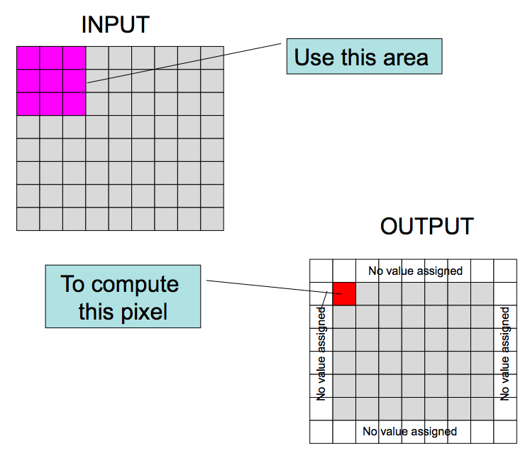

# Lab 4 - Code Optimization
## Introduction
This assignment deals with optimizing memory intensive code. Image processing offers many examples of functions that can benefit from optimization. In this lab, you’ll be improving the overall performance of an “image processing” application by a factor of about 25 – an extra credit phase will challenge you do increase the speed further. In the past, some students have sped up the code by a factor of 200-300. The score you receive for the "performance" portion of the lab depends on the score returned by the **Judge** script with the filters for the default image (blocks-small.bmp). Your code **must** function correctly for each filter and can be tested using `make test`

The application you’ll be modifying reads in an “image” (a picture) and a “filter”. An image is represented as a three-dimensional array, described in [cs1300bmp.h](cs1300bmp.h). Each pixel is represented as a combination of (red, green, blue) values. When coded in the BMP picture format, the individual (R,G,B) values can taken on the values 0...255, but the `cs1300bmp.h` code is designed to handle larger pixel values. The code in `cs1300bmp.cpp` provides routines for reading and writing images in the BMP format. **You are free to modify the format or the layout of the data structures in that code.**

The “filter” is an n x n array of numbers. We’ll go through the logistics of how a “filter” works in recitation and in class and briefly summarize it here. Basically, you can cause a number of visual affects by applying a filter to an image. The filter is implemented as a *convolution*, which means that elements of the filter matrix are multiplied by the image matrix to compute a new value for the image. Pictorially, this is represented as:



Computationally, this is structured as five nested `for` loops (three to go over the colors, row and columns and two more to apply the filter). In the solution provided to you, filters are represented using the `Filter` class, implemented in `Filter.h` and `Filter.cpp`.

The majority of the work performed by the filter application is in the routine shown below:

```
  long long cycStart, cycStop;
  rdtscll(cycStart);

  output -> width = input -> width;
  output -> height = input -> height;

  for(int col = 1; col < (input -> width) - 1; col = col + 1) {
    for(int row = 1; row < (input -> height) - 1 ; row = row + 1) {
      for(int plane = 0; plane < 3; plane++) {
        output -> color[plane][row][col] = 0;
        for (int j = 0; j < filter -> getSize(); j++) {
          for (int i = 0; i < filter -> getSize(); i++) {
           output -> color[plane][row][col] = output -> color[plane][row][col]
            +  input -> color[plane][row + i - 1][col + j - 1] * filter -> get(i, j);
          }
        }
        output -> color[plane][row][col]
         = output -> color[plane][row][col] / filter -> getDivisor();
        if ( output -> color[plane][row][col]  < 0 ) { output -> color[plane][row][col] = 0; }
        if ( output -> color[plane][row][col]  > 255 ) { output -> color[plane][row][col] = 255; }
        output -> color[plane][row][col] = output -> color[plane][row][col];
      }
    }
  }
  rdtscll(cycStop);
  double diff = cycStop - cycStart;
  fprintf(stderr, "Took %f cycles to process, or %f cycles per pixel\n",
          diff, diff / (output -> width * output -> height));
```
This routine is “instrumented” using the `rdscll` function. This inline function records the starting and finish times in terms of CPU cycles. We use this to determine the “cycles per element” needed to apply the filter to a given image. A sample of the output for the provided setup code looks like the following when run:

```
Took 170624720.000000 cycles to process, or 3229.816007 cycles per pixel
```

The cycle counter measures times using the CPU clock of your computer. It is fairly accurate, but many things (such as other running programs) influence the reported time. Thus, we will use the *median* of a number of runs to determine the time for a particular implementation of the program for a number of different filters.
`
Your job is going to be to improve the performance of this application using techniques detailed in Chapter 5 of the text. You’ll be using two images ([boats.bmp](boats.bmp) and [blocks-small.bmp](blocks-small.bmp)) The first image is fairly small (useful for quickly testing ideas) and the second image is larger (and used for grading / evaluation). You can run your program using a command line similar to this:

```
$ filter hline.filter boats.bmp
```

This invocation will leave the output image in `filter-hline-boats.bmp` and will report the time taken, as in the examples above. You can repeat the image name (or use different images) on the same command line to run the filter multiple times & return the average. For example:

```
$ ./filter hline.filter boats.bmp boats.bmp
Took 139255936.000000 cycles to process, or 2636.025138 cycles per pixel 
Took 137527184.000000 cycles to process, or 2603.300977 cycles per pixel 
Average cycles per sample is 2619.663057
```

## Performance and Correctness

We’ll be using a script called `Judge` to score your program. The `Judge` program takes three optional arguments.
*  `-n`  specifies the number of times each filter should be executed,
*  `-i` specifies the image file and,
*  `-p` specifies the program name.

The default options are shown explicitly in the following example.

```
% make
g++ -m32 -g -O0 -fno-omit-frame-pointer -o filter FilterMain.cpp Filter.cpp cs1300b
./Judge -p ./filter -i blocks-small.bmp
gauss: 4003.824003..4038.171866..3872.371058..3990.658428..3931.838805..4319.173193 
avg: 3807.727624..3822.502626..3962.588553..4237.542068..4322.871861..4056.862357.. 
hline: 4171.320541..4234.822551..3851.320030..4385.223120..4366.434546..4422.357822 
emboss: 3694.797139..3924.230283..3927.254491..4309.121033..3981.110480..3990.70275 
Scores are 3694 3807 3822 3851 3872 3924 3927 3931 3962 3981 3990 3990 4003 4038 40 
median CPE for is 4003
Resulting score for is 0
echo "Done"
Done
```

This would result in an average of 4003 cycles per second. Scoring is based on the a function based on the CPE for the `blocks-small.bmp` image running on the GitHub Actions. In other words, the GitHub Actions is being the source of truth for grading.

The provided `Makefile` compiles your program; **you may need to modify it to change compiler options or the like**. We assume you are compiling your program on the https://coding.csel.io machines. You are free to use different compiler options if you think that will help and know how. You can read more about the GCC options at http://gcc.gnu.org/onlinedocs/gcc-4.4.2/gcc/i386-and-x86_002d64-Options.html. You can also use the clang compiler (clang++) if you think that will help.

The `Makefile` includes a target make test that compares your output to the reference solution. Run make test frequently, because it’s easy to accidentally break the code when trying to optimize. Your code must be correct as well as quick.

The Makefile also provides a make judge rule that runs the test images and filters. Lastly, it provides a `make clean` rule to delete any temporary files or images.

Your measured time needs to include any active processing you do to the image after it is read in and before it is written out. You’re free to go “whole hog” on any optimization that might work, as long as it works with all the test images and filters included in the assignment. Your modified code does not need to handle any filters or images not included in the evaluation suite. This means you can go ahead and e.g change the matrix layout in the BMP image library, replace the Filter library, etc. However, you’d be well advised to make certain those changes are important and effective before you sink a lot of time.

## Extra Credit
The most “extreme” solution is to use SIMD extensions such as MMX, SSE, SSE2 or SSE3. See http:// jeffmatherphotography.com/dispatches/2012/02/an-experiment-with-sse/ for more information.

For this lab, the 2400 machines will also each have multiple CPU’s or cores and you could use the OpenMP language extensions (see http://bisqwit.iki.fi/story/howto/openmp/ to try to use both cores. This is an easy thing to do, but hard to get big speedup.

Alternative, you can take advantage of the sk1llz of other l33t h4x0rs and use a libary like the “Open Computer Vision” library, [OpenCV](http://docs.opencv.org/modules/imgproc/doc/filtering.html?highlight=filter2d#filter2d). This is complicated because you have to get your image into their data structure format and you need to include the time to get it into that format in your timing.

One year, one student (who later interned for Google) got a CPE of about 20ish. Another year, another student (who later interned for Apple) for a CPE of about 3-4.

Some students have used these methods in the past, but you’re well advised to go for the easy low-hanging fruit before tackling the most aggressive optimization.

If you come up with a solution that uses OpenMP, you’ll get up to an additional 5 points extra credit. If you come up with a solution using SSE/vectors, you’ll get up to 10 points extra credit (assuming your changes result in faster code and you know why) and likewise switching to OpenCV is good for 10 points of extra credit. In each case, you’ll have to know what you did and why it works like always.

## Logistics
The only “hand-in” will be electronic through your GitHub repo. Any clarifications and revisions to the assignment will be posted on the course Web page.

Different computers will run this code at different speeds (even measured in “cycles per second”). In order to have a level playing field, everyone must use the 2400 machines on the https://coding.csel.io platform to time their projects or the autograding on our GitHub Actions. 

Since it’s usually true that making something run faster on one machine makes it run faster on another, you might be able to do your development on one machine and then use the https://coding.csel.io machines or GitHub Actions simply to validate your measurements or improvements.

## Grading
You must commit and push your changes to github by the due date. That is the only mechanism for handing in your solution.

The score calculated by running the program provides 40% of the total score. You need to be able to explain why your code modifications improve the running time for the program and explain what would happen with minor modifications for the other 60%.

Again, you must be able to explain *why* you got the performance you did, so you should take notes for why you made each modification to bring to your grading meetings.
