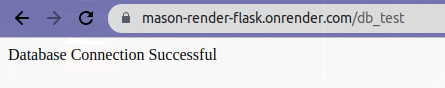

# Welcome to the Render Lab
The goal of this lab is to introduce the concept of bringing our flask apps onto the web.
To do so we'll use a site called "Render" which allows us to host websites, databases and much more at no cost. 
***
There are two parts to this lab
<li> Following the Render flask app tutorial to host a basic flask app on Render. </li>
<li> Spinning up a database using Render and creating routes that allow us to populate that database with information.

***
## Render Flask Tutorial
For this portion of the lab we will be following the Flask quickstart tutorial available on Render.
<li>All of the information that you will need can be found on this link https://render.com/docs/deploy-flask
but we will also walk through how to complete this portion step by step.
<li>You'll need to create an account on Render.com for this lab.
<li>To begin fork the repo located at https://github.com/render-examples/flask-hello-world, do so by clicking for and create a new forked repository.


<li>For the second portion of the lab you'll need to clone this locally to edit, app.py. You can either do this now or later.
<li>This contains the starting files needed to create a basic flask app.

<li>Next we need to create a new web service using Render.
From the quickstart tutorial page, you should see a link in the top right corner to the Dashboard.


<li>Once you've navigated to the render dashboard an icon to create a new service should appear up top. This will open a drop down with links to open a static site, web service, Postgres database and much more. For now we are going to create a <b>Web Service</b>.
<li>You'll be brought to a screen to enter the name the repository you forked.


<li>Next create a name for your web service on the next page, be sure that you've selected the free tier of services and you'll be good to go!
<li>Your flask app will be deployed to your_app_name.onrender.com 
<li>Whenever you push a change to your repo you'll have a version of your app automatically deployed to that render link.
<li>Note that deploying and reploying to render is not very fast, so whenever you make a change be sure to double check that your code is correct.
<li>  <b>Make sure to change the default index page to say: "Hello World from --your name-- in 3308". </b>
    
***

## Creating a Database on Render
<li> For the next portion of this lab our goal is to "spin up" an instance of a Postgres database, and create routes to populate it with data, query data, and delete data.
<li>Using services like Render, AWS, Heroku and more we can "spin up" an instance of a database or web service. When we spin up this instance we are essentially starting a virtual machine dedicated to running the selected service. 
<li> You'll be spinning up a database on render and creating the following table. I'll provide all of the necessary SQL and you'll be creating the necessary routes to perform all of the functions needed.

|First|Last|City|Name|Number|
|---|---|---|---|---|
|Jayson|Tatum|Boston|Celtics|0|
|Stephen|Curry|San Francisco|Warriors|30|
|Nikola|Jokic|Denver|Nuggets|15|
|Kawhi|Leonard|Los Angeles|Clippers|2|
|--your name--|--your name--|CU Boulder|--your team--|3308|
***
<li>We will be using the <b>psycopg2</b> module which is the most popular PostgreSQL database adapter for python.
<li>For this portion of the lab be sure that you've cloned the repository that you forked earlier locally, this will allow you to push changes and create new routes in your flask app.
<li>First we will need to need to make sure that we include the library in our requirements file, so include the following line to the requirements file.

```
psycopg2-binary==2.9.5
```
<li>Next we need to spin up an instance of a Postgres database, fortunately for us Render allows us to do this for free.
<li>Similar to how we created a web service go to the dashboard in Render, select the new icon and this time choose PostgreSQL.


<li>Now give your database a name and press create.
<li>You'll be brought to a screen with information about the database you created and if you look under the connect tab you'll be given a url that'll link directly to your new database within other Render services.


<li>Next we need to connect to this newly created database within our flask app.
<li>Within the app.py file of the quickstart flask app add the following line to the top of the file.

```
import psycopg2
```

<li> Next create a new route called db_test.
<li>Inside of that route we are going to connect to the database, do so by passing the internal database url to the following line.

```
conn = psycopg2.connect("your_db_url_here")
```
<li>conn is now a variable that represents the connection to our database. Its important to remember to close the connection whenever we are done with it. So the last line of our route should be

```
conn.close()
```


<li>Finally in this route we need to return something to show that our database connection is working properly. Return a string informing the user that the connection works properly.

<li>Once your db_test route is complete it should look like the following (with your database url in the connection).


<li>Push the changes to your repository to trigger a new deployment of your flask app. (Note : If at any point you aren't seeing the new version deploy navigate within the dashboard to your web service, select manual deploy and deploy the latest commit).
<li>Once the new build of your app has successfully deployed, navigate to the db_test route you just created and you should see your connection string returned.



***

### db_create


<li>Great, we were able to successfully connect to our database, now I'm going to go over the basics of executing SQL statements using psycopg2 and then get into the list of routes you'll need to create along with the SQL for each route.

<li>Create a new route called db_create, here we will be creating a table titled Basketball. Begin this route similar to how we began the db_test route by connecting to our database.
<li>Next we are going to create a connection cursor that will allow us to execute SQL statements from inside of our route. Use the following code to create a cursor.

```
cur = conn.cursor()
```
<li>We now want that cursor to execute some SQL for us, namely the creation of our Basketball table. Call the execute method on our cursor and use triple quotes to allow multiple lines of SQL statements. (Be sure to end your statement with a semicolon).

```
cur.execute('''
    CREATE TABLE IF NOT EXISTS Basketball(
        First varchar(255),
        Last varchar(255),
        City varchar(255),
        Name varchar(255),
        Number int
        );
''')
```
<li>Next inside of that route we want to commit the changes from our cursor to our database, do so by using

```
conn.commit()
```
<li>Finally close the connection and then return a string to show that the table Basketball was successfully created.
<li>Test that your table was successfuly created by going to your db_create route and seeing if your string was returned. If you have any error messages you can check the log sections of your web service and postgres database but if everything goes well you should see something like this.


<li>Once your db_create route is complete it should look something like this.


<li>Note everytime that we visit one of these routes, the SQL statements provided will be executed. So be careful when calling a route multiple times as it may lead to unexpected results.
***

# Required Routes

<li> I'd like you to create a few additional routes for this database. I'll provide the SQL but I'd like you to create routes to populate the table, query from the table, and drop from the table.
<li> Be sure to use conn.commit(), and conn.close() to commit your changes and close your connection when you are finished with each route.

***

### db_insert
<li> This route will insert data into the Basketball table that you've created. Following is the SQL for you to use.

```
INSERT INTO Basketball (First, Last, City, Name, Number)
Values
('Jayson', 'Tatum', 'Boston', 'Celtics', 0),
('Stephen', 'Curry', 'San Francisco', 'Warriors', 30),
('Nikola', 'Jokic', 'Denver', 'Nuggets', 15),
('Kawhi', 'Leonard', 'Los Angeles', 'Clippers', 2);
```
<li> Return the string "Basketball Table Populated"
<li> Once your db_insert route is complete it should look something like this.


***

### db_select
<li> This route will query all of the data from the database, and return the information in a table. Following is the SQL for you to use.

```
SELECT * FROM Basketball;
```
<li> After your query you'll need to call the fetchall method on your cursor in order to capture the results of your query something like

```
records = cur.fetchall()
```
<li> I'd then like you to take the information from records, format that as a table using HTML and return that table of information.
<li> To help create your table think of records as a list of tuples. You can then iterate over that list, and do an inner for loop inside of each tuple to get the information. Then by dynamically building your table using HTML tags and appending to one long "response string" you should be able to create a table similar to the one below.

<li>Once your db_select route is complete it should look something like this.


***

### db_drop

<li>For our final route, I'd like you to create a route that drops the Basketball table from the database. The following SQL should help you out.

```
DROP TABLE Basketball;
```
<li> After that return the string "Basketball Table Dropped"
<li> Once your db_drop route is completed it should look something like this


***

# Helpful Hints
<li>If you encounter errors in either your database or in your flask app itself you can check the logs section of either in your dashboard to see if their are any errors.
<li>If you find that your app isn't automatically redeploying check that the repository is properly linked. If you still encounter errors you can use the manual deploy button on the flask app render page to redeploy your app.


***
# Final Product

<li> After you've completed your app you should have a flask app on Render with 6 total working routes.
    <ul>
        <li>/ Our initial Hello World route</li>
        <li> db_test Which tests the database connection </li>
        <li> db_create Which creates the Basketball table </li>
        <li> db_insert Which inserts the provided information into the Basketball table </li>
        <li> db_select Which queries the data from Basketball and returns a formatted table of information </li>
        <li> db_drop Which drops the Basketball table </li>
    </ul>
<li> Before submitting your final product call the db_drop route to ensure that the database used for your render app is empty, so that I can call your routes to test it.
***

# Deliverables

<li>For this lab I'd like you to submit the following items as deliverables
    <ul>
        <li> A link to your github repository containing your app.py file with the required routes</li>
        <li> A link to your flask app on render</li>
        <li> An empty database (db_drop was the last route called)</li>
    </ul>

***

# Grading Breakdown
<li> Points for this assignment are given for each route that succesffuly performs as described on your Render Flask app with the following point values. Partial points will not be given on a per route basis for incomplete routes.
    <ul>
        <li> Route from the flask quickstart guide, the Hello World Route (30 points) </li>
        <li> db_test, testing the connection to the PostgreSQL database instance (15 points)</li>
        <li> db_create, creating the Basketball table (10 points) </li>
        <li> db_insert, populating the Basketball table with the provided information (15 points) </li>
        <li> db_select, Querying all of the information from the Basketball table AND returning a table of information (20 points)</li>
        <li> db_drop, Dropping the Basketball table (10 points)</li>
