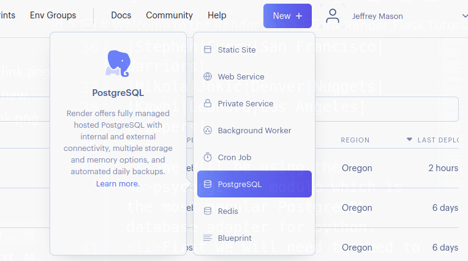

# CSPB-3308  Lab 10 :  Web Site Hosting
<figure width=100%>
  
</figure>
<br>
    
    
When you create a website, you have a set of files, images, and HTML code that make up your website. To be available for public access, these files need a place to live that is available 24/7. Without a public online host, your files would just sit on your computer and no one would ever see them. A hosting provider will provide a place on a web server to store all of your files and are responsible for delivering the files of your website as soon as a browser makes a request by typing in your domain name.

   
Web hosting is a service that provides organizations and individuals 
with a platform to store their website files and make them accessible online. 

Hosting allows you to rent space on a server in their server space.
There you can store your website data, such as HTML and CSS files, media content, and other documents.
You can also rent services to run your web site so that your website can be accessed by anyone with an Internet connection 24/7.
Web hosting is typically provided by web host providers, which are businesses that maintain, configure, and run physical servers to house websites.

<hr>
    


### This lab is still under construction.  
 
 Please report all speeling and grammered issues.<br>
 Also let us know about any unclear descriptions of work to be performed. 
 <br><br><br>
<hr>    

**Objectives**
	
* use GitHub to manage changes to project files
* use Flask to create a website
* use Render to host web site
* use Automated Deployment of repository changes to website
* configuring and accessing a database using Render's free Postgres database

<hr>

Project has following folder tree:
```
.  
├── images  
|   └── ...  
├── app.py
├── requirements.txt
├── Render_tutorial.md
└── README.md  
```

| File | Description |
|---|---|
| images                  | directory holding images for README.md |
| &nbsp;&nbsp;&nbsp;&nbsp;...        |  |
| app.py        | sample Flask application using simple database access |
| requirements.txt        | list of software and version numbers required to run application |
| Render_tutorial.md      | Readme file with lab instructions |
| __README.md__           | __Readme file you are viewing here__ |

<hr>

### This assignment will focus on introducing  you to Web Site Hosting and automated Deployment

### Getting Started

You will be using tutorials from Flask and Render to complete this lab.
Follow the step by step [Render_tutorial](Render_tutorial.md) that we have provided to walk you through the forking (create your own version of a respository) of a Flask app, creating website in Render, Allocating a Database in Render, and Connecting your repository to the website for automated deployment.  We also walk you through connecting to the database, creating some tables and data, and then displaying the information in the web pages.


    
* You will follow the [Flask quick start tutorial](http://flask.pocoo.org/docs/1.0/quickstart/#a-minimal-application)
* You will be using a sample project with [Render](https://render.com).
* You will follow a tutorial to [deploy a website](https://render.com/docs/deploy-flask).
* You will connect your route handler to acces the database provided by Render.
<br><br>    

<hr>
    
### When you have completed the Lab tutorial


Although the grading will be done by accessing your Public Domain Website, <br>
you must submit the following to Moodle Assignment:

* Your name:
* CU ID: (4 letters - 4 digits)
* GitHub Username:
* hours to complete lab:
* Website URL:
* URL for website's GitHub repository:

<hr><hr><hr>