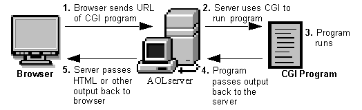
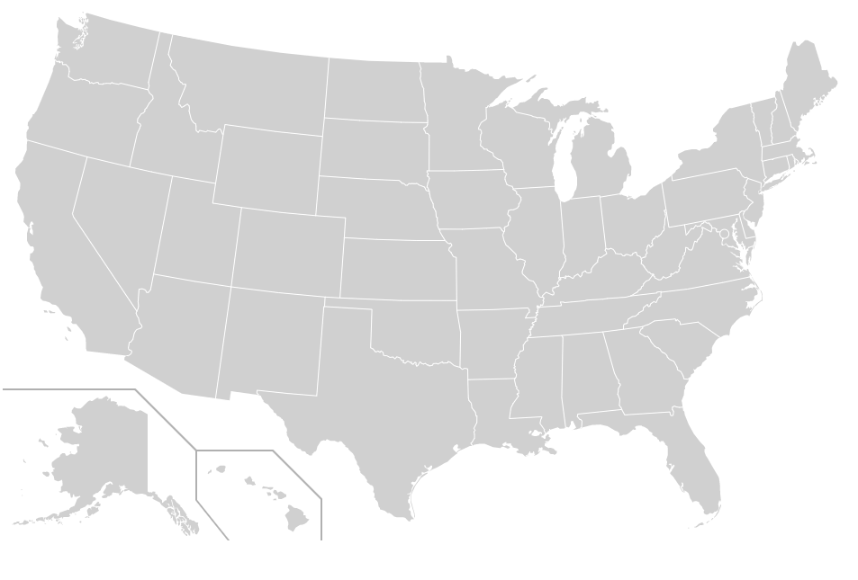
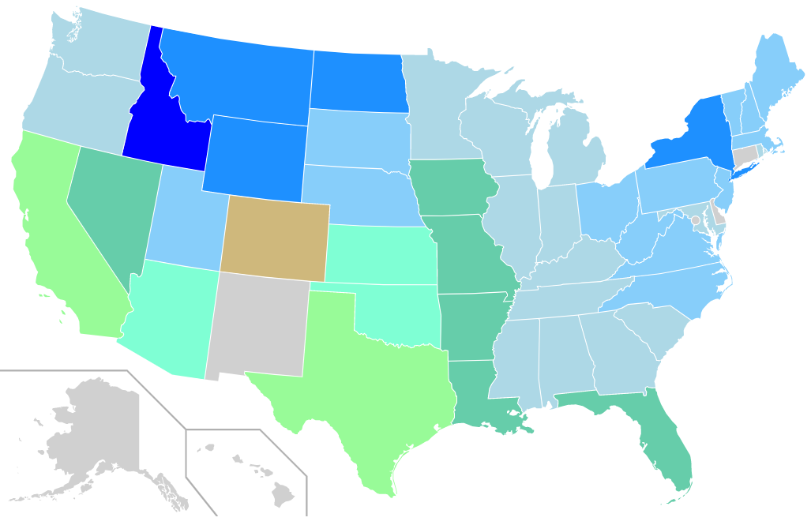

# CSPB-3308  Lab 11 :  REST APIs
<figure width=100%>
  
</figure>
<hr>

### What is a REST API?
Representational State Transfer (REST) is a software architecture that imposes conditions on how an API should work. REST was initially created as a guideline to manage communication on a complex network like the internet. 
    
An API, or application programming interface, is a set of rules that define how applications or devices can connect to and communicate with each other. A REST API is an API that conforms to the design principles of the  representational state transfer architectural style. For this reason, REST APIs are sometimes referred to RESTful APIs.
First defined in 2000, REST provides a relatively high level of flexibility and freedom for developers. This flexibility is just one reason why REST APIs have emerged as a common method for connecting components and applications in a microservices architecture.

### REST design principles
At the most basic level, an API is a mechanism that enables an application or service to access a resource within another application or service. The application or service doing the accessing is called the client, and the application or service containing the resource is called the server.

Some APIs impose a strict framework on developers, but REST APIs can be developed using virtually any programming language and support a variety of data formats. The only requirement is that they align to the following six REST design principles - also known as architectural constraints:

1. **Uniform interface** - All API requests for the same resource should look the same, no matter where the request comes from. 
The REST API should ensure that the same piece of data, such as the name or email address of a user, belongs to only one uniform resource identifier (URI). 
Resources shouldn’t be too large but should contain every piece of information that the client might need.

1. **Client-server decoupling** - In REST API design, client and server applications must be completely independent of each other. 
The only information the client application should know is the URI of the requested resource; it can't interact with the server application in any other ways. 
Similarly, a server application shouldn't request more information from the client application and only pass the requested data via HTTP.

1. **Statelessness** -  REST APIs are stateless, meaning that each request needs to include all the information necessary for processing it. 
In other words, REST APIs do not require any server-side sessions. 
Server applications aren’t allowed to store any data related to a client request.

1. **Cacheability** - When possible, resources should be cacheable on the client or server side. 
Server responses also need to contain information about whether caching is allowed for the delivered resource. 
The goal is to improve performance on the client side, while increasing scalability on the server side.

1. **Layered system architecture** - In REST APIs, the calls and responses go through different layers. As a rule of thumb, don’t assume that the client and server applications connect directly to each other. 
There may be a number of different intermediaries in the communication loop. 
REST APIs need to be designed so that neither the client nor the server can tell whether it communicates with the end application or an intermediary.

1. **Code on demand (optional)** - REST APIs usually send static resources, but in certain cases, responses can also contain executable code (such as Java applets). 
In these cases, the code should only run on-demand.

The representation of the state can be in a JSON format, and probably for most APIs this is indeed the case. It can also be in XML or HTML format.

The **National Weather Service (NWS) API** allows developers access to critical forecasts, alerts, and observations, along with other weather data. 
The NWS provides an api at *api.weather.gov* to represent the public face of the next generation of data services from the National Weather Service. It offers public access to a wide range of essential weather data, in a way that modern web developers expect: a REST-style, JSON-based web service. The API is also built to provide a powerful and modern platform for data dissemination for both internal and external customers. This means it can give you and our own forecasters and developers a one-stop shop for vital data.
<hr>

### Overview
    
In this lab you will create a dynamic HTML page that is updated with realtime information obtained from the National Weather Service.  The page will display a SVG (Scalable Vector Graphics) map of the United States.  Each state in the map can be dynamically identified and can have its attributes changed.  One of the attributes available is a *fill color* that indicates the color applied to the interior of a shape.  You will be dynamically  modifying the *fill color* of a state with the temperature obtained from the REST API of NWS.

You will also learn to use an alternative way of accessing page content from a web service.  Common Gateway Interface (CGI) is a resource for accommodating the use of scripts in Web design. You will create a python program that will generate an HTML page on demand.  That means the output from your python program will be a fully functioning HTML file with descriptions of the header and body.  Your generated page will also have scripts that can run when the page is displayed.

When using the Flask framework in a previous lab, you specified individual functions within the python Flask application to handle generation of each page.  The web services handled receiving the client requests and *routing* the request to a route handler.
<figure width=50%>
  
</figure>
On most Web servers, the CGI mechanism has been standardized in the following way. In the directory tree that the server considers to be the root for all web services, you create a subdirectory named cgi-bin. The server then understands that any file requested from the special cgi-bin directory should not simply be read and sent, but instead should be executed. The output of the executed program is what it actually sent to the browser that requested the page. The executable is generally either a pure executable, like the output of a C compiler, a Python script, or it could be a PERL script. PERL was (and still is in some places) an extremely popular language for CGI scripting.

When running a generic web service you make a request to the web service to specify the name of the HTML page you want delivered to your browser, such as `http://127.0.0.1:8000/USA_map.html`.  The service will send the contents of that file back to the browser.  But you can also specify a script to be run. `http://127.0.0.1:8000/cgi-bin/weather_script.py` will look in the `cgi-bin` directory for a script with the name `weather_script.py` and execute that script.
The output from the script is returned to the browser.

You will write a couple scripts to create pages that can be displayed by the browser.  One will be a map of the USA with each individual state outline described in a SVG format.  The other script will also display a map, but will dynamically access the REST API of the NWS to obtain the current temperature and using a color scale will fill the state object with the color associated with the current temperature.
<hr>
    
## Objectives

  - Display SVG image on a page
  - Use generic web service and CGI scripts
  - Access information via REST
  - Work with JSON formatted data
  - Use jQuery functionality to access data
  - Use of Internet to find answers to usage and issues

<hr>
    
## Part 0 - National Weather Service API
Before you can get started on the creation of pages and scripts, you will need to get some background information about how to use the NWS's REST API.
  - Browse the documentation at: [https://www.weather.gov/documentation/services-web-api](https://www.weather.gov/documentation/services-web-api)
  - Get weather JSON data from the command line by using the command below. The `curl` command is an operating system agnostic version of the linux `wget` command. The command will return the response from the URL.  In this case, you should get back a JSON document with forecast information. <br>`curl 'https://api.weather.gov/gridpoints/BOU/53,74/forecast'`<br>You can also just type that URL into the browser to see the information returned.
  - Using the information in the results you can extract the temperature information you need. Later in the lab, you will perform this request dynamically within a JavaScript function that is placed into an HTML file.

<hr>
	
## Part 1 - Static HTML

1.  Download a map of the United States in SVG format.  <br>[https://en.wikipedia.org/wiki/File:Blank_US_Map.svg](https://en.wikipedia.org/wiki/File:Blank_US_Map.svg)<br>Save this file in the top level of your lab directory.

2.  Create a new HTML file named `usa_map.html` in the  top level of your lab directory.
3.  Fill the `usa_map.html` file with correct HTML tags to create a complete HTML page. <br>You will add the following tags to create a basic web page:

    ``` 
     <html>
     <head>
       <title>US Map Lab by Your last name</title>
     </head>
     <body>
         <!-- insert the SVG here -->
     </body>
     </html>
    ```

4.  Insert the downloaded SVG map commands.   
    Copy-paste the SVG commands in the previously  downloaded file in the appropriate place in your HTML file.  You can view the file by right clicking on the HTML file and selecting to open a new browser tab.

5.  Run a simple web service via Python on your machine.   
Read the docs for python's [simple http server](https://docs.python.org/3/library/http.server.html).  Run a python http server on your machine (make sure to use the CGI version).  Because you are running a web service with a specific port that is already used in the JupyterHub environment, you should clone this lab on your local machine.  Git is designed to allow you to have multiple clones of the repository all linked to a single remote repository.  Therefore you can have a local machine clone and a JupyterHub clone of the repository.
```
python3 -m http.server 8000 --cgi --bind 127.0.0.1
```

<figure width=50%>
  
</figure>

7.  Test your map display in your browser.
	Access the HTML page by asking your browser to get the page from the local web service and the map should display.
```
	http://127.0.0.1:8000/usa_map.html
```

<hr>
	
## Part 2 - CGI script to generate an HTML page

You will now create a Python script (`make_map.py`) to generate the file you just created by hand.  Instead of manually copying the correct information into the HTML file, your program will generate output that is the HTML file.  Be sure to create a `cgi-bin` directory at the top of your lab repository and place the newly created script in that `cgi-bin` subdirectory.
	
You can test that your program is generating a valid HTML file by capturing the output of the program.  The command below will run your python script and capture the output in a file.  You can verify that file by looking at it in an editor or use the browser to display it.
```
python3 cgi-bin/make_map.py > map.HTML
```
Use the special triple quotes to generate a Python print string that has multiple lines of output.  The print statement below will print 4 lines to the output.
```
	print(''' This is the first line
	          this is second
			  third
			  last
	      ''')
```
Use this mechanism to write the header information needed for the HTML file.  That includes the tags up to where you inserted your SVG commands.  You can also use that mechanism to write out the closing tags for body and html.

In between these two print commands, you need to copy the data from the SVG file into the output file.
You can again use the triple quotes, but that adds a lot of lines and makes your script complex.
Instead, write a few lines of code to loop through reading each line of the SVG file and printing it to the output.

The script must be executable.  That means you must ensure that the file itself is executable and that it is marked as a Python script.
  -   Check permissions! `chmod +x cgi-bin/make_map.py`
  -   The first line of the script should indicate the script is a Python script.  When trying to execute a script, the system will look at the first line to see how to process the executable.  You must use the shebang line to tell the handler how the script is to be processed.  You may need to change this based on your python3 install location.
```
#!/usr/bin/python3
```
     
  -   You will also need to add the following to the very beginning of your HTML output (before the `<html>` tag).
```

         print("Content-type: text/html")
         print() # This extra newline is important!
```

To test that the script creates the correct file, capture the output from your script as we did before.
When you are ready to test your HTML response in your browser, you will specify the local service to access
the file in the `cgi-bin` directory and you should see the same map as before.
```
http://127.0.0.1:8000/cgi-bin/make_map.py
```
***Hint:* If you get stuck, look for errors in two places:**
  * the server output in your terminal
  * the developer console in your browser.

<hr>

## Part 3 - Dynamically  changing attributes of display elements

The next step is to try and manually change the color of a state.  When an HTML file is first loaded, there is an event that is triggered.  You can capture that event by placing an event handler in a JavaScript script in the header section of your HTML file.  
Add the following script code to the header section of your script to make the state of Colorado turn gold.

``` 
    print('''
          <script>
             window.onload = function() {
               var elements = document.getElementsByClassName('CO') // returns a list of elements
               elements[0].setAttribute('fill', '#CFB87C');         // set the color in the first element returned
             };
          </script>
    ''')
```
This sets the event handler for `window.onload` and accesses the page being displayed.  The `getElement` function will find a specific display element in the document (html page).  If you look at the SVG file you will notice that there is an `id` field for each state.

When you load (or reload) the page, and you should see Colorado filled in gold!

***Optional:*** At this time you could add a loop to your script that would cycle through all the states and assign a random color to that state.  
The code below selects a random color and sets the background for the page.  You can adapt this code to create a function that returns a random color.
```
const setBGtoRandomColor = () => {
  const randomColor = Math.floor(Math.random()*16777215).toString(16);
  document.body.style.backgroundColor = "#" + randomColor;
  color.innerHTML = "#" + randomColor;
}
```

***Make sure to save your `make_map.py` Python script in the cgi-bin subdirectory.***
Save a copy of your `map.HTML` file in the top level of your repository.
Commit and push those files to your remote repository.

    
<hr>

## Part 4 - Dynamically access the temperature data
Now we will create a second Python script (`weather_script.py`) to be placed in the `cgi-bin` subdirectory.
Copy the working `make_map.py` script to `weather_script.py`.  You will be modifying the new script to change dynamically each time the page is refreshed.
You will access the REST interface to the National Weather Service using two different requests.
When a request is successful, the response will have information that will be used to make another request or to update the display.
The first request will obtain grid points used by the NWS to specify locations for a forecast.  You will use the latitude and longitude to obtain the grid points.
Once you have extracted the grid points from the response to the first request, they will be used to format the second request.

The request you make to get data from the REST interface uses a `fetch` function call.  But you do not want the computer to lockup while getting ths data.  You want the computer to continue to display information in the browser window and handle any user interface.
To make this happen you will use an `await` operator. The await operator is used to wait for a response to request. It can only be used inside an async function or at the top level of your script.
You will specify a function that will be called when the response data has been received.
    
The second request will ask for a forecast for the grid points received for a specific location.  When this response is received it has a list of lots of information.
It will be stored in a dictionary structure.  You can ask for a specific section of the response be specifying the name of that section to the dictionary.
The data is hierarchical and may have a dictionary or a list of items.
See the documentation on the API to understand the structure of the data.
You will use the code below to extract a temperature for the forecast and use that to update the color of the state.
    
1.  You need to call the NWS URL to get the weather.  
Lets start with weather for Boulder, CO. You can use Google to learn how to read the JSON file.  See the answer at [StackOverflow](http://stackoverflow.com/questions/13921910/python-urllib2-receive-json-response-from-url).
Remember, if you use this source, make sure to attribute  it in your code! (That means placing comments in the code acknowledging where you got it)

2. To access the weather in Boulder from NWS, you need to know the latitude and longitude for Boulder (40.0150° N, 105.2705° W).
To access the data, we need to use an asynchronous function call using the latitude and longitude Boulder.
Use variables `lat` and `lon` to hold the values for Boulder and the code below will access the data from NWS.
An asynchronous function means that the function is called and then the display processing resumes.
When the process completes, it will call the function defined in the `then` clause so we can process the results.
```
const response = await fetch('https://api.weather.gov/points/'+lat+','+lon)
const json = await response.json()
				.then(function(json) {
						const gridx = json['properties']['gridX']
						const gridy = json['properties']['gridY']
						const id = json['properties']['gridId']
						console.log ( . . . )
						. . .
						}
					 )
```

Once we have the initial data needed, we can ask for the forecast using another asynchronous function call.  
Notice that the processing uses a call to a function to get the color to use for a given temperature.  
Also notice that we are looping through the results of the find (stored in elements).  
Some states are made up of multiple elements (such as islands).  We want to fill all those elements with color.
```
const response = await fetch('https://api.weather.gov//gridpoints/'+id+'/'+gridx+','+gridy+'/forecast');
console.log("getting", value, response)
const json = await response.json()
				.then(function(json) {
					var cur_temp = -1000
					if ((json['properties'] != undefined) 
					 && (json['properties']['periods'] != undefined)) {
						// may want to comment out this log message once you have it running
						console.log("Forcast:", json['properties'])  
						cur_temp = json['properties']['periods'][0]['temperature']
					}
					color = get_color(cur_temp)
					console.log("Temp:", cur_temp, "Color:", color)
					for (var i = 0; i < elements.length; i++) {
						var element = elements[i];
						element.setAttribute('fill', color);
					}
				})
```

	
3. You don’t want to manually type in latitude and longitude for all the states.
    - Find the average latitude and longitude for each state in the following file: [https://gist.github.com/meiqimichelle/7727723](https://gist.github.com/meiqimichelle/7727723)
    - Here is a file containing the  state names mapped to abbreviations: [https://gist.github.com/rogerallen/1583593](https://gist.github.com/rogerallen/1583593) 
    - Combine these to get a dictionary mapping each state abbreviation (such as `CO`) to coordinates.


4.  Now you have all the information you need to start asking for real time temperature forecasts.  

**Very important**: We don’t want to hit the API a billion times while you are testing your code.  
You may receive a denied service response if you make too many requests.
Requesting data for all 50 states on every refresh of the page will probably only last about an hour until the NWS site restricts your requests.
Make sure to only request a small number of states (5?) while debugging your code.  You can comment out the other states in the mapping file(s). 

***Note:***:  It is normal that Hawaii, Alaska, New Mexico and a couple other states may fail to retrieve data.
    
5.  Determine which color should be used for the state. Use the following colors based on the current
    temperature forecast (you should write a function to return the color based on a given temperature):

<figure width=50%>
  
</figure>
<br>
    <table>
        <caption>  Temperature Scale    </caption>
        <tr><th> Temperature   </th><th>  Color          </th></tr>
        <tr><td>  [default]    </td><td> <span style="background-color:Gray">             Gray             </span></td></tr>
        <tr><td>  ..-11        </td><td> <span style="background-color:Navy">             Navy             </span>(Navy)</td></tr>
        <tr><td> -10..-1       </td><td> <span style="background-color:Blue">             Blue             </span>(Blue)</td></tr>
        <tr><td> 0..9          </td><td> <span style="background-color:DodgerBlue">       DodgerBlue       </span></td></tr>
        <tr><td> 10..19        </td><td> <span style="background-color:LightSkyBlue">     LightSkyBlue     </span></td></tr>
        <tr><td> 20..29        </td><td> <span style="background-color:LightBlue">        LightBlue        </span></td></tr>
        <tr><td> 30..39        </td><td> <span style="background-color:MediumAquamarine"> MediumAquamarine </span></td></tr>
        <tr><td> 40..49        </td><td> <span style="background-color:Aquamarine">       Aquamarine       </span></td></tr>
        <tr><td> 50..59        </td><td> <span style="background-color:PaleGreen">        PaleGreen        </span></td></tr>
        <tr><td> 60..69        </td><td> <span style="background-color:Khaki">            Khaki            </span></td></tr>
        <tr><td> 70..79        </td><td> <span style="background-color:Gold">             Gold             </span></td></tr>
        <tr><td> 80..89        </td><td> <span style="background-color:Orange">           Orange           </span></td></tr>
        <tr><td> 90..99        </td><td> <span style="background-color:Tomato">           Tomato           </span></td></tr>
        <tr><td> 100..109      </td><td> <span style="background-color:Red">              Red              </span></td></tr>
        <tr><td> 110..         </td><td> <span style="background-color:DarkRed">          DarkRed           </span>(DarkRed)</td></tr>
    </table>
 
<hr>
    
## Display temperatures for all the states (**Optional**)

Once everything is working, uncomment the rest of the states and run it
again to see the full color map. Once the code is working and not hanging or making extra calls, you can access all the states without worrying
about hitting the API request limits.

    
***Make sure to save your `weather_script.py` Python script in the cgi-bin subdirectory.***
Commit and push the file to your remote repository.
<hr>

## Deliverables for this assignment
 * Your remote repository will be used to grade this assignment.  Make sure to push your local commits to your remote repository.
    * must contain
      * comments in both your Python files as well as the code for the script(s) in the HTML files.
      * map.HTML
      * cgi-bin/make_map.py
      * cgi-bin/weather_script.py
 <br><br>
 * You must also provide the following text in the Moodle assignment submission:
   * Your name
   * CU ID: (4 letters - 4 digits)
   * GitHub ID:
   * number of hours it took to complete the lab
   
<hr><hr><hr>
