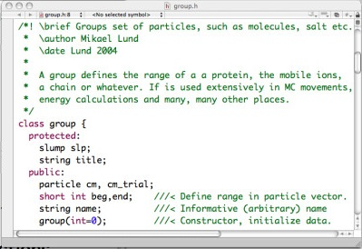
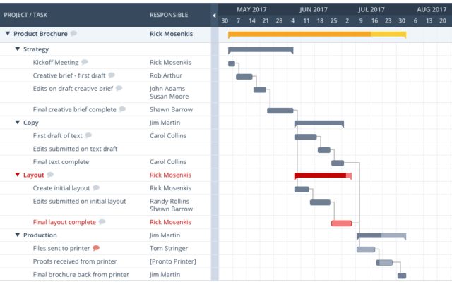

# CSPB-3308  Lab 12 :  Documentation
<figure width=100%>
  
</figure>
 
 
Documentation is how we communicate about the details of a project.  There are three types of documentation that are used in a typical project.  The first is documentation within the source files.  Comments are provided to give a new developer (or to remind yourself) what knowledge is needed to understand the code, its uses, and its limitations.  
 
<figure width=100%>
  
</figure>
Usually the source code contains a set of global comments at the beginning of a file.  These will describe the overall purpose for the code in the file, may describe the overall usage and functionality, and describe the limitations and known issues with the code. Each function within the source would also have descriptions about that specific function's purpose, parameters, usage, algorithm, and other information needed to understand the functions performance.  Comments within the code should give the developer an indication of the step within the algorithm that a section of code is performing.  The inline code comments give the developer hints about tricky or non obvious function of the code.  These inline comments can also warn the developer of subtle issues that might occur if that code is modified.
 
 
<figure width=100%>
  
</figure>
 
The second form of documentation is for the user of a resource.  If the resource is a program, then documentation might take the form of a user guide or user manual.  This documentation describes the features of the program and different ways you might use those features.  If the resource is a code library, then the documentation comes in the form of description of the elements in the library and the parameters to the functions.
 
<figure width=100%>
  
</figure>
The third type of documentation is for the Project Management of the project.  
Project documentation is a set of online documents comprising key project details, milestones met, targets achieved, changes accommodated, and much more. 
These documents act as a centralized reference point where teams can quickly find the information they need to complete certain tasks, track progress, or check recent updates. 
By consolidating all project information in one place (project repository), the documentation can bring clarity to the project management process.   It helps teams stay on target and improves team focus and productivity. 

### Learning Objectives
- Become familiar with standard documentation resources
- Adopt common good documentation practices
- Learn how to properly document your own processes

 ### Documentation is about *How* the code works
Documentation for an industry project is not for explaining *what the code does*.  The documentation for source code is to provide an explanation of *HOW the code works*.  That is different than what you have probably been doing for most of your academic problem solutions.

One of the major risks you encounter, especially when working with a remote development team,  is that the code in the project repository can easily become impossible to read or work with.

How can you make sure that the code is readable, can be easily understood, and can easily be maintained by another developer or another team?   You must set standards for the type of documentation that should (must) be included.

Documentation's main purpose is to increase the product’s maintainability, regardless of which developer might be working with the code.  That means an experience developer must explain the workings of the code to a generic developer that may not have all the same experience.  The developer must leave explicit details about the problem they were solving and how they decided to solve that problem.

Many inexperienced developers argue against code documentation.  Their reasoning is that a well-written program is self-explanatory and should be clear for anyone proficient with the knowledge to make changes.  However, this is not usually the case. Even developers with years of experience have had trouble with understanding undocumented code that they themselves had written only a few months earlier.  Information that would make it easy to pickup the old code can be placed into the source files to aid in quick refreshers about the important details. There are many other reasons to maintain proper code documentation.

* Good documentation allows knowledge transfer. Not all code is as obvious as the current developer thinks. There might be some complex algorithms or custom fixes that are not clear enough for other developers.
* Good documentation helps to troubleshoot issues. If there are any problems with the product after it’s released, having proper documentation can speed up the resolution time required to understand and fix the problem. Finding out  details and architecture specifics is usually a time-consuming task, which can be greatly reduced by good documentation.
* Good documentation can speed up the development of new features as it should  describe dependencies between custom code and third-party tools. This would allow a quicker integration process with new third-party tools.
* In general, good documentation will increase your productivity and adaptability in new development and maintenance efforts.  If documentation is done properly and is understandable, developers and other teams wont waste time trying to decipher code.  They will be able to quickly understand the code and be able to make correct updates or enhancements.

### What does good documentation consist of?
Having no documents at all is as bad as having excessive or inappropriate documentation. Here are some basic rules for creating useful and, most importantly, usable code documentation.

* Keep it simple and concise by following the DRY (Don’t Repeat Yourself) principle. You don’t need to comment on every single line of your code, use comments to explain something that really needs explaining and is not self-evident.  Explain the concepts and the algorithms.  Highlight the sections of the algorithm within the code.  Make sure to point out any regions in the code where it may not be obvious why the code is written that way or it took extra debug time to figure out the proper code to use.
* Keep the documentation up to date at all times. It’s best to document the code step by step, as it is written, instead of writing down the comments for the code that was written months ago. In doing so, you will save time and make the documentation precise and complete. Use proper versioning to keep track of all changes in the document.
* Document any changes to your code. Documenting new features or bug fixes is pretty obvious. However, you should also document deprecated features, capturing any change in the product.
* Use simple language and proper formatting. Code documents are typically written in English so that any developer could read the comments, regardless of their native language. Some of the best practices for documentation writing specify using the *Imperative mood, Present tenses, preferably active voice, and second person*. Use consistent formatting for header, footer, headings, and common font sizes for better readability.

There are tools to help generate documentation.  Such tools are typically language-specific:

* Doxygen (C, C++, C#, Java, Objective-C, PHP, Python)
* GhostDoc (C#, Visual Basic, C++, JavaScript)
* Javadoc (Java only)
* Docurium or YARD (Ruby)
* jsdoc (Javascript)
* Slate and Swagger are among the most popular tools for API documentation.

### Conclusion
Some teams may prefer to skip code documentation in order to save time and effort. Remember that this strategy might result in even more significant efforts once the product is in development by a team.  If a partially developed portion of the project is picked up by another developer, re-writing the code just takes additional time you may not have available.  Using a dedicated team approach, you can efficiently and effectively cooperate with your team by transferring the knowledge while development is being completed.

(information derived from https://easternpeak.com/blog/source-code-documentation-best-practices/) 

## Now its your turn
This will be your deliverable for the lab time to take what you've learned, explore something unfamiliar and apply it. 

### Step 1 - Select a project for a library or program that interests you, but which you are not familiar with yet.  
Make sure you don't pick NumPy, Pandas, or something you've seen before in another class. If you're a wiz at R, Java, or another language then feel free to use  a library/package from that language. It should be unique to you and something that neither you nor maybe even the instructor have seen before. Remember that nobody wants to read twenty different analyses of the NumPy package.
 
Perform a Google Search on "most interesting Open Source Repositories"   
 OR   
Visit a site like: [A.W.E.S.O.M.O](https://github.com/lk-geimfari/awesomo)
which is an extensive list of interesting open source projects written in various languages.
 
### Step 2 - Find examples of the different types of documentation within that library. 
Show external documentation, in-code documentation, README files and explain what is present in the documentation. Note which of the characteristics of good and bad documentation are present in the library you chose. Find examples of at least three of the different characteristics that are present in the documentation and provide evidence of them.

- What's missing from the documentation? Is there something that could be added to help the user understand the library? If you were using the library what would you include? Write or Include at least examples of what you would add to the documentation to improve it.

- Write your own : Remember the flask app you built a few weeks ago. Using what you've learned create some sample documentation for your flask app including documentation in the different styles we've discussed (in-code, readme, external) and be sure to follow the conventions discussed earlier. Include a docstring of both the required routes and the ones that you chose to incorporate into your flask application.

### Step 3 - Create a document (LAB12_REPORT.md) in your lab repository
Create a new file within your lab repository and make sure it covers the items listed below.  You can place any snapshot images in a directory `images` at the top level of your project repository.  The html `` or markdown command `` for accessing the image should use a relative path.

#### Items to cover in Lab Report
1.  Description of the project and sources being reviewed

    * URL of site being reviewed
    * Name of resource
    * Purpose or Vision provided by authors
    * What kind of documentation (plain text, html, markdown, markup, ...)

2. Show an example of documentation (standardized headers, ...) for a source file.
3. Show good examples of comments for a code section and for inline comments within the source.
4. Is there 'bad' documentation?  Show an example.
4. What other documentation does the project provide? Give examples.
5. What kind of testing or testing frameworks are used for the project?
1.  Your summary of the documentation style and contents for the project being reviewed.  
    * Was it good or bad?  
    * What could be changed?  
    * What needs to be added?
    * . . . 

### Step 4  - Add documentation to your Flask Lab
Remember when you coded up those routes for your Flask Lab.  You were creating some code and maybe external data files.   Now you will update your sources in the lab repository with header, function, and in code comments.  You will produce a new readme file called `MY_README.md` that explains what you were doing and how you are doing it in the application code.  Make sure to describe any external files or templates used by the application.

##### **Although your assignment will be graded from your files in the remote repository,**
##### **You must submit the following text when you have completed the assignment:**

   * Your name:
   * CU ID: (4 letters - 4 digits)
   * GitHub Username:
   * hours to complete lab:
