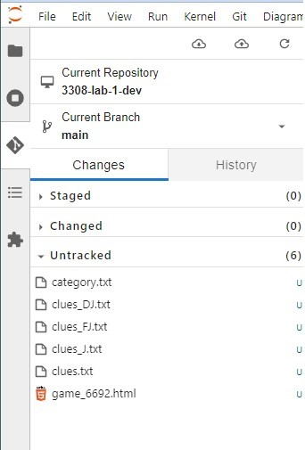
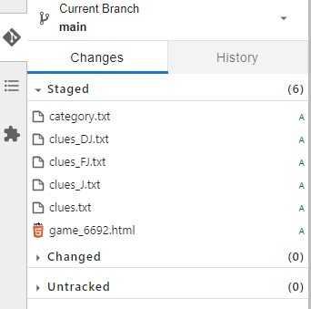
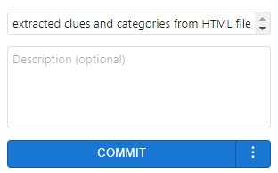

# CSPB-3308  Lab 1 :  Using Command Line Interface
<figure width=100%>
  
</figure>

For many course projects you will need to obtain data to use.  Often that data is only available from a website that displays the information using a web browser.  The information sent to a web browser is HTML (Hypertext Markup Language). HTML is a text-based approach to describing how content contained within an HTML file is structured, how it should be displayed, and how the components of the page can interact with the user.

Web scraping is the practice of sifting through a web page's HTML to gather data that you need and place it in a format useful to you.  In this assignments you will perform tasks to scrape data from an HTML page that has been downloaded.      

<hr>
In this assignment you will use a set of unix commands from the command line of a terminal window.  From the command line you will extract data from a given file, access other web pages, and create a hierarchical storage structure to organize the data.

You do not need to understand the HTML files, only that they are lines of text.  We will use commands to take advantage of the format of the text files to extract the data.

## This lab is a tutorial which will provide the steps needed to complete the assignment.  You should follow along in a terminal window by issuing the same commands.
If you have not **cloned** the assignment repository you will need to return to the project's [README.md](README.md) to view the instructions.
    
### Step 1 - Viewing the data in an HTML file
You  have started __Step 1__ already if you have successfully **cloned** the repository to your local development environment.  If you have not already opened a terminal window, open a new window and change your current working directory to the top directory in the assignment repository.

You should see two files in your top level directory: `README.md` and `game_6692.html`.  
Using the `ls -l` command in the terminal should look like this: 

```
jovyan@jupyter-knoxd:~/CS-3308/assignment$ ls
game_6692.html  images/  LAB_1_README.md  Lab_2_data/  LAB_2_README.md  README.md
```


We will be adding more data files to this assignment in later steps.  To keep the data organized, we should create a sub-directory to hold all the data.  Use the `mkdir` command to create a directory called `Data` in this directory.  Then move the one data file into that directory  (be sure to use a move command and not a copy command).  Now the directory structure should look like this:

```
jovyan@jupyter-knoxd:~/CS-3308/assignment$ ls -R
.:
game_6692.html  images/  LAB_1_README.md  Lab_2_data/  LAB_2_README.md  README.md

./images:
Commit.jpg  deliverable.png  Push.jpg  Staged.jpg  Untracked.jpg

./Lab_2_data:
answers1.txt  answers3.txt  regex_data1.txt  regex_data3.txt  regex_data5.txt
answers2.txt  answers4.txt  regex_data2.txt  regex_data4.txt  template.sh*
```

The `ls -R` performs a short listing of the files in the current directory and all sub-directories.  In this case you see two entries in the top level directory (four files and two directories) and then it lists the entries in each of the directories.  Your can ignore the images and Lab_2_data subdirectories and the README files for now.

While we are still working in the top level directory, we would need to use a **relative** path to the data file.  If we want to see the first few lines of the data file we can use the `head` command on the data file by specifying the subdirectory and the file name within that subdirectory `Data/game_6692.html`(you will not see the lines numbers, I have added them to aid the descriptions below).
```
jovyan@jupyter-knoxd:~/CS-3308/assignment$ head Data/game_6692.html 
     1  <!DOCTYPE html PUBLIC "-//W3C//DTD XHTML 1.1//EN" "https://www.w3.org/TR/xhtml11/DTD/xhtml11.dtd">
     2  <!-- saved from url=(0051)https://www.j-archive.com/showgame.php?game_id=6693 -->
     3  <html xmlns="https://www.w3.org/1999/xhtml" xml:lang="en"><head><meta http-equiv="Content-Type" content="text/html; charset=UTF-8">
     4  <title>J! Archive - Show #2240, aired 1994-05-06</title>
     5  <link type="text/css" rel="styleSheet" href="./J! Archive - Show #2240, aired 1994-05-06_files/styles.css">
     6  <link rel="shortcut icon" href="https://www.j-archive.com/favicon.ico"><meta name="keywords" content="Jeopardy Archive Matthew Stone Jeff Stewart Keri Ellis Final clue response question answer Daily Double"><meta name="description" content="An archive of clues and players for Jeopardy! show #2240."><meta name="loadtime" content="0.0504958629608">
     7  </head>
     8  <body>
     9
    10  <div id="navbar">
```
<hr>

### Step 2 : Search the data file for information
Now we can get started on looking for the data we want to extract from our data file.  You can see the first few lines of the data file from our last command.  This is an HTML formatted file and the information you see is describing how to display the information.  If you want to see what the page looks like you can download the file and open it in a browser, or see it at [J! Archive](https://j-archive.com/showgame.php?game_id=6693).  

We will provide a quick explanation  of the format, but you do not need to understand the format to complete the assignment.  We will learn the HTML format details later in the course. The HTML format is a set of **tags** that describe the information that follows it.  Each tag starts with a `<` symbol then a tag type and ends with a `>` symbol.  Sometimes there is more information provided after the tag type.  
In this case, the first line is describing the type of document in the file.   The second line is a comment.  It starts with `<!--` and everything is considered a comment until it reaches the closing `-->` even if it spans multiple lines.  In our example, the comment is terminated at the end of line 2. 

Line 3 shows how HTML can have a start tag and corresponding end tag. The tag for setting the title of the document is `<title>`, which is followed by some text and an ending tag `</title>`.  All the information between the start and end tags belongs together as a single object.  Tags can be nested inside other tags, which is where the **Hierarchical** parts of the name comes from.  Another example of a starting and ending tag is `<head>` and `</head>` on lines 3 and 7.   HTML does not require that each tag be on a line by itself.  In fact, the line endings are important in the file.  We will talk more about this later in the course.  For now, notice that all the information from the middle of line 3 until just before line 7 are part of the `<head>` object of the HTML file.

The `link` tags are referencing elements that are located somewhere else besides this file.  The `meta` tag describes some meta-data about the information in this file.  The `<body>` tag indicates  the start of the main portion of the page description.  An ending `</body>` tag would be near the end of the file. The last thing to notice is on line 10.  This tag has more information in the start tag.  The additional information `id="navbar"` is a means to identify this object.  We will see this type of marking later and use it to our advantage.


The data file is taken from a description of a Jeopardy game played in the 1990's.  Jeopardy is a game show that gives you clues and players must answer in the form of a question.  The clues are the answers to the questions that the players articulate.   This data file has both the clues and the correct responses.  How can we get to this data?  First we can move the working directory into `Data` so we don't need to specify the `Data` directory everytime we reference the data file.
Then using the `grep` command we can find all the lines within a file that match a pattern.

```
jovyan@jupyter-knoxd:~/CS-3308/assignment$ cd Data
jovyan@jupyter-knoxd:~/CS-3308/assignment/Data$ grep "Clues" game_6692.html 
jovyan@jupyter-knoxd:~/CS-3308/assignment/Data$ 

jovyan@jupyter-knoxd:~/CS-3308/assignment/Data$ grep "clues" game_6692.html 
<link rel="shortcut icon" href="https://www.j-archive.com/favicon.ico"><meta name="keywords" content="Jeopardy Archive Matthew Stone Jeff Stewart Keri Ellis Final clue response question answer Daily Double"><meta name="description" content="An archive of clues and players for Jeopardy! show #2240."><meta name="loadtime" content="0.0504958629608">
```
Remember that almost everything in linux is case sensitive.  Therefore we do not find the match to line 6 above. If we change the case of our pattern, there is only the one line that we had seen before that matches **"clues"** within the whole file.  

You should open the data file in an editor window.  If the file is rendered (text boxes, colors on screen) then you have  opened a *preview* of the HTML file.  You need to open the file in an editor window.  Right click on the file and select "open with ..." to select that you want to edit and not preview the file.  You could also open the file using a built-in editor such as `vi` or `nano` commands from the command line.  Once you have an editor window, you can scroll through the file.   We need to see what kind of data is in there.

As you scroll, you will see lines such as `  <tbody><tr><td class="category_name">COMMUNICATIONS</td></tr>` 
and `<td id="clue_J_4_1" class="clue_text">The Libyan Desert is actually the northeastern portion of this desert</td>`c which contain information we want to extract.  You can goto [w3schools.com](https://www.w3schools.com/tags/tag_td.asp) to learn more about HTML tags.  The pattern **"clue_text"** should list out all the lines with the clues we want to extract.
```
jovyan@jupyter-knoxd:~/CS-3308/assignment/Data$ grep "clue_text" game_6692.html 
    <td id="clue_J_1_1" class="clue_text">When Montezuma II came to power in 1502, this empire was at its height</td>
    <td id="clue_J_2_1" class="clue_text">Among these animals to have their own 1994 calendars are Felix &amp; Garfield</td>
    <td id="clue_J_3_1" class="clue_text">KLAX, the top-rated radio station in Los Angeles for the 4th quarter of 1993, broadcasts in this language</td>
    <td id="clue_J_4_1" class="clue_text">The Libyan Desert is actually the northeastern portion of this desert</td>
    <td id="clue_J_5_1" class="clue_text">When you bake these in their jackets, puncture them with a fork when they're half done</td>
    <td id="clue_J_6_1" class="clue_text">A light rain</td>
    . . .
```
There are 61 lines that are displayed.  We can count the number of lines in the output of the `grep` command by sending the output to another command.  Use the `|` symbol to send the output from `grep` command to a second command `wc`.
```
jovyan@jupyter-knoxd:~/CS-3308/assignment/Data$ grep "clue_text" game_6692.html | wc
     61     986    8057
```
The `wc` command by default will show the number of lines, words, and characters in the input data.  If you want to only see the lines, we can tell the `wc` command to print only lines by adding a command line option `-l`.
```
jovyan@jupyter-knoxd:~/CS-3308/assignment/Data$ grep "clue_text" game_6692.html | wc -l
61
```
We will need all those lines with the clue text and all the lines with the category names.  
<hr>

### Step 3 : Capturing the results of commands

The results of a command can be captured by redirecting the output from a command into a file.   In an example above we used piping `|` to have the output from one command be the input to another command.  Here we want to capture those output lines into a file.  We can redirect the output from a command using the `>` symbol and direct it into a file.

```
 
jovyan@jupyter-knoxd:~/CS-3308/assignment/Data$ grep "clue_text" game_6692.html > clues.txt
jovyan@jupyter-knoxd:~/CS-3308/assignment/Data$ head -2 clues.txt 
    <td id="clue_J_1_1" class="clue_text">When Montezuma II came to power in 1502, this empire was at its height</td>
    <td id="clue_J_2_1" class="clue_text">Among these animals to have their own 1994 calendars are Felix &amp; Garfield</td>
jovyan@jupyter-knoxd:~/CS-3308/assignment/Data$ wc -l clues.txt 
61 clues.txt
```


Now create a second file `categories.txt` capturing the category names from the data in the file.  You should collect 13 category names.
    
```

jovyan@jupyter-knoxd:~/CS-3308/assignment/Data$ wc -l categories.txt 
13 categories.txt
```

Each Jeopardy game is broken up into three rounds: Jeopardy, Double Jeopardy, and Final Jeopardy.  If you look at the information we have captured in the `clues.txt` file you can see that you could extract only the clues for a particular round.  

##### Please create three new files `clues_J.txt`, `clues_DJ.txt`, and `clues_FJ.txt`.  

You can extract from the original file or the all clues file that you created.

```
    
    
jovyan@jupyter-knoxd:~/CS-3308/assignment/Data$ wc -l *.txt
   13 categories.txt
   30 clues_DJ.txt
    1 clues_FJ.txt
   30 clues_J.txt
   61 clues.txt
  135 total
```
<hr>

### Step 4 : Sorting the Results
You might have noticed that the questions of a category are not listed together.  They are listed by value and each of the lowest value questions in a category are listed before the next lowest valued questions.  It would be nice to have each of the categories questions listed together.  If you look at the lines of the clue files, you will notice that the clues have an id field that indicates the round, the category, and the question number within the category.   We can use this id to sort the lines.  The `sort` command will take the lines from the input data, sort it, and output the lines in sorted order. 

```
jovyan@jupyter-knoxd:~/CS-3308/3308-lab-1-dev$ sort clues_DJ.txt 
    <td id="clue_DJ_1_1" class="clue_text">The war contributed to the passage of the 26th Amendment giving this to 18-year-olds</td>
    <td id="clue_DJ_1_2" class="clue_text">This defoliant widely used in the war consisted of 2 weed killers—2,4-D &amp; 2,4.5-T</td>
    <td id="clue_DJ_1_3" class="clue_text">The route by which the North supplied the Viet Cong was nicknamed this, after North Vietnam's leader</td>
    <td id="clue_DJ_1_4" class="clue_text">In 1968 Robert S. McNamara left this cabinet post because of doubts about the war</td>
    <td id="clue_DJ_1_5" class="clue_text">Near the end of 1967 this U.S. general said we were "winning a war of attrition"</td>
    <td id="clue_DJ_2_1" class="clue_text">Speechwriter Peggy Noonan coined this president's famous phrase "A thousand points of light"</td>
    <td id="clue_DJ_2_2" class="clue_text">This current senator's maiden name was Dianne Goldman</td>
    <td id="clue_DJ_2_3" class="clue_text">Midori, who's a virtuoso on this instrument, gave her first public recital at the age of 6</td>
    <td id="clue_DJ_2_4" class="clue_text">A concert hall in this theatre complex is named for Katharine Hepburn's second cousin Alice Tully</td>
    <td id="clue_DJ_2_5" class="clue_text">This British-born editor of the New Yorker is also an award-winning playwright</td>
```
    

For the final action in this step, rebuild the individual clue files for the Jeopardy and Double Jeopardy rounds and store the sorted results.  You should take the command line you used before and extend it to perform `sort` before redirecting the results.  If you were to create a sorted list from all the clue data we could use the following command:

```
grep "clue_text" game_6692.html | sort > clues.txt
```
which searches the data file for lines matching the pattern and prints those lines to the output.  The output of the `grep` is piped as the input to the `sort`.  The `sort` command will read the input and write the lines in sorted order.  The output of the `sort` command is captured by redirecting the data into a file.  Reprocess the data to generate the `clues_J.txt` and `clues_DJ.txt` files to contain sorted lists.

<hr>
    
Now that we have finished Steps 2-4, we should save the file(s) and directory(s) that have been created into our local repository.  There is a GUI and command line interface to **add** the changed or new files we want to include in the repository.  When you **add** a file, you are *staging* the files or marking them to be committed.  The **commit** command updates the repository with the files that were staged and clears the list of staged files.


In the image to the left you can see that all the files you have changed are listed under the **Untracked** section of the Git interface.  This is because they have not been added to the repository yet.  The original HTML file is listed as **Untracked** because the file was moved into a different directory.  To add them into the staging area, hover the mouse over the file and select the **+** symbol.  You will see that the file has moved into the **Staged** section.  Repeat for all the other **Untracked** files.


Now that all the file have been staged, you can **commit** all of them by selecting the COMMIT button at the bottom of the window.  But before you can **commit** you must specify a summary of the changes that you have made.  In the summary field enter a short description such as "extracted clues and categories from HTML file".  

Once you enter a summary string, the button will be activated.  When you select the COMMIT button, the local repository will be updated for all the staged files.  

The commit is only to the local repository.  You can tell that the local and the remote repositories are different by looking at the top of the Git menu.  You will see  with the up arrow having an orange dot next to it.  This indicates there are changes in the local repository that have not been **pushed** to the remote repository.



When you press the **push** icon, all the changes (even if multiple local **commits** occurred) will be copied to the remote repository.  You can validate the changes have been transferred by accessing the web page for the repository.  You will see the updates and the comments that you made for the commits.

If you see an orange dot on the down arrow icon, that means there are changes in the remote repository that are not yet copied to the local repository.  You must **pull** all the changes from the remote repository before **pushing** local changes to the remote repository.  This usually happens when you have been using two different computers to make modifications to the remote repository.  We will learn more about **push** and **pull** later in the course.

Make sure that all your changes are **pushed** to the remote repository before continuing with the next step.

<hr>

### Step 5 : Get more data from J!Archive
The [https://j-archive.com/](https://j-archive.com/) website holds data for most of the Jeopardy games played since 1984.
We have processed one of the games from 1994.  The data is available by going to the site and accessing the game you want to see.  Such as [game 2731](https://j-archive.com/showgame.php?game_id=4206) which was broadcast Monday, June 17, 1996 has the following categories in the Jeopardy round: 
* MEMOIRS
* COOKING
* REPTILES
* 12-LETTER WORDS
* SPORTS LEGENDS
* EUROPEAN NATIONAL ANTHEMS

There are multiple ways of obtaining the data files.  We can manually goto the page we want,
right click on the page and select **View page source**.  You will see the actual HTML that is rendering that page.    
You could also right click and select **Save as** to create a new file on your local computer.  You would need to copy that file to your JupyterHub machine.  
OR, we can get te computer to download the file for us in a single command on the command line.
    
The `wget` command will access the HTML page for you and write the page to an output.
We will not need to learn the ways that `wget` can be used for this assignment.  You can always get more information about a command by asking the command for **help**.  Here are the first few lines of the output when asking for help:
```
$ wget --help
GNU Wget 1.20.3, a non-interactive network retriever.
Usage: wget [OPTION]... [URL]...

Mandatory arguments to long options are mandatory for short options too.

Startup:
  -V,  --version                   display the version of Wget and exit
  -h,  --help                      print this help
  -b,  --background                go to background after startup
  -e,  --execute=COMMAND           execute a `.wgetrc'-style command

Logging and input file:
  -o,  --output-file=FILE          log messages to FILE
  -a,  --append-output=FILE        append messages to FILE
  -d,  --debug                     print lots of debugging information
  -q,  --quiet                     quiet (no output)
  . . .
```
The only option we are going to use is the `-O` option to place the output into a filename that we specify.
If we only specify the URL in the command, `wget` will save the information to a file with a name it creates.  
```
$ wget  https://j-archive.com/showgame.php?game_id=4206

--2022-05-01 23:52:49--  https://j-archive.com/showgame.php?game_id=4206
Resolving j-archive.com (j-archive.com)... 155.138.141.248
Connecting to j-archive.com (j-archive.com)|155.138.141.248|:443... connected.
HTTP request sent, awaiting response... 200 OK
Length: unspecified [text/html]
Saving to: ‘showgame.php?game_id=4206’

showgame.php?game_id=4206          [ <=>                                                 ]  75.53K  --.-KB/s    in 0.1s    

2022-05-01 23:52:50 (778 KB/s) - ‘showgame.php?game_id=4206’ saved [77347]
```
It will generate a filename into which the data will be saved. Not an easy name to type.  Delete the `showgame...` file.
A better name for this data is `game_4206.html` so we know it is a game HTML for the game with id=4206.
We can add the `-O` option and specify the name in which we would like to store the data.

```
$ wget -O game_4206.html https://j-archive.com/showgame.php?game_id=4206
```

Now we have two data files.  We should grab some more files from the archive site.  Go back to the website and find 3 games from the 1999 season.  Access the pages to get the game_id for each of them.  We can substitute the ids into the previous `wget` command to download more data.   

It would be nice if we could create a command to call that would automatically substitute an id into the two places. In the next step, we will learn how to create scripts that can perform multiple functions such as  the clue file creation commands can be collected into a single script.  We can then issue one command to build all the files.
<hr>

### Step 6 : Customizing Your Development Environment

Programmers are always looking for ways to make things easier.  We create solutions that take advantage of the computer to solve problems in all kinds of fields.  But we are also always trying to make it easier in our development environment.  One of the ways we can make things easier is to take complex commands that are used every day and make it easier to perform that command.

For example we are constantly asking for a directory listing to see the files in the current directory or in other directories. 
Often we would like to see a long listing which shows the permissions, size, and date of the file by using `ls -l`.  Although this is not many characters, we do it so often that it would be nice to have a shortcut to perform that command.   
The shell supports aliasing commands.  This means that you type a command that has been aliased to another command.  In our case, we can create an alias `ll` to be a long listing.  

The `alias` command will add an alias to the current terminal window (see Chapter 11 in TLCL).  `alias ll='ls -l'` will create a new alias called `ll` that will behave the same as `ls -l` when typed on the command line. After issuing the alias command, that alias will always be available in that terminal window.  If we often want to list files in time order, we could create another alias `alias lt='ls -lt'` to quickly list files in a long listing in time order.

The `ls` command has many options (try `ls --help` to see the options) and there are some options that are great to use all the time.  The `--color=auto` option will add color to the output of the directory listing.  Files will be in one color, directories in another color, and symbolic links in a third color.  
Although this is very useful, it is not very efficient to type the whole command `ls --color=auto` just to look at the current files.  It would be nice to just type `ls` and have it run the command with those options.  The shell also supports an alias that runs a command of the same name.  This means that we can alias the `ls` to run   the command `ls --color=auto`.  Try the `alias ls='ls --color=auto'` command.  Issuing the `ls` command will now show color in the output.  Even better is that now when we run `ll` it will use the aliased `ls` command, which means our long listing now has color.

Another useful option is `-F` which will append an indicator (one of `*/=>@|`) to entries to visually indicate the file type.  
Every entry in the directory that is not a simple file will have one of those indicators appended to the name.  This is useful because in a standard listing you cannot tell the directories from the files.  Using this option will append a `/` to each directory in the listing.  If there are executable files in the directory, the `*` is appended to the name.  Use the `alias ls='ls -F --color=auto'` to use both the options whenever a `ls` command is given.

Alias commands are useful for creating shortcuts for commands as well as for helping with common typing errors.  The command for moving from the current working directory to the parent directory is `cd ..`.  But often it gets typed as `cd..` without the space character.  It is annoying to get an error message everytime, so we can create an alias to help us out.  ``alias cd..='cd ..'` will assign an alias to the mistyped command so that it performs the intended command.

Some common aliased commands:
```
alias ls='ls -hF --color=auto'
alias ll='ls -l'
alias cd..='cd ..'
alias 3308='cd ~/3308'

alias ve='python3 -m venv ./venv'
alias va='source ./venv/bin/activate'

alias hist='history | grep'
```

You can see all the current aliases assigned in your terminal window by using the `alias` command.  If you want to remove an alias, use the `unalias` command.


##### Automatically Customizing Your Development Environment
The alias command is only effective in the terminal window in which it is defined.   We want those alias commands to be available in every terminal window that we create.  When a new terminal window is created, there is a startup script that is run.  For the JupyterHub virtual machines, the startup script is in your home directory.  You can list the files in your home directory using `ls ~` because the `~` is interpreted as the full pathname to your top level directory.
If you try this command you will see a few files, but not any script files listed.  That is because they are **hidden** files.  There is another option for listing all the files, including the hidden files, that can be used.  `ls -a ~` will show all the files in your home directory.  Any file or directory name that begins with the `.` character is considered to be hidden.

You should see a file named `.bash_profile` or `.bashrc` (or both) in your home directory.  These files contain a list of commands to be executed when your shell (terminal window) is started and before the prompt is displayed in the window.  If we edit this file and add in the `alias` commands, the aliased commands will be available in any window you create. 

In the default setting for JupyterHub the hidden files are not visible.  If you are using the Visual Studio Code extensions, you can change the setting to allow you to see hidden files, but most of the time they are hidden for a reason and we do not need to see them.   You can edit the file using `vi`, `vim`, or `nano` from the command line.  You can edit the file in JupyterHub by selecting the `File / Open from Path ...` menu and entering a path from your home directory to the file. 
In this case, selecting `.bash_profile` will bring up an editor tab with the contents of the file. 

In the editor of your choice, add the alias command that you want to have available to you.  You can add any valid commands in this script file.  One that is handy is the `echo` command to print out information to the window.   I suggest you add a `echo "Completed the .bash_profile script"`  at the end of your script file.   When you start a new terminal window, you should see that message before the first prompt.

Speaking of prompts, the default prompt can become very long when you are delving deep into a directory structure because it prints the entire current working directory in the prompt.  We can change the prompt with the following command `export PS1='[\!:\w]$ '` from the command line.   This will set the `PS1` prompt that you see when the window is ready for the next command.  The special `\!` and `\w` indicate strings to be substituted at that position in the prompt (see [https://ss64.com/bash/syntax-prompt.html](https://ss64.com/bash/syntax-prompt.html) for list of others).  The `\!` will substitute the command number in the history and `\w` will add the current working directory from your home directory.  If we use the `\W` then we would only see the base name (the last name in the path) in the current working directory.

The prompt setting command can also be placed into the bash script file to be applied each time you start a terminal window.

Commands added to the `.bash_profile` script:
```
. . .

alias ls='ls -hF --color=auto'
alias ll='ls -l'
alias cd..='cd ..'
alias 3308='cd ~/3308'

export PS1='[\!:\w]$ '

echo "Completed the .bash_profile script"
```
<hr>

### Step 7 : Creating an Organized Directory Structure

We will be extracting the data from many HTML files and it would get difficult to see all the related information when listing the Data directory.  We can organize the data by creating a hierarchical structure to our data.  So far you have created extracted data from the HTML file for one Jeopardy game.  

```
.  
├── Data  
|   ├── categories.txt
|   ├── clues_DJ.txt  
|   ├── clues_FJ.txt  
|   ├── clues_J.txt  
|   ├── game_4206.html  
|   └── game_6692.html 
  . . .
```

To maintain the data relationships between files when we process lots of data, we will need to define a hierarchy for the storage.  Below is the storage layout that we will use for this assignment. The data will be split by year and each year will have a directory for each individual game.  The game directory will hold all the extracted data for that  game.
  
  
```
.  
├── Data  
|   ├── Year
|   |   ├── 1994  
|   |   |   ├── Game_6692  
|   |   |   |   ├── categories.txt
|   |   |   |   ├── clues_DJ.txt  
|   |   |   |   ├── clues_FJ.txt  
|   |   |   |   ├── clues_J.txt  
|   |   |   |   └── game_6692.html 
|   |   |   ├── Game_xxxx  
|   |   |         . . .  
|   |   ├── 1996  
|   |   |   ├── Game_4206  
|   |   |   |   ├── categories.txt
|   |   |   |   ├── clues_DJ.txt  
|   |   |   |   ├── clues_FJ.txt  
|   |   |   |   ├── clues_J.txt  
|   |   |   |   └── game_4206.html 
|   |   |   ├── Game_xxxx  
|   |   |         . . .  
|   |   ├── 2000  
|   |   |   ├── Game_xxxx  
|   |   |         . . .  
|   |   └── 2001  
|   |   |   ├── Game_xxxx  
|   |   |         . . .  
  . . .
```
<hr>


To create the hierarchy you must:
* first create the **Year** subdirectory in **Data** directory.
* create the 1996 directory in the **Year** directory.
* create the Game_4206 directory in the **1996** directory.
* move the **game_4206.html** file and all the files you created from that game into the **Game_4206** directory.<br>Should be able to do this in one or two commands.

If you have already loaded some additional games using the `wget` command from the previous lab, make directories for the years and the games that those games were broadcast.  You can find the needed broadcast information at the beginning of the HTML file.


If you have not downloaded at least 2 additional games from different years, use the `wget` to get those HTML files.  Make sure to store those files in the correctly named **Year** and **Game** directories.  

You should end up with a directory structure that displays like this:
```
$ ls -R
.:
Data/  README.md

./Data:
Year/

./Data/Year:
1994/  1996/

./Data/Year/1994:
Game_6692/

./Data/Year/1994/Game_6692:
game_6692.html

./Data/Year/1996:
Game_4206/

./Data/Year/1996/Game_4206:
categories.txt  clues_DJ.txt  clues_FJ.txt  clues_J.txt  clues.txt  game_4206.html
```
    
You have created lots of changes to the project.  Files have been moved and new directories created.  You need to update your local repository with all these changes.
Once you have completed the **commit**s for all changes, make sure to **push** your work to the remote GitHub Classroom repository. 
    
<hr>

### You have completed the Lab-1 tutorial.  
We have created a data hierarchy and extracted some data from one of the HTML files that contain the data.  We need to perform the same extraction process on all the HTML files that we download.  We will create an easier way to perform the processing in the next lab.
    
**IMPORTANT**: Make sure that all your changes are **pushed** to the remote repository before going to Moodle to submit your completion information in the Moodle assignment.

Here is what you should have accomplished.
	
	1. Created directory structure and all the files listed below and have **pushed** all of them to your remote repository.
	2. Created categories.txt, clues_J.txt, clues_DJ.txt, and clues_FJ.txt in the Game_4206 directory.<br>
	   Make sure that the original HTML file from the lab is also in the directory.
	3. Created another *year* and *Game_XXXX* directories and downloaded the *game_XXXX.html* file.
	
<hr><hr><hr>


