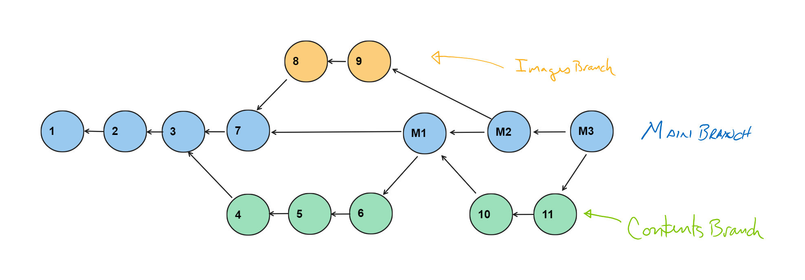

# CSPB-3308  Lab 4 :  Version Control System (VCS)
### Lab Tutorial Step Descriptions
<figure width=100%>
  
</figure>
    
This assignment is in the form of a tutorial that will walk through a scenario that tries to approximate multiple developers making changes to a single file.  The developers would normally create a branch so that they can save their partial work in the repository without disturbing the working code in the main branch.  Once the changes are completely working, the changes are merged back into the main branch.  Many of these branches can be simultaneously allowing multiple developers to modify the source code without affecting other developers. Managing the multiple branches is probably the greatest feature of version control systems.
    
The tutorial will walk you through the creation of a branch, switching between branches, and eventually merging a branch into the main branch.  The merge may determine that there are conflicting changes to a file from the two branches.  The `git` application cannot determine how to merge those two versions of a file.  It requires that a developer review the changes and create a merged version.  The merged version will need to be committed and then merge can be completed.

During the tutorial we will also introduce you to the formatting of an HTML document.  The HTML document is a description of how to display information on a web page in a browser.  We will walk you through several basic formatting instructions while creating different versions of a file for use in the `Git` tutorial.

The tutorial text will include graphics to help you visualize the different versions and their relationship between each other.
The different versions of the `sample.html` file is represented in colored and numbered circles.  The circles are connected to the previous version within a branch.  When a branch is created and the file is committed, we show the file versions in a different color.  A merged version would have two previous versions.  One for the previous version in the current branch and another for the version from another branch that is being merged into main branch.  Below is a representation of the versions that this tutorial will walk you though and you will commit to your local repository.  You can use the `git log` command to view the history of he versions committed.



<hr>

1. Create a file `sample.html` with some simple text.
 * You can use an editor to create the file or use the command below to place some text into a file.
```
    echo "hello world!" > sample.html
```
 * Open the `sample.html` and notice that the text is displayed.  This is the simplest html file that contains just some text to be displayed.

 * Take a look at the current commit log (`git log`) to see that only the initial commit for the lab files is shown.  You can also use the JupyterHub environment's `Git` interface to view the history.  You select the `Git` icon along the left side menu.  Select the "Current Branch" dropdown to see all the branches that have been created so far.  You should see `main` along with a couple of branches with `origin/` that represent the main branch in the remote repository.  You can select `Changes` to see what changes have occurred in the repository directory.  The `History` tab will list out the different commits that have occurred.  The list in the graphical interface will be the same as the information provided by `git log`.
 * To add the `sample.html` file to repository, first add the file to the **staged** files that are waiting to be committed.
```
        git add sample.html
```
 * Commit the staged files to the local repository.  Make sure to give a good comment message to be associated with the commit.
```
        git commit -m "# 1. simplest HTML page"
```
    
You have now created a new file in the local repository.  Remember that this tutorial is only walking you through changes to the local repository.  If you want to save those changes in the remote repository, you will need to **push** the changes.
    
<hr>

2. Add some HTML commands into the sample file.

 * HTML is a markup language that instructs the browser in displaying the information in a file
    * HTML uses tags to mark sections of the document with display attributes.
    * Tags usually have a starting tag and an ending tag surrounding the text to which the attributes are to be applied.
    <br><br>
 * Add a start tag for header text, `<h1>`, before the first character of the text and an end tag `</h1>` after the last character.
```
        <h1>hello world!</h1>
```
 * Display the new file in the browser (make sure to save file before trying to display)
    * In the JupyterHub environment, double click on the file (or right click on the file and select `+ Open in Browser Tab`).
    * Notice that the text is larger.  The `<H1>` tag specifies that the text is a header, meaning it is larger and bolder than regular text.
    <br><br>
 * Stage and commit the changes to the `sample.html` file.  Use the commit comment message: `"#2 updated the text to use header tag"`.

<hr>

3. Add the minimal HTML tags usually found in a page
 * Although the browser can display the simplest text files, every HTML file usually has a basic set of tags to setup the browser.

 * Try accessing any page in a browser window (Try the Moodle page for this course or your GitHub repository page)

 * Right-click on the page and select `View page source` and a new tab will appear with the source HTML for the page displayed.
   * Notice the tags `<...>` 
   * The first tag in the file `<!DOCTYPE html>` specifies the type of document that is being rendered by the rest of the text in the file.
   * The following are the basic tags used in every HTML file are shown below.

 * Edit your `sample.html` file to match the text listed below with the minimal tags for an HTML file:
```
			<!DOCTYPE html>
			<html>
			<head>
			</head>

			<body>

				<h1>hello world!</h1>

			</body>
			</html>
```
 * Stage and commit the changes to the `sample.html` file.  Use the commit comment message: `"# 3. added the minimal HTML document tags"`.
 
<hr>

4. Suppose that we have been requested to change the contexts of the page to display more information.  We would create a new branch in the repository.  All our changes would be placed into this branch.  The `main` branch would not have any of our changes until we merge it back into the `main` branch.
 * View the current branches using the command: `git branch`.  This will only list the current local branches.
```
        $ git branch
        * main
```
 * The `*` character indicates the current branch under which we are working.
 * View the branches on both the local and remote repositories, use the command `git branch -a`.
```
        $ git branch -a
        * main
          remotes/origin/HEAD -> origin/main
          remotes/origin/main
```
 * Create a new branch for development: `Contents`
```
        git branch Contents
```
 * Even though we have created a new branch, we are still working in the `main` branch.  Use `git branch` to see the branches in the local repository.  The association to the `main` branch will remain unchanged  and any new commits will be to the `main` branch.

 * To tell `git` that we want to use the `Contents` branch, issue the following command: `git switch Contents`.  Once we have done this, al changes going forward will be done on a separate branch called `Contents`.


 * Check the current branch with `git branch` command.  The new branch should be displayed along with `main` branch.  The `Contents` branch should be marked as the current branch.

 * If you want to see the last commit for each branch you can use the command: `git branch -v`.

 * The `git log` command will show that there are three commits in the source history.
    
<hr>

5. Lets add a title for this HTML page that will show up in the text for the browser tab.
    
 * One of the tags available to place in the `<head>` section will set the title on the browser page.  
 * The title text is seen in the tab of the browser (or across the top of the page) and can be set by the page itself.
 * Modify the `<head>` section of the document to include the title information.   
```
		...
			<head>
				<title>Sample Page 3308</title>
			</head>
		...
```
 * View your changes to the file by using the browser to display the new file.

 * You should see that the tab title has changed from a URL to the string we provided.


 * Stage and **commit** the changes to the `sample.html` file.  Use the commit comment message: `"# 4. added text for page title tag"`.
    
 * Verify the commit is in the `Contents` branch using `git branch -v`
    
 * Notice that the MAIN branch still has its last commit as `"# 3. added the minimal HTML document tags"`
    
 * `Contents` branch should have  `"# 4. added text for page title tag"` for its last commit.

<hr>

6. Modify the page text specifically for CSPB 3308
 * The text is generic in the HTML.  Make it a bit more personal.
    
 * Change title to `Welcome to the 3308 World!`
 * Change text in the **body** to `Hello 3308 students and welcome to the world of Software Dev!` 
 * Verify the page displays correctly
 * **commit** the changes to the `sample.html` file with `"# 5. modified text specifically for 3308"` as the comment message.
 * There are now two commits on the DEV branch
 * Use `git log` to see the commits 
<hr>

7. Display some centered text on the page.
 * Add new tags to follow the `</H1>` 
```
		... 
			<h1>Hello 3308 students and welcome to the world of Software Dev!</h1>
		
			<center>This centered text was added by <your name here>.</center>
		...	
```

 * Make sure to modify the text to include your username.


 * Verify the page displays correctly
    
 * **commit** the changes to the `sample.html` file with `"# 6.  added centered text by <your git username>"` as the comment message.
    
 * There are now three commits on the DEV branch, 3 on the MAIN branch
    
 * Use ` git log --graph --all` to see the commits in a graph form.  You can also see the graph form in the JupyterHub history display.
    
 * The graph form will become more useful as we create more interleaving branches and merging branches.

<hr>

8. Suppose we get an urgent request to change the current version of the `main` branch.  We need to add some comments to the HTML file about the page and its author.
 * We have not completed the changes for the `Contents` branch yet, but we want to change the version of the file in the main branch.
 * We can switch to the `main` branch
```
        git switch main
        git branch -v
```
 * If you open the `sample.html` file in an editor, you will notice the file is missing all those changes we performed and stored in the `Contents` branch.  The file will match our `#3` change that added the minimal tags for an HTML document.  
 * The changes for the `Content` branch are still there (use `git log --all` to see all the commits).
 * Now that we have the `main` version, we can add some comments.  A comment in an HTML file has format shown below.  Make sure to change the text to add your name and your own text.  Notice that you should also capitalize the words in the header tag.
```
        . . .
        <!-- this is an HTML comment -->
        <!-- Author: <your git user name> -->
        <!-- Date: <date you made the changes to this page> -->
        <h1>Hello World!</h1>
        . . .
```
 * Verify display and **commit** the changes to the `sample.html` file with `"# 7. show a comment tag, capitalized words"` as the comment message.

 There are now changes to the `main` branch that are not reflected in the `Contents` branch.  When we go to **merge** these two branches, there will be *conflicts* that must be resolved.  *Conflicts* arise when the same file has been modified in both the branches that are being merged.
 
<hr>

9. However, before we get back to finishing the development of the `Contents` branch, our manager has asked us to get started on yet another task.  They want us to add a CU logo and another graphic image to the HTML page.  Instead of adding the graphics to the development we are doing in the `Contents` branch, we should create a different branch to isolate that development.  We will keep the development for `Contents` separate from the development for new images.
 
 * Create a new branch for development: `Images`
```
        git branch Images
```

 
 * Even though we have created a new branch, we are still working in the `main` branch.  Use `git branch` to see the branches in the local repository.  The association to the `main` branch will remain unchanged  and any new commits will be to the `main` branch.

 * To tell `git` that we want to use the `Images` branch, issue the following command: `git switch Images`.  Once we have done this, al changes going forward will be done on a separate branch called `Images`. 
 
 * Because we are currently in the `main` branch, the `Images` branch is based off the last commit to the `main` branch.  This was `"#7 ..."` commit that added comment tags.
 
 * There are now three branches defined.  The `main` branch, the `Contents` branch, and the `Images` branch.  Because there have not been any new commits to the `Images` branch, the last commit in the `Images` branch is considered `"#7 ..."` commit.

<hr>
 
10. Add logo image to HTML page 
 * Images can be added to the display of an HTML page by using the `` tag. The `` tag creates a holding space for the referenced image.   You can specify the width and/or height of an image. If width and height are not specified, the image is displayed in its full size.

 * The `` tag has two required attributes:
   * src - Specifies the path to the image. Can be a reference to a web image or a relative path within the web site to an image.
   * alt - Specifies an alternate text for the image, if the image for some reason cannot be displayed.
   * Visit [W3schools.com/tags/tag_img](https://www.w3schools.com/tags/tag_img.asp) for more information about the `` tag.


 * Edit the `sample.html` file to include a reference to a CU logo
```
	...
		<h1> ... </h1>

		<div>
        
        </div>
	...
```
 * Verify display and **commit** the changes to the `sample.html` file with `"# 8. added CU logo "` as the comment message.

 * This commit is part of the `Images` branch.
 
 <hr>
 
11. The development team has determined that the DEV branch is ready for your current changes you have made to `Contents` branch.  You still have more more to do, but they want the changes you have made so far.  You need to merge the version of the file in the `Contents` branch into the version of the file in the `main` branch.  Remember that the `main` branch file has been updated from the time when we created the branch.  This will cause *conflicts* that must be resolved by a developer.
 
You will always **merge** another branch into the current branch you are working with.  
 
 * Switch to the receiving branch (`main`)
 * **merge** the `Contents` branch into the `main` branch
```
		$ git switch main
		$ git merge Contents
		Auto-merging sample.html
		CONFLICT (content): Merge conflict in sample.html
		Automatic merge failed; fix conflicts and then commit the result.
```
 * If there are no *conflicts*, then the merge will complete without any errors.
 * Notice in the output above, the merge failed because there are *conflicts*.  These conflicts must be fixed and a new fixed version of the file must be committed.  Once the *conflicts* are fixed, the `git` processing can be restarted to complete the merge.
 
   * The conflict must be resolved by editing the source file
   * Open the `sample.html` to see the conflict:
```
!DOCTYPE html>
<html>
<<<<<<< HEAD
<body>
        <!-- this is an HTML comment -->
        <!-- Author: <your git user name> -->
        <!-- Date: <date you made the changes to this page> -->
<h1>Hello World!</h1>
=======
<head>
        <title>Welcome to the 3308 World!</title>
</head>
<body>
better header in HTML document with specified title and centered text: 

        <h1>Hello 3308 students and welcome to the world of Software Dev!</h1>

        <center>This centered text was added by \<your name here\>.</center>
>>>>>>> Contents

</body>
</html>
```

  
 * The `<<<<<<< HEAD`,  `=======`, and `>>>>>>> Contents` mark the boundaries of the changes.  There may be multiple changes within a file and each change must be *fixed*.  In our case we need to keep some of the lines from each of the versions.  Make sure to remove the marker lines when you *fix* the source code.
 
 * Verify display and **commit** the changes to the `sample.html` file with `"# M1. Merged Contents branch [title, center tags] and Main branch [comment tag]"` as the comment message.

 * If there were conflicts, we must complete the **merge**.
 ```
          git rebase --continue
 ```
 
 * To see all the changes in all the branches, use `git log --all` to see all commits.  Using the following command will show a colorized version of the log.
 ```
          git  log --graph  --format=format:'%C(yellow) %s %d' --all
 ```

 

<hr>

 12. Now the changes for the branch are merged into `main`, but we have more changes for the `Contents` branch that need to be done so we will not delete the `Contents` branch yet. We will first complete the changes needed in the `Images` branch.  
 
 * Switch to the `Images` branch
 * Add another image to the HTML page.  This time we will access the image used for this course in Moodle.
 * Add a second image tag immediately after the first.  Notice that we do not need to place the tags on separate lines.  They can be compacted to take less space.
```
	...

			<div></div>
	...
```
 * Verify display and **commit** the changes to the `sample.html` file with `"# 9. added 3308 logo"` as the comment message.
<hr>
 
13.  The two images in the page were all the changes requested.  We can now merge these changes into the `main` branch.
We have completed changes needed within the `Image` branch and we can **merge** the changes into the `main` branch.  Once we have done the **merge** we are through with the `Images` branch and could delete that branch. If the changes are not merged and you try to delete the branch, you will receive a warning message.  If the changes are already merged, then the branch would be deleted and no longer appear in the `git branch` results.
 
 * If we try to delete the current branch, we receive an error message.
```
    git branch -d Images
    error: Cannot delete branch 'Images' checked out at '/home/jovyan/CS-3308/Master-Assignments-Spring-2023/lab-4-CSCI-KNOX'
```
 * If we switch to another branch and then try to delete the `Images` branch, we will still receive an error message.
```
    git switch main
    git branch -d Images
    error: The branch 'Images' is not fully merged.
    If you are sure you want to delete it, run 'git branch -D Images'.           
```
 

 
 * Make sure the current branch is the receiving branch (`main`)
 * **merge** the `Images` branch into the `main` branch
```
	$ git switch main
	$ git merge Images -m "# M2. Merged Images branch [2 image tags] and Main branch [M1]"
	Auto-merging LAB_4_DATA/sample.html
	Merge made by the 'ort' strategy.
	 LAB_4_DATA/sample.html | 9 +++++++++
	 1 file changed, 9 insertions(+)
```
 * If there are no *conflicts*, then the merge will complete without any errors.
 * Notice in the output above, the merge succeeded in merging the two versions. If there are *conflicts*, they must be fixed and a new fixed version of the file must be committed.  Once the *conflicts* are fixed, the `git` processing can be restarted to complete the merge.
 
<hr>

14.  Modify the text you have created in the `Contents` branch with some of the HTML tags listd below. Try placing some of the different tags around some of your text to see what they do.  Be sure to add starting and ending tags
```
		<i>...</i>
		<b>...</b>
		<em>...</em>
		<strong>...</strong>
		<sup>...</sup>
		<sub>...</sub>
```
 * Verify display and **commit** the changes to the `sample.html` file with `"# 10. added text attributes"` as the comment message.

<hr>

15.  Complete the changes needed for the `Contents` branch.  We have a couple more HTML tags that need to be added to the page.
These tags will allow lists of information to be displayed.  There are two kinds of list, ordered lists which have a number in from of each item and unordered lists which display a marker in front of each list item.

```
 <ol>
  <li>ordered item 1</li>
  <li>ordered item 2</li>
  <li>ordered item 3</li>
 </ol>
 
 <ul>
  <li>unordered item 1</li>
  <li>unordered item 2</li>
  <li>unordered item 3</li>
 </ul>
```
Produces the following lists:
 <ol>
  <li>ordered item 1</li>
  <li>ordered item 2</li>
  <li>ordered item 3</li>
 </ol>
 <ul>
  <li>unordered item 1</li>
  <li>unordered item 2</li>
  <li>unordered item 3</li>
 </ul>
 
 * First add an ordered list into the page.  Have at least three items in the list.
 
 * Now add an unordered list into the page.  List at least five things you want to learn in this course.
 
 * Verify display and **commit** the changes to the `sample.html` file with `"# 11. added lists to page"` as the comment message.

 
<hr>
 
16.  Need to merge the changes from `Contents` into `main` once more.

 * Switch to `main` branch and **merge** the `Contents` branch. Use the following merge message: <br> `"# M3. Merged Contents branch [tasks, instructions] and Main branch [M2]"` 

 * If there are no *conflicts*, then the merge will complete without any errors.
 
 * If there are *conflicts*, they must be fixed and a new fixed version of the file must be committed.  Once the *conflicts* are fixed, the `git` processing can be restarted to complete the merge.
```
        git rebase --continue
```

<hr>

18. You have completed all the steps in the assignment
   * The `Contents` and `Images` branchs have been merged into the `main` branch.  
   * Be sure to **push** all these changes to the remote repository.
   * Be sure to submit the correct information to the Moodle assignment
<hr>
<hr>
<hr>
