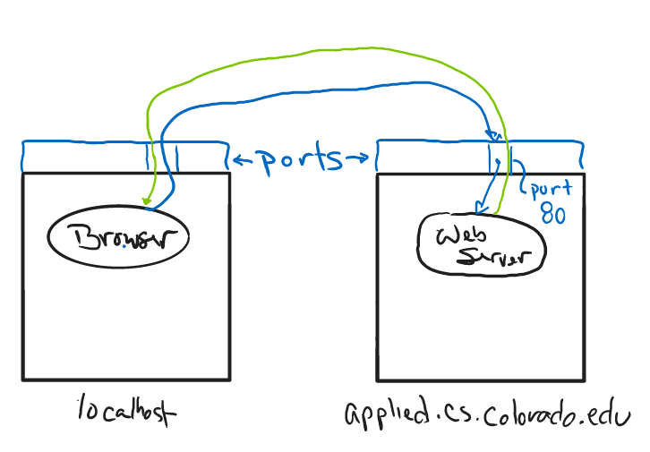
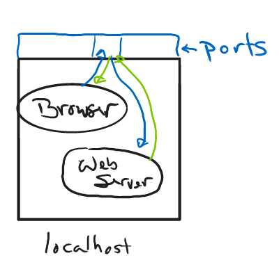
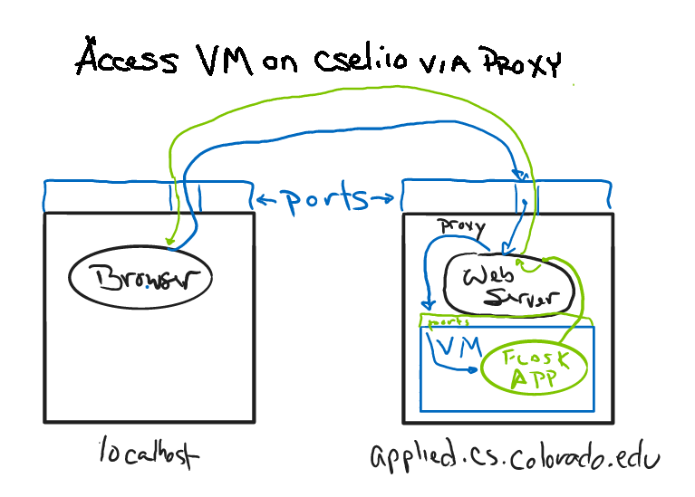
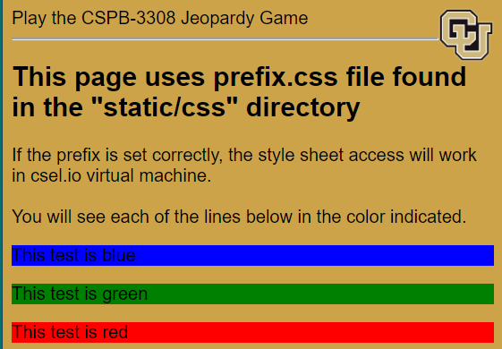

# CSPB-3308  Lab 6 :  Flask Tutorial
<figure width=100%>
  
</figure>
<hr>
Flask is a web framework, which means it provides you with tools, libraries and technologies that allow you to build a web application. The web application can be as simple as a few web pages, a blog, a wiki, or as complex as a full web application with dynamic pages and access to database data.   

Flask is a micro-framework that is written in Python. It is classified as a micro-framework because it does not require particular tools or libraries. It has no database abstraction layer, form validation, or any other components, but there are many third-party libraries provide common functions.
One of the drawbacks of a light weight framework is that you will have to do more work on your own.  This is good when doing school projects, but may become cumbersome if you are working to create a complex website (100's of pages)

Flask is a back-end framework, which means that it provides the technologies, tools, and modules that can be used to build the functional rendering of pages of the web app rather than the design or look of it. Flask is considered one of the easiest frameworks to learn for beginners.    

<hr>

In this lab you will be installing the Flask application, setting up your environment to run a web service, and writing the code to render web pages in your browser.
This is an individual project where each student will create a basic web server and support a number of independent web pages. 
 
You can install Flask in a virtual environment on your local system or on the **csel.io** jupyterHub virtual machine.   If you will be working in the **csel.io** environment, there are a few extra steps to setup the flask pages to be accessed in your local browser while getting information from the virtual machine.

Here are descriptions of the files in the lab repository:
```
.
├── images
│   └── ...
├── samples
│   └── ...
├── static
│   ├── css
│   │   └── prefix.css
│   └── images
│       └── prefix_test.html
├── templates
│   └── prefix_test.html
├── lab6_app.py
├── prefix.py
├── setup.cmds
├── LAB_6_ROUTES.md
└── README.md
```
 
|Filename | &nbsp;&nbsp;&nbsp;&nbsp;&nbsp; | Description |
|--- |--- |--- |
| images || directory with images for the README files |
| samples || directory with files used for page generation |
| static || directory with files needed for page display |
| &nbsp;&nbsp;&nbsp;css || directory with files for testing **prefix.py** |
| &nbsp;&nbsp;&nbsp;images || directory with images for testing **prefix.py** |
| templates || directory with template HTML for rendering test pages for **prefix.py** |
| prefix.py || Flask app containing routines needed to run web service on csel.io virtual machine with access from local browser |
| lab6_app.py || starter code for Flask app with calls to **prefix.py** |
| setup.cmds || commands to setup your shell to run a Flask app |
| LAB_6_ROUTES.md || description of the different routes that can be chosen as deliverables |
| README.md | | generic instructions |
<br><br>

 
##### Please install Flask on the machine of your choice and work through the Flask quickstart up through the section "Render Templates"
<br>
<hr>

### Step 1 : Creating a Virtual Environment and Installing Flask
You will be installing the Flask application.  Depending on which system, Python, and currently installed utilities, you may be installing different versions of Flask. Sometimes you need to run two different sets of applications, but need to isolate them as if they were the only version on the system.
 
A virtual environment is a Python environment such that the Python interpreter, libraries and scripts installed into it are isolated from those installed in other virtual environments, and (by default) any libraries installed on a computer.
A virtual environment is a directory tree which contains Python executable files and other files which indicate that it is a virtual environment.  Once you activate a virtual environment, any installations will occur only in that virtual environment.  

 
Create a Virtual Environment as described in the videos.  Creating a new virtual environment is also reviewed in the Flask Installation guide. 
<span style="color:red">Make sure to create your virtual environment OUTSIDE of the lab repository.</span>  The virtual environment can be very large depending on the set of utilities and application that are installed.  These can be hundreds of megabytes of data that SHOULD NOT be stored in your repository.   The virtual environment is usually created in the directory above where you store your cloned repositories.
 
Once a virtual environment has been created, it can be “activated” using a script in the virtual environment’s binary directory. The invocation of the script is platform-specific (<venv> must be replaced by the path of the directory containing the virtual environment):

When a virtual environment is active, the VIRTUAL_ENV environment variable is set to the path of the virtual environment. This can be used to check if one is running inside a virtual environment.  All scripts  or applications will first check the Python virtual environment to find the files.  You can run all your commands without needing to know which environment is currently active.

You can deactivate a virtual environment by typing “deactivate” in your shell. The exact mechanism is platform-specific and is an internal implementation detail (typically a script or shell function will be used).

##### Follow the setup procedure described in:
 
https://flask.palletsprojects.com/en/2.2.x/installation/#installation
 
<span style="color:red">Remember that you DO NOT include your virtual environment in the repository.</span>  It adds unneeded and unwanted megabytes to the repository.
<hr>
 
### Step 2 : Creating Web Service and Routes from the Flask Tutorial

You will be working though the Flask quickstart tutorial and creating support for a set of web pages.   But first we need to talk about how your browser will access your Flask application depending on where you are running your code.
When you are running the flask application on your **CSel.io** virtual machine, you will need to use a slightly different web address to see your pages in the first part of the tutorial.
You will also need to complete Step 3 before continuing with the tutorial.



To access a page (like a Moodle page) the browser on your local machine will send a message to the *applied.cs.colorado.edu* server.  There is a program listening for requests on that machine.  Specifically, the program listens on a specific port. Port 80 is the port number assigned to commonly used internet communication protocol, Hypertext Transfer Protocol (HTTP). It is the default network port used to send and receive unencrypted web pages Normally the port is left off your browser request, but you will need to include the port number when running another listening application like Flask.


    
Flask is an application that will listen on the port number that it is configured.
Flask will by default use port 5000 and all requests by a browser will need to include that port number.  When you are running a version of the Flask app on your local machine, your browser can access that application by a modification to the URL given to the browser. To access the default page of the web service on your local machine you can use `https://localhost:5000`, where the `5000` is the port number being used by Flask.  Another URL that will also reach your local machine is the magic address  `https://127.0.0.1:5000` where the `:5000` is again the port number.



When you are running your code on the *csel.io* virtual machines, the path for the request becomes more complex.  Your local web browser is accessing the *applied.cs.colorao.edu* server and talking to the virtual machine running in that server environment.   When you run a application on your VM, it is actually running on the server and the server is sending information to the browser on your local machine.

If you want to talk with the Flask application running in your VM, you must specify that application in the URL.
To access the pages when you are running the web service on the *CSel.io* Virtual Machine, use the following address:
```
https://coding.csel.io/user/<user name>/proxy/5000
```
Again, the `5000` is the port your Flask application is using.  The `<user name>` is replaced with your user name used by the *CSel.io* system.  Look at the address field when you are in a browser window for the virtual machine.  You will probably see your CU Id in the address.  That is the value that you replace in the web address listed above.
    
The *\<user name\>* in the URL will cause the web service to route your request to the application handling your VM.  The *proxy* is telling your VM handler that you want to send the request to a specific port on the VM.  The port specified must be the port that your Flask app is listening to (5000 by default).  

### Creating the Routes from Flask Tutorial
Now that you can run the Flask app  on your *csel.io* virtual machine (and your local machine if you want), you can begin the tutorial provided by Flask.
Work through the Flask quickstart and complete the steps of the tutorial through the **Variable Rules** section.
    
https://flask.palletsprojects.com/en/2.2.x/quickstart/


#### First set of Required Routes from Flask Tutorial for Lab
You will create a number of routes while completing the tutorial.  Below is a list of the routes that you should have created up to this point in the tutorial:
    
```
1. static text page, "index"   @app.route('/')
2. static text page, "hello"   @app.route('/hello')
3. static text page, "project" @app.route('/projects/')
4. static text page, "about"   @app.route('/about')
5. dynamic text, route parameter, string  @app.route('/user/<username>')
6. dynamic text, route parameter, int     @app.route('/post/<int:post_id>')
7. dynamic text, route parameter, subpath @app.route('/path/<path:subpath>')
```
* The "static text page" means that the page text does not change.  The page text is statically generated and is usually hard coded in the source.    
* The "dynamic text" indicates that the page text can be different in different context, i.e. when including the value of a parameter.
<hr>

### Step 3 - Setup DEBUG Environment for Flask
    
Often you will create a link to another page, or you will need to access information stored on the webserver such as style sheets or images.  You must create a paths to these resources that are correct for the environment in which the browser is running.  In the tutorial section on *Unique URLs / Redirection Behavior* you will see the use of paths to other pages.  In the *URL Building* section you will see code containing `url_for('index')` which will print the generated URL for that page on the terminal window for the Flask app.  When you are running in the *CSel.io* virtual machines, the URL must include the `proxy` indirection describe in our previous instructions. The changes we installed will automatically place the `proxy` information into the URL when you call the  `url_for(...)` function.
    
When using the *csel.io* environment, you can run the Flask server in a terminal window on the VM.  You can configure Flask from either from the command line or by setting environment variables.  There is a sample *setup.cmds* file to show you how to enable *DEBUG* and to set the port to *3308* instead of the default.  Because you are using your local browser to access the development environment on your *csel.io* virtual machine, you must augment the URL to include your user id.
The following URL in your browser `https://coding.csel.io/user/<username>` (where `<username>` is your CU id) will access your virtual machine interface.
When you run the flask service on the virtual machine, you need to create a URL that includes the path to your virtual machine and that you want to access a different port.
This is done be appending `proxy/<port number>` to the path.  

For example, I reach my Flask web service with `https://coding.csel.io/user/knoxd/proxy/3308/` to display the default page.  I normally use 3308 as the port number so that I know it is my Flask app vs another default Flask app. To get the `prefix_url` page of my web site use:
```
https://coding.csel.io/user/knoxd/proxy/3308/prefix_url
```
    
This URL pattern works well when using the browser to access simple pages that do not need access to resources local to the Flask service.
If you want the local browser to display an image stored locally in the *csel.io* virtual machine web server, you must make sure that the `proxy` information is included in all paths that are generated by the Flask processing.  For your lab, you will probably want to access stylesheets, graphic images, and other local files on the virtual machine.
This requires that we modify the basic Flask application to include the prefix for every local file the browser will need to access.  With the correct `proxy`, the browser will have read access to those file on the virtual machine.

##### Automation of the *Proxy* path when generating URLs for links
Because the indirect path access is a common occurrence, there is an automated procedure for creating the indirect paths.  
We have provided the automated  inclusion of the prefix for all your page addresses.  Included in the Lab repository is a file that contains everything you need.  You just need to access that code.  The `lab6_app.py` file is starter code that is already setup to use that code.  You can just extend the Flask application by adding more routes to the starter code.


    
To test the prefix functionality, you can run the prefix.py file in Flask.  Use `flask --app prefix:main  run` to activate the web service using the `prefix.py` file.  You can access the test routes listed below that are available in the prefix.py file.

* `https://coding.csel.io/user/<username>/proxy/3308/prefix_url` to display the URL path used. 
    
* `https://coding.csel.io/user/<username>/proxy/3308/prefix_link` to display images from the virtual machine on that page if the prefix is set correctly.  You should also be able to click on the first link to get the image displayed by itself.
* `https://coding.csel.io/user/<username>/proxy/3308/prefix_css` to render a page that uses a local CSS file to set colors and other style attributes for the page.
Right click on the page and select the `view source` menu item to see the source of the page being rendered.  You will see the "proxy" information is a number of places.
    
#### Make sure the testing pages work before writing and testing your own routes.
You may want to set the environment variables for Flask.  The `setup.cmds` file has a set of the variables that make it easier to debug your Flask code.  To get these variables set, use `. ./setup.cmds` or `source ./setup.cmds` to run the commands in the setup file.

#### You need to make sure your code will work in `CSel.io` virtual machine to be graded
Your code will be graded by running it within a **csel.io** virtual machine.  The required routes will each be accessed to validate the implementation. You should have created a `projects` route to show a page with links to all your other pages.  When your lab is graded, we will run your code in a *csel.io* environment and access each page on your *projects* page.
    
<hr>

### Step 4: Continue the Tutorial through the *Rendering Templates* section

Continue with the tutorial and complete the sections for *Unique URLs / Redirection Behavior* and *URL Building*.  The `HTTP Methods` section will provide you with the basics needed to create a login page that will be sufficient for your project.   Create functions within your Python code for the two functions `do_the_login()` and `show_the_login_form()` (they can just print out that they were called).
   
The tutorial section on `Static Files` show the use of `url_for` to generate the information needed to access a resource.
    
The last tutorial section you will complete is the `Rendering Templates` section.
If your website contains only few pages, changing the style of a page or adding content will take you some time but is doable. However, if you have a lot of pages (for example the list of items you sell in your store), this task would become overwhelming.

By using templates you are able to set a basic layout for your pages and mention which element will change. This way you can define your header once and keep it consistent over all the pages of your website, and if you need to change your header, you will only have to update it in one place.

Using a template engine will save you a lot of time when creating your application but also when updating and maintaining it. See a quick introduction to templates here: [How To Use Templates In A Flask Application](https://www.digitalocean.com/community/tutorials/how-to-use-templates-in-a-flask-application)
 


After you have completed the tutorial sections, your `lab6_app.py` file should be containing all the routes described in flask tutorial.

##### Required Routes from Flask Tutorial
```
1. static text page, "index"   @app.route('/')
2. static text page, "hello"   @app.route('/hello')
3. static text page, "project" @app.route('/projects/')
4. static text page, "about"   @app.route('/about')
5. dynamic text, route parameter, string  @app.route('/user/<username>')
6. dynamic text, route parameter, int     @app.route('/post/<int:post_id>')
7. dynamic text, route parameter, subpath @app.route('/path/<path:subpath>')
8. methods for GET and POST, @app.route('/login', methods=['GET', 'POST'])
9. render template,  @app.route('/hello/<name>'), render_template('hello.html', name=name)
```
    
For now you just need to have prototype routines for the login and logout functionality.  They do not need to perform any real tasks.
<hr>

### Step 5 : Creating Custom Information for basic Routes

Modify the static text generated for the `index` route to include a list of all the routes you have created in your lab.   You will also add additional information to some other of the required routes.

* Change the `hello` page to welcome the reader and have references our course and lab numbers.
* Change the `about` page to list the following information:
   * Team #
   * CU id
   * GitHub name
* The `index` page must list all the routes you have defined.  It should list the required routes under a heading `Required Routes` (hint: lookup the \<h1\> tag).
* The `projects` page must list the *optional routes* implemented and their use (parameters, possible values, ...).<br>Place these under an `Optional Routes` heading.

<hr>

### Step 6 : Creating Custom Routes
Now that you have written a few routes and produced a few pages, you should have the basics down.  Next you will create some custom pages using HTML tags.
Below is a list of possible custom routes that you can create. The number in parentheses is the relative amount of effort required (as in Agile task sizing) to create the route.  
The more difficult items require programming to create the HTML structures on the page.  This will take more time as you need to learn a bit more about HTML tags (before we get to them in the course), but will get you ahead for implementing your project.


You get to select a set of custom routes to implement for this lab. 
Select a set of routes from the lists below (one from each section A, B, C)

For more descriptions and details about implementation of these custom routes, read the [LAB_6_ROUTE_DESC.md](LAB_6_ROUTE_DESC.md) file. 

#### A. Static Pages ( static ascii text as embedded string or data read from file)
* A.1 (1) static ascii text page, text read from known filename.
* A.2 (1) static ascii text page, text read from text file specified in a route parameter.

#### B. Static HTML Pages ( static HTML text as embedded string or data read from file)
* B.1 (1) static HTML page, HTML source read from known filename.
* B.2 (2) static HTML page, HTML source read from file specified in a route parameter.

#### C. Dynamically Built Pages (create the string of HTML programmatically)
* C.1 (2) dynamic text, read, increment, and write a value in a file,  value added to page.
* C.2 (3) dynamic text, display the results of system call (e.g. text = os.system(cmd), where cmd is command line string).
* C.3 (2) dynamic text, display form data received in the URL (name/value pairs in URL).
* 
* C.4 (3) dynamic HTML, display an HTML list from Python list.
* C.5 (3) dynamic HTML, display an HTML table from Python list of lists Each item in the outer list is a row, each item in the inner list is a column.
* C.6 (3) dynamic HTML, display an HTML list from Python dictionary  (columns show key and value).

#### If you have time, try to implement some of the pages described below in sections D and E.
These are optional, but will give you experience that would be useful for your project.
    
#### D. Rendering Templates with Substitution (using render_template)
Templates are files that contain static data as well as placeholders for dynamic data.

* D.1 (2) dynamic text, create template with placeholders, render with static data.
* D.1 (2) dynamic text, create template with placeholders, render with dynamic  data (url parameter).
* D.1 (2) dynamic text, create template with placeholders, render with dynamic  data (url form data).
* D.1 (3) dynamic text, create template with for loop placeholder, render using static Python list.
* D.1 (3) dynamic text, create template with for loop placeholder, render using Python list.

#### E. Special Routes
* E.1 (2) error handler for 404 error (see Flask tutorial: “Redirects and Errors”)
* E.2 (3) dynamic HTML, display an HTML table from system data (OS environment variables and/or Flask 
* E.3 (4) dynamic HTML, display an HTML table from Flask configuration to list the defined routes.
<hr>
 


Commit and Push your Flask work in a `lab6_app.py` file containing the required and custom routes that you have created.  Make sure to comment each route to indicate which of the items that route is implementing.

<hr>

### You have completed Lab-6
    
Here is what you should have accomplished:
	
	1. Created a virtual environment with Flask installed (not in the repository)
	2. Created the routes described in the Flask Tutorial
	3. Created a set of custom routes for your web site (comments in code describe each route's purpose)

##### You should have approximately the following structure in your project (your flies will vary depending on your implementations):
```
.
├── lab6_app.py (containing both required and custom routes)
├── images
│   ├── . . .  your new images
│   └── . . .  <== cloned images
├── static
│   ├── . . .  your new static files
│   └── . . .  <== cloned static files
│── templates
│   ├── . . .  your new template files
│   └── . . .  <== cloned template files
├── setup.sh (optional)
├── LAB_6_README.md
└── README.md

```


Although the grading will be done by accessing your Git Classroom remote repository, <br>
you must submit the following to Moodle Assignment:

    * Your name:
    * CU ID: (4 letters - 4 digits)
    * GitHub Username:
    * hours to complete lab:


**IMPORTANT**: Make sure that all your added files and changes are **pushed** to the remote repository before going to Moodle to submit your completion information in the Moodle assignment.

<hr><hr><hr>

