# CSPB-3308  Lab 6 :  Flask Tutorial - Custom Routes  
<figure width=100%>
  
</figure>
<hr>


### This Documentation is still Under Construction 
 Please report all speeling and grammered issues.<br>
 Also let us know about any unclear descriptions of work to be performed. 
 <br>
<hr>
    
### Exploring HTML
We will be exploring HTML in a future lab, but here are a few things you need to know to complete the Flask lab.

HTML is a tag language.  There are start and end tags that you use to give the browser instructions about how to present your information.  I consider writing HTML to be the same as other programming languages.  Instead of giving instructions to the Python command interpreter or the C compiler, you are instructing the browser.

To make a section of text be displayed in a bold font, place the `<b>` and `</b>` tags around the text.
```
Normal text can be <b> bolded text </b> and then return to normal. 
```

You can also specify text to be displayed as italic.
```
Normal text can be <b> bolded text </b> and then return to normal. 
It can also be <i> italic text </i>.

<b><i>OR both!</i></b>
```
You can overlap the instructions (although it is not the best practice because it does not work in every rendering application).
```
This is normal, <b>bolded text, <i>bold and italic,</b> 
just italic</i>.
```

### Creating Interesting Routes for Flask Server
In the description of the lab, you are asked to create your own routes that display pages that have specific characteristics. In this document, we will attempt to give examples of the HTML display that each one of the route ideas would produce.

### Static Pages
Each of the static pages can be stored within the Python server code as a single string.  You will have already created some of the when implementing the simple routes that return strings like "Hello".

You can create multiple line strings in Python to store long strings.
```
@app.route('/about')
def about():
   long_string = ''' This is text on multiple
                     lines of the Python file,
                     but are all part of one string!
                 '''
                 
   return long_string
   
@app.route('/table')
def table():
   long_string = ''' This is text outside of table.
                     <table>
 
                          --- place HTML for rows/columns here --
 
                     </table>
                 '''
                 
   return long_string

```
The results from a call to `about()` will have all the indentation and line endings in the string.
```
' This is text on multiple\n                     lines of the Python file,\n                     but are all part of one string!\n                 '
```
 
You can add HTML tags into those static strings.  For example, the HTML above for bold and italic could be stored as a string and returned as the response from a route.  The different types of HTML displays for lists and tables can also be stored statically.  Below is a simple table that has two rows and three columns filled with data.
```
<table>
 <tr>
     <td>one A</td>
     <td>one B</td>
     <td>one C</td>
 </tr>
 <tr>
     <td>two A</td>
     <td>two B</td>
     <td>two C</td>
 </tr>
</table>
```
Each row is delimited by the `<tr> ... </tr>` tag.  Similarly, each column is delimited by the `<td> ... </td>` tag.   The whole table is delimited with the `<table> ... </table>` tag.
Here is what a string with the table tag listed above will look like when it is returned from a route and rendered in the display by a browser.

<hr>
<table>
 <tr>
     <td>one A</td>
     <td>one B</td>
     <td>one C</td>
 </tr>
 <tr>
     <td>two A</td>
     <td>two B</td>
     <td>two C</td>
 </tr>
</table>
<hr>

[W3Schools](https://www.w3schools.com/tags/) is a great place to learn how to use different HTML tags.  See the instructions on how to use different tags in HTML at the [W3Schools.com](https://www.w3schools.com/tags/) website.

<table>
 <tr>
     <td>Construct</td>
     <td>Link</td>
 </tr>
 <tr>
     <td>Bold</td>
  <td> <a href="https://www.w3schools.com/tags/tag_b.asp"> https://www.w3schools.com/tags/tag_b.asp </a> </td>
 </tr>
 <tr>
     <td>Italic</td>
  <td> <a href="https://www.w3schools.com/tags/tag_i.asp"> https://www.w3schools.com/tags/tag_i.asp </a> </td>
 </tr>
 <tr>
     <td>Headers</td>
  <td> <a href="https://www.w3schools.com/tags/tag_hn.asp"> https://www.w3schools.com/tags/tag_hn.asp </a> </td>
 </tr>
 <tr>
     <td>Ordered Lists</td>
  <td> <a href="https://www.w3schools.com/tags/tag_ol.asp"> https://www.w3schools.com/tags/tag_ol.asp </a> </td>
 </tr>
 <tr>
     <td>Unordered Lists</td>
  <td> <a href="https://www.w3schools.com/tags/tag_ul.asp"> https://www.w3schools.com/tags/tag_ul.asp </a> </td>
 </tr>
 <tr>
     <td>Tables</td>
  <td> <a href="https://www.w3schools.com/tags/tag_table.asp"> https://www.w3schools.com/tags/tag_table.asp </a> </td>
 </tr>
</table>

### Dynamic Creation of HTML string 
The string can be stored statically like we have seen above, or dynamically created.  
Using concatenation we can add more text to a string.  
For example, we can place all the values from 1 to 10 on separate lines.
```
   response = "<b>"   # Make everything bold
   
   for i in range(10):
       response += str(i+1)
       response += "<br>"   # cause a line break
   response += "</b>"   # close bold tag
   
```

We could get the data for each element from a list, a dictionary, read them from a file, or even get the data from a database.
You dynamically build the HTML string to be returned to the browser.

### Reading Data from a File
You can read and parse lines of data from a file as needed.  Once you have the data,  you would dynamically generate a information to be placed on the page.

See [Example of using Python WITH statement](https://www.freecodecamp.org/news/with-open-in-python-with-statement-syntax-example/) to view examples of reading file data into a string.

<hr>
    

### A. Static Pages ( static ascii text as embedded string or data read from file)
* A.1 (1) static ascii text page, with preformatted text concatenated with route parameter information.
* A.2 (1) static ascii text page, text read from known filename.
* A.3 (1) static ascii text page, text read from text file specified in a route parameter.

### B. Static HTML Pages ( static HTML text as embedded string or data read from file)
* B.1 (1) static HTML page, HTML read from known filename.
* B.2 (2) static HTML page, HTML read from file specified in a route parameter.
* B.3 (2) static HTML page, the HTML displays a list of static data.
* B.4 (2) static HTML page, the HTML displays a table of static data.

### C. Dynamically Built Pages (create the string of HTML programmatically)
* C.1 (1) dynamic text, use a global variable that is increment on access and its value added to page.
* C.2 (2) dynamic text, read, increment, and write a value in a file,  value added to page.
* C.3 (3) dynamic text, display the results of system call (e.g. text = os.system(cmd), where cmd is command line string).
* C.4 (2) dynamic text, display form data received in the URL (name/value pairs in URL).
* 
* C.5 (3) dynamic HTML, display an HTML list from Python list.
* C.6 (3) dynamic HTML, display an HTML table from Python list of lists Each item in the outer list is a row, each item in the inner list is a column.
* C.7 (3) dynamic HTML, display an HTML list from Python dictonary (columns show key and value).
* C.8 (3) dynamic HTML, display an HTML list from rows in a file
* C.9 (3) dynamic HTML, display an HTML table from rows,columns of a CSV data file.

### D. Rendering Templates with Substitution (using render_template)
Templates are files that contain static data as well as placeholders for dynamic data.

* D.1 (2) dynamic text, create template with placeholders, render with static data.
* D.1 (2) dynamic text, create template with placeholders, render with dymanic data (url parameter).
* D.1 (2) dynamic text, create template with placeholders, render with dymanic data (url form data).
* D.1 (3) dynamic text, create template with for loop placeholder, render using static Python list.
* D.1 (3) dynamic text, create template with for loop placeholder, render using Python list.

### E. Special Routes
* D.1 (2) error handler for 404 error (see Flask tutorial: “Redirects and Errors”)
* D.2 (3) dynamic HTML, display an HTML table from system data (OS environment variables and/or Flask 
* D.3 (4) dynamic HTML, display an HTML table from Flask configuration to list the defined routes.
<hr><hr><hr>

### A.2 Static Ascii Text Page, text read from known filename.
You can see the output of a sample text file that I've created called "story.txt" below.Using what you've learned you should be able to create and display a static (hardcoded filename) text file.You will need to open a file, then read and return the data
(Hint : you should be able to do this in less than 5 lines of code)  

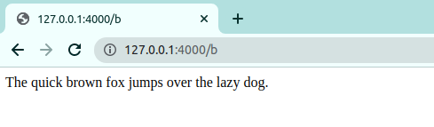

<hr>

###  A.3 Static Ascii Text Page, text read from text file specified in a route parameter
In the image below you can see I've passed in the filename "lotr" in the url.
This time display the text but without hardcoding the filename into the route source code. Instead pass the filename as a parameter so that we can display any text file in the directory.

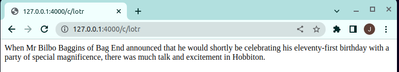

---

### B.1 Static HTML Page, HTML read from known filename
In the first image below you can see a sample html file that I've created containing the names of the different Avengers. 

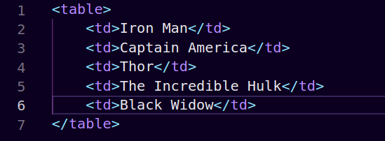

For this route the task is to display the html file using a static filename. To do so we begin by declaring a string with the location of the file that we want to display. Next we open the file and then read and return the contents of the file. (Hint : This took me 3 lines of code).It should look something like this

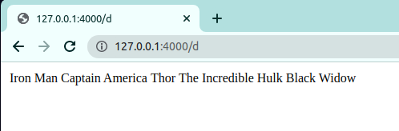

---

###  B.2 Static HTML Page, HTML read from file specified in a route parameter
In the first image below you can see a sample html file that I've created containing the names of the four houses at hogwarts.  

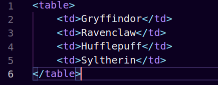  

For this route your task is to display an html file using a parameter file name. To do so make sure that you pass the filename of the html file you wish to open in the url of your route. Next you will need to open the html file by using the parameter filename (Hint : use .format to add in the filename to your variable). Lastly, with the file open read the file and return it. (Hint: This took me roughly 3 lines of code) You should see something like this.

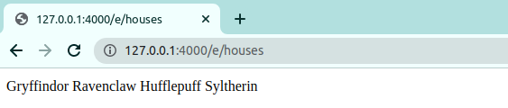  

<hr>

###  B.3 Static HTML Page, the HTML displays a list of static data
Here we want to display a list within the HTML. In the first image below you can see a sample list that I've created containing the first six Star Wars movies.  

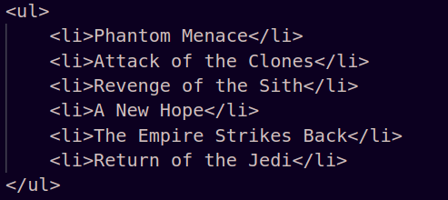

Note that I've surrounded each item in the list with a list item (\<li\>) tag. You could use an unordered list (\<ul\>) or an ordered list (\<ol\>). Assign a variable using Python multi-line string quotes ```'''``` to encapsulate the multiple lines of HTML. We can simply return that string variable as the results of the route.

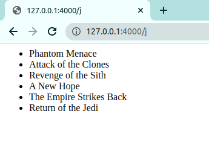  

<hr>

###  B.4 Static HTML Page, the HTML displays a table of static data
In the image below you can see that I've created a simple static table and displayed it. To do so begin by creating a long string with the html that you want to display. Then simply return the string. When thinking of the table it can be helpful to understand the different tags you will use here. 

There are a number of tags used in describing an HTML table.  I have listed a few of them below.  These should be enough for you to create a simple table.

|tag|&nbsp;&nbsp;&nbsp;&nbsp;|description|
|---|---|---|
|\<table\>| | surrounds the data for the table|
|\<th\>| | table header (column header label)|
|\<tr\>| | table row, with multiple columns of data, surrounds the column data for that row|
|\<td\>| | table data (column data)|

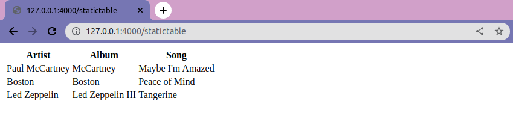

<hr>

### C.2 Dynamic Text, read, increment, and write a value in a file,  value added to page.
For this route we want to display a counter, that is we want to read in a number from a file, increment it, and then write that new number to the file and display its contents. This will represent the number of times that someone has visited this page. To do so first we will create a "hits" text file that contains our starting number. 

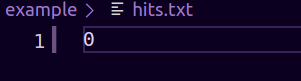

Next we will need to read in the contents of the file AS AN INTEGER. We will then increment that number to indicate that someone has visited the page. We then need to write that new number to our text file to update it for the future. Lastly as we need to display something on our web page we will return a string that contains the updated hits variable.

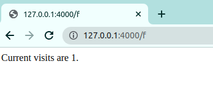

<hr>

###  C.3 Dynamic Text, display the results of system call 
For this route we want to show that we can use a system call  (e.g. text=os.system(cmd), where cmd is the command line string) and display its results. This might seem a little tricky but once you know which system call you want to use it should be relatively easy (DO NOT USE THIS SAME ONE). I chose to display the current working directory. Simply return the results of your system call and it should display on the page (Hint : Make sure that you check the data type of what you are returning)

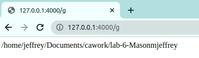

<hr>

### C.4 Dynamic HTML, name value pairs in the URL
In this route our goal is to pass paired data through the url and parse that data into our web page. In these cases data passed through the url will be in the format
```
127.0.0.1:4000/h2?city=Atlanta&team_name=Braves
```
Here our route doesn't actually take parameters but instead we use a question mark '?' to indicate the query. We then indicate the arguments that we are passing by defining what city and team_name are. Note that we separate the arguments with an ampersand in the url.

Now for the route. Here we are going to use the requests part of flask. Namely 
```
requests.args.get('argument_name')
```
For each argument in the url, assign the requested argument to a variable (replace argument_name with the argument in the url still in quotes). Next simply return a string containing the arguments formatted in HTML.
My page looked like this

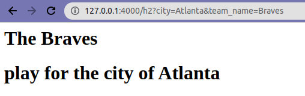
<hr>

###  C.5 Dynamic HTML, display an HTML list from Python list

This route is a little bit more complex but I actually really enjoyed learning about it. Here we want to dynamically build an html list to display from an array. I've declared a sample array that holds the names of several farm animals and now we are going to turn this into our html list. The first step to doing this is to declare a string that begins with an html tag, you can use the paragraph tag, bold tag, your choice. Next we are going to iterate over the array of animals and for every animal in the list we are going to append that animal to our html string along with a line break tag for each animal. That way after each item in the list we have a line break before the next item. After we finish iterating through the list we need one last thing in our string, we need to remember to close the html tag that we used to start out list. Our final step is to return the full html string that we've created. You should get something like the following list.

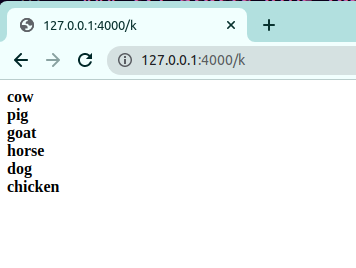

<hr>

###  C.6 Dynamic HTML, display an HTML table from Python list of lists data structure
Each item in the outer list is a row, each item in the inner list is a column.
```
table_data = [ ['row1', 'contains', 'column data' ], 
               ['row 2', 'row 2 item', 'row 2 item'] ]
for row_item in table_data:
    response_string+="<tr>
    for col_item in row_item:
        response_string+="<td>{}</td>".format(team_data)
    response_string+="</tr>"
```
Running this code in Python gives the following results:
```
             row1        contains      column data
             row 2      row 2 item      row 2 item
```

For this route we want to dynamically create an HTML string that will display a table of information. I've started by creating two sample lists, one with NBA team names and one with their corresponding cities.

```
 [ [Boston, Celtics], [Atlanta, Hawks], [San Francisco, Warriors], 
   [Los Angeles, Lakers], [New Orleans, Pelicans], [Denver, Nuggets] ]
```

To begin our table we are going to declare our string that will start with the opening table tag. Next we are going to iterate over the length of our lists to add each paired item. In each iteration we are going to start by appending a table row tag to our string. We then are going to append an item to our string from the first list encapsulated by table data tags. Then append the corresponding item from our second list encapsulated by table data tags. To end each iteration we want to close the table row tag that we opened at the start of the iteration. Once we have finished going through our lists our last step is to close the outer table tag. Now all we need to do is return the string.

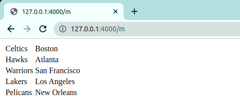


<hr>

### C.7 Dynamic HTML, display an HTML list from Python dictonary (columns show key and value).

For this route our goal is to take a python dictionary and display the keys and values on the page. To start declare a python dictionary filled with the information you'd like to share. Next start your response string with the unordered list tag. You will then iterate through the items in your dictionary. For each item you will start with a list item tag, then append the key and then the value to your dictionary then close the list item tag. Finally close the list tag and return the response string. Your page should look something like this.

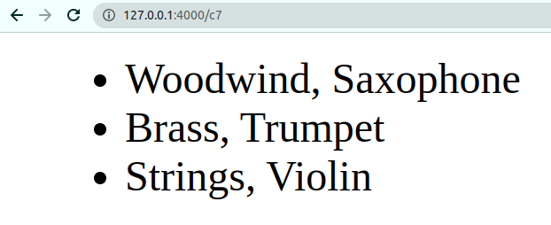

<hr>

### C.8 Dynamic HTML, display an HTML list from rows in a file

For this route our goal is to display an HTML list from rows in a text file. I've declared a sample file containing the list of some of my favourite cooking shows.

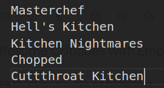

To display this list on a page we will begin by opening the text file in our route. Then with the file open we will start our response string with a list tag. We will then iterate through the lines in our file and as we do so we will append each line to our response string encapsulated with list item tags. Finally we will close the list and return the response string. It should look something like this.

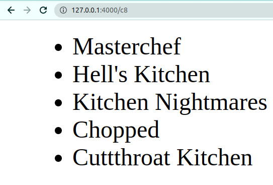

### C.9 Dynamic HTML, display an HTML table from rows,columns of a CSV data file.

For this route our goal is to take the data in a CSV file and display it on a web page. I've created my own csv file containing the names and teams of several quarterbacks in the nfl.

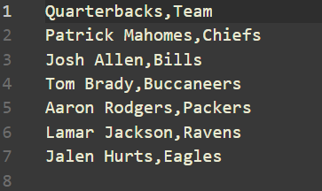

Link to the file and open it. Next we need to create out response string. Because we are going to display this information in a table start our response string with a table tag. Next we are going to iterate through each line in the csv file. Within each iteration we want to split each individual line on the comma ','. Next within the iteration start a row tag place in each piece of data with data tags and then close the row.
```
for line in data_file:
  line_info = line.split(',')
  response_string+="<tr>"
  response_string+="<td>{}</td>".format(line_info[0])
  response_string+="<td>{}</td>".format(line_info[1])
  response_string+="</tr> 
```
Once you've finished your loop close the table and finish by returning the response _string. Your result should look something like this

    