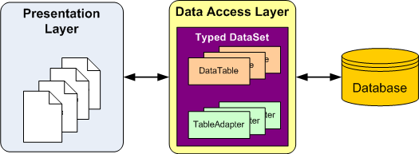
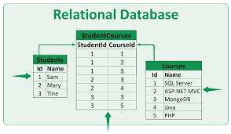
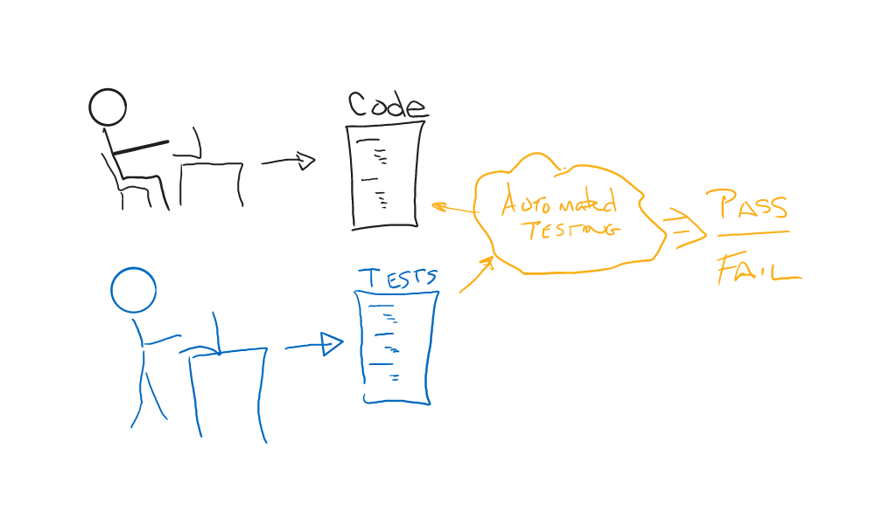
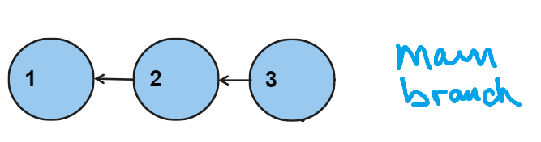
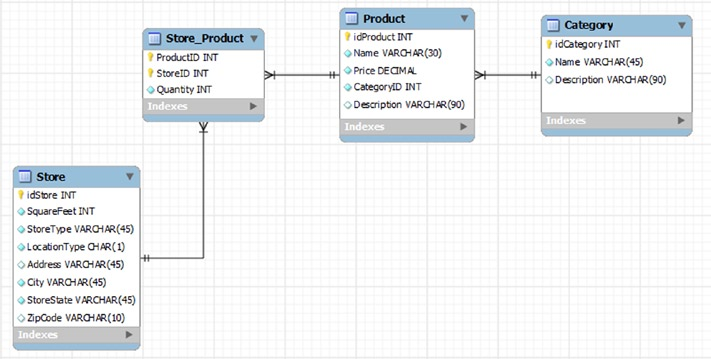

# CSPB-3308  Lab 7 :  SQL and Unit Testing
<figure width=100%>
  
</figure>
 
In Computer Science we spend a lot of time managing data and the volume of data has dramatically increased over the years.  To handle the complexities of the interrelationships between pieces of data, we can use Relational Databases.  Relational Database Systems (RDBMS) and the Standard Query Language (SQL) were developed in the 1970's and although the performance and capacity have increased, the basic functionality has remained the same. There are database management frontends that can be used to manage the whole database system as well as individual tables and rows of data.  These interfaces will allow you to issue commands to the DBMS directly and see the results displayed. There are also programmatic interfaces (APIs) that make connecting and issuing commands easy from languages like C++, Java, and Python.  The APIs allow developers to code the logic of database interaction with needing to understand the different ways each operating system uses to access a database server.  This abstraction makes it easier to understand the logic within the code by hiding the details.

<figure width=100%>
  
</figure>
 
Databases allow multiple users to simultaneously read and modify parts of the database information. The information may be stored within multiple tables with relationships between a row in one table and one or more rows in another table.  The classic example is for each of the students (student information stored in a table) there are multiple courses being taken (each course description is stored in a second table).  The relationship we need to store is to keep a record of student-course pairs.  This would be stored in a third table with two columns, one for student id, and a second for the course id.  A student could be in multiple courses and there would be one record in the table matching the student to each of the courses.  Now we can ask the database to get all the records for a specific student, or we could ask for all the students for a specific course.  

<figure width=100%>
  
</figure>
 
There is usually a database used to support most websites.  The information collected is stored and retrieved from the database and incorporated into the pages presented.  You will need to support a database in your team project for this course.  To make your website code easier to understand, you will create a set of functions that will handle the details of accessing the data in a database.   Your website routing functions will make calls to these  interface functions to insert and retrieve your data.  Usually this means creating functions to add data and functions to retrieve data.

<figure width=100%>
  
</figure>

In this lab you will create a set of Python functions to perform creation of tables, insertion of rows of data in the tables, and retrieval of the data by using the programmatic database interface.  This will allow the complexity of the code used to perform the database operations to be hidden or abstracted so that other parts of your website application will not need to know those details.  It also confines the logic and SQL commands needed to perform the operations into a single location instead of spread throughout the application.
 
You will also create unit test for an added function.  In Test Driven Development, the tests are created first, then the code to pass those tests is written.
 
### Why use a Database?
You will find databases in use on most web based applications as well as many applications running on your phone and even in the space station.   A database is nothing more than a set of data that can be stored and retrieved.
 
* Databases support data access  - Multiple users can read and modify the data at the same time. 
* Databases are searchable and sortable, so the data you need can be found quickly and easily.
* Databases are an integral part of business operations
* Every technology-based business needs a robust database along with a database management system to manage all their data.


### Why do we use Structured Query Language (SQL))?    

SQL is used to communicate with a database and it is the standard language for relational database management systems. SQL statements are used to perform tasks such as create and define the tables and attributes within the database,  insert, update, or delete data in the database, or to retrieve data from the database.
    
SQL is a simple query-based language that is easy to read and write.  The commands are compatible across different database management systems,  such as MySQL, Microsoft SQL Server, Oracle, and SQLite as well as many others.   It’s one of the most universal languages in the world. 
 
<hr>
 
### Lab Objectives

- Use SQL statements to create tables, insert rows, and select information from a database.  
- Create and use an API written in Python that will abstract the management of database connections, inserting, and retrieving  data from the database.
- Convert business logic to program logic and SQL statements.
- Practice creating Unit Tests.

<hr>

### Your changes to the repository MUST BE COMMITTED after each step of the lab 
There are multiple steps to achieve in the lab.  The order in which you complete each of the steps of this lab is important.  To verify that you have completed the steps in order, you will commit the files and changes to files after the completion of a step.  The repository log will verify the order you have completed each step in the lab.  Be sure to `push` your commits to your remote repository often.

<figure width=100%>
  
</figure>
 
There are three python files that will be created which will contain scripts to complete the steps.  One script will be a library of support functions to create a database, create the database tables, fill the database tables with demo data, and print information about the tables and data.  Another script will use those functions (import your support functions and call the routines) to build a sample database.  A third script will use the Python Unit Testing framework (`unittest`) to create a unit test for the support functions.   Besides testing the support functions already written, you will create a set of tests for a new support function that will add new data to the tables.  You will follow the Test Driven Development methodology where the tests are written first and then the code is written to pass the tests.  Each step of this process will be recorded by commits to your repository. **You will have many commits in this repository when you complete the lab.**
 
* It is essential that you create the files with the correct file names.
* You must create the tables and attributes with the correct names.
* Your support code must create the functions with the exact names and parameters given in the lab.
 
<hr>
 
### Overview of steps
You must create the correct filenames, function names, and function parameters as outlined in this document.
	
1. Create `dbAPI.py` file containing support routine `create`.  **Commit** changes to project.
1. Update `dbAPI.py` file to add support routine `fill`.  **Commit** changes to project.
1. Create `test_dbAPI.py` that includes and calls the support routines you have created.  **Commit** changes to project.
1. Create a `test_addProduct.py` that includes the `unittest` framework for Python.  Create at least one test for each of the requirements given for parameters.  **Commit** changes to project.
1. Update the `dbAPI.py` file to include a new function `addProduct(...)` that will perform the required parameters checks.  Remember to **commit** your changes after changing code to pass a single test.  There should be at least five commits for this section of the lab.

<hr>

### Step 1: Creating `dbAPI.py` file with support routines
Create a python file `dbAPI.py` that initializes a database with the schema described in image below.  
 
Use `import sqlite3` to access the functions that create connections and execute SQL commands within Python scripts. 
Note that SQLite has slightly different (and optional) types compared to most databases, see [SQL as understood by SQLite](https://www.sqlite.org/lang.html) .
 
SQLite will always create an automatically incrementing index id for each table.  This is essentially the row number of the data.  Other databases do not automatically provide this field, therefore any ID values that are used to relate information in one table to another should be explicitly created.  This means you should NOT take advantage of the automatic row number provided by SQLite and explicitly create a field that is a unique identifier for that row of data.

<figure width=100%>
  
</figure>

The file must define a function `create` that takes a single argument, for the database filename:
 
```
# Create a database with the filename given.
# Create the required tables and fields.
#
def create(db_filename):
    conn = sqlite3.connect(db_filename)
    ...
```

In this function you will need to *create* the four tables described in the image above.  That means you will need four `CREATE TABLE` SQL statements in your script.
You should **not** use rowid as the primary key for each of the four tables.  You should see that a file with the name passed into the create function is in the local directory.  The file will have a `.db` added if it is not specified in the name given.

 
#### Testing that the database is created correctly
Testing can be done by asking the database to show the tables and the table columns.  That means creating a SQL statement to retrieve that information.

Here is an example of how I would write some python code to get the schema information from the database (in fact, this is how I get the information from your database for grading your creation script):
```

def print_tables(db_filename):
    conn = sqlite3.connect(db_filename)
    c = conn.cursor()
    c.execute("SELECT name FROM sqlite_master WHERE type='table';")

    print ("\nTables:")
    for t in c.fetchall() :
        print ("\t[%s]"%t[0])

     ##   print ("\tColumns of", t[0])
        c.execute("PRAGMA table_info(%s);"%t[0])
        for attr in c.fetchall() :
            print ("\t\t", attr)
        
        print ("")
        
```

You can write additional support routines to print out information to be used while debugging your support code or testing framework code.


#### **Commit** changes to project and **push** to remote repository.
Once you have your code in `dbAPI.py` correctly creating the tables, perform a local commit and push those changes to your remote directory.  Make sure you have added function description comments and *purpose, author, usage* information in the beginning of the file.

<hr>
 
### Step 2: Create a routine to fill the database tables with some demo data
 You need to add a new function to the `dbAPI.py` file to place at least three items into each of the tables.

<pre>
def fill(db_filename):
    conn = sqlite3.connect(db_filename)
    ...
</pre>

- Insert at least 3 categories into the table `Category`.
- Insert at least 3 stores into the table `Store`.
- Insert at least 3 into `Product`. 
    * This insert **must use a sub-query select** on the `Category` table to get the  correct id from the table for a given category name.
- Insert at least 3 items into `Store_Product`. 
    * Take care to ensure that ProductID and StoreID correctly match the id  of their respective tables.
 
Your data values can be whatever values you like as long as they make sense and match the database schema.


#### **Commit** changes to project and **push** to remote repository.
Once you have your code in `dbAPI.py` correctly filling the tables, perform a local commit and push those changes to your remote directory.  Make sure you have added function description comments and *purpose, author, usage* information in the beginning of the file.

<hr>
 
### Step 3: creating `test_dbAPI.py` file to make calls to the `dbAPI` support routines 
You do not need to use the Unit Testing framework for this file.  Import the support routines and call the routines.  When you import any module, you can call the routines in that module by using the dot (`.`) operator.  For example there is a module that lets you access information from the OS.  There are many functions available such as getting the current directory or deleting a file.

```
import os
  . . .
   cwd = os.getcwd()
   status = os.chdir(...)
  . . .
   status = os.remove(...)
  . . .
```   
Notice that the calls to the module use the format \<module name\>.\<function name\> to specify the function.  You will use the same concept to import and call your support routines (`dbAPI.create(...)`).
 
#### Make sure the database has the tables and data that you inserted
Calling the functions in your support routines, create and fill the demo data into your database.  Now that the data is in the database, write some calls in Python to access the database and execute SQL commands.  Use any support routines you may have created to select the data and print out the results.  For this step you just need to visually verify that the data is correct. 

- Implement four test functions `test_category`, `test_store`, `test_product`, `test_store_product`.
  - Each test should run a SELECT statement on the table, and assert that the results are what you expect them to be. 

#### Make sure that no output is generated from the support routines except when calling the printing functions.

 If you have a `testing.py` file that only has the import function
```
import dbAPI
```

You should not see any output when you execute the support routines script.
There should not be any print statements that are executed when including your code in another python script.
The only print statements would be in functions that are not called when the file is imported.

```
$ python testing.py
$
```
 


#### **Commit** changes to project and **push** to remote repository.
Once you have your code in `test_dbAPI.py` correctly calling the support routines, perform a local commit and push those changes to your remote directory.    Make sure you have added function description comments and *purpose, author, usage* information in the beginning of the file. 
 
<hr>
 
### Step 4: Create a `test_addProduct.py` that includes the `unittest` framework for Python
Create a new file `test_addProduct.py` that imports `unittest` and `dbAPI`.
Write at least four new testcases in `test_addProduct.py` for a new function `addProduct`.
The `addProduct` function will take 5 parameters:
```
 addProduct(dbName, productName, price, categoryID, description)
```
 
Write tests to verify the following behavior:

- addProduct should raise a ValueError if name or description are empty or not strings.
- addProduct should raise a ValueError if price is less than 0 or not a number.
- addProduct should raise a ValueError if categoryID is not a valid row in the category table.
- If addProduct returns successfully, the product table should have a new row in it with the correct information.
 
#### Your python test code should:

- Implement a `setUp` method that creates a new sqlite3 database file (use `test.db`) and runs both functions.
  - See [setUp()](https://docs.python.org/3/library/unittest.html#unittest.TestCase.setUp) and [tearDown()](https://docs.python.org/3/library/unittest.html#unittest.TestCase.tearDown)
- Implement a `tearDown` method that deletes the database that was created.  Make handle exceptions for a failed remove.
- Implement at least 4 tests for the different behaviors and at least one expecting success.

#### You should write all the tests first, and verify that they fail. 
You will need to create the template for the support routine in the `dbAPI.py` file, but it should not raise an exception.  Make sure that all the tests fail (no exception is raised) when calling the function with an invalid parameter.

Once you have all the tests in place, proceed to writing the code that can pass the tests.


#### **Commit** changes to project and **push** to remote repository.
Once you have your code in `test_addProduct.py` correctly calling the support routines, perform a local commit and push those changes to your remote directory.    Make sure you have added function description comments and *purpose, author, usage* information in the beginning of the file. 
  
<hr>

### Step 5: Write code to pass a single test for `addProduct(...)`
Update the `dbAPI.py` file to include new code in the function `addProduct(...)` that will perform the required parameters checks.  Remember to **commit** your changes after changing code to pass a single test.  There should be at least five commits for this section of the lab.

You can use the following python statement to raise a ValueError when you find a validation error in the parameters:
```
    if (....) :
       raise ValueError
```
Make sure your  `addProduct` function performs a **SELECT** from the category table to get the validity of the given category id.


#### Individually **commit** changes to project for passing each test and **push** to remote repository.
Once you have your code in `dbAPI.py` correctly processing the checks on the parameters, perform a local commit and push those changes to your remote directory.    Make sure you have added function description comments and *purpose, author, usage* information in the beginning of the file. There should be at least five commits for this section of the lab.

<hr>

## Deliverables for this assignment
 * Your remote repository will be used to grade this assignment.  Make sure to push your local commits to your remote repository.
 
 * You must also provide the following text in the Moodle assignment submission:
   * Your name
   * CU ID: (4 letters - 4 digits)
   * GitHub ID:
   * number of hours it took to complete the lab
   
<hr><hr><hr>
   
