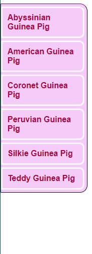
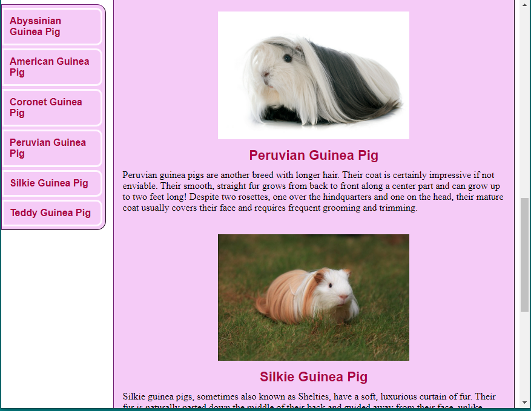
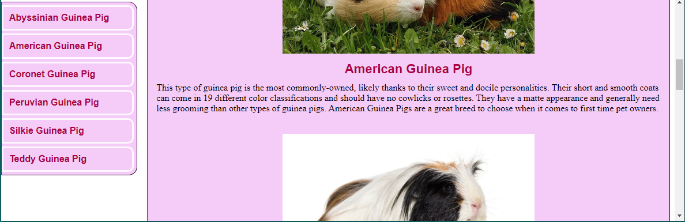
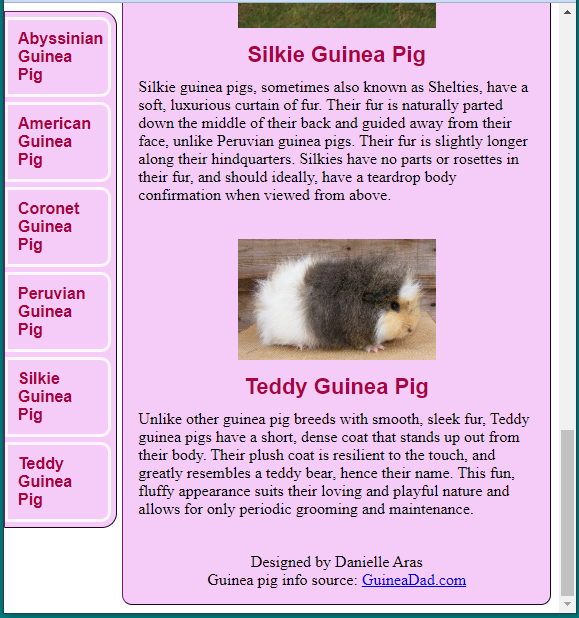

# CSPB-3308  Lab 8: HTML & CSS
<figure width=100%>
  
</figure>
<hr>

One of the most important reasons why the internet is so ubiquitous today is that a web server can describe the way a page should look on the local system.
The browser window will receive information from the from a remote server.
This information contains both content and some instructions about how to layout the information for the page.
The local browser will then *render* the image on the local computer using local settings and fonts.
HTML is the name of the structured data that is transferred from server to client.

HTML stands for *HyperText Markup Language* and is used to design web pages using instructions for page layout.
Lets break down the words in HTML. *Hypertext* is a term that describes the ability of one section of information to be *linked* to other information.
A *Markup language* can describe the general layout and attributes of the information being displayed.
Markup languages have existed since the late 1960s.
The first widely used markup language was SGML, a variant on GML that some systems still use today.
Developers at IBM used SGML to create large, complex documents that could be easily read and distributed.
In the 1990s when the internet was becoming more widely used, HTML was proposed to easily describe information to be shared.
HTML started off with less than 25 *tags* to mark text.  Developers and designers quickly adopted it throughout the World Wide Web.

XML is a more recent markup language but is still very popular.
Developed in late 1990s, XML is simple to read and easy to understand yet powerful enough to describe data between different systems.
We will be using some XML later in the course.

The HTML language is used to annotate or make notes for the application displaying the information.
Most markup languages (e.g. HTML, SGML, XML) are human-readable and contain *tagged* information.
The language uses *tags* to mark text with different attributes like bold, italic, and underline.
HTML also contains tags to explain the layout of the information.
Combining these two sets of tags provides a rich description to the browsers for displaying complex information.
    
##### Features
When we think, “what is a markup language,” we consider some common features. If you’re wondering whether a language is a markup language, compare the language to these hallmarks:

* A markup language uses tags to annotate texts. Tags are special words or characters that indicate when formatting should be applied.
* Tags come in pairs, with an opening tag and a closing tag. For example, in HTML, the bold tag is written as \<b\> and \</b\>.
* The text that goes between the opening and closing tags will be affected by the formatting. In the case of the bold tag, the document would show the text in bold font.
* Markup languages are easy to read. For the most part, anyone should be able to read and understand a markup language, even if they can’t write it.
* Markup languages also have a syntax, or set of rules, that define how to use the tags. This syntax allows for consistent and structured documents.

In this lab you will explore the layout described within HTML documents and create a page that uses some advanced features of HTML layout.
    
### You can work with a teammate on this assignment, but you must do it in a pair programming style.  
    
##### taken from https://duckly.com/blog/7-tips-for-successful-pair-programming
    
Pair programming is a great way to work on a software project and share knowledge. 
It’s when two or more programmers work together. 
Usually, one developer is leading while the other is providing feedback and following the development. 
The benefits of pair programming are many: improved code quality, greater knowledge transfer, and 
increased motivation and satisfaction among developers. With that said, there are some challenges 
to overcome when doing pair programming that you need to be aware of.
    
##### Pair programming tip \#1: Plan together

Before start programming, plan what you are going to do and what are your goals. Is this about building something new? Debugging? Mentoring a junior developer? Be clear about your goals and communicate them to your partner. It could be that the most experienced developer is responsible for planning, but it doesn't need to be like that. Plan together and have your partner participate too.

Be sure to know a bit about your peer before starting the pair programming session. There are many different ways to do this. Each person should be given the opportunity to chat before the session starts. They can get to know their development’s style, quirks, and preferences. This helps you both understand each other’s mental model and put a plan in practice that makes the session more productive.

**Plan your pair programming session:**

* What's the task, what we are trying to accomplish
* Length of the session
* How often should change roles
* Any personal preferences
    
   
##### Pair programming tip \#2: Change roles regularly

One of the most common mistakes developers make when doing pair programming is switching roles too often or not switching at all. How often you need to change roles depends on the experience level and how long is the session. If the session is less than 60 minutes long, you can switch just one time. If the session is shorter, it might be more productive to have just one person leading, but you still can switch in the half.

If you are working in a longer session, you need to be more conscious about the roles and when to change. It can happen that you are so focused on the task that you forget about changing roles. That's a mistake. Be sure to change regularly and you can use the Pomodoro technique to help with this.

In summary: to make things simple, start by changing roles every 30 minutes using the Pomodoro timer. Don't let your excitement of coding prevent you from giving the opportunity to the other developer to be leading the session.

##### Pair programming tip \#3: Good audio and video setup

Naturally, the pair programming tips from this guide are considering that you are working remotely. In this scenario is crucial to have a good audio and video setup that allows you to communicate clearly.

First a basic pair programming tip: Be sure to have a good internet connection and to be in a place without much noise.

Although is not required, it's good practice to turn ON your video camera when pair programming. Communication is not only about what you say, but your body expression, how your face is reacting, etc. By having a video camera active your colleague can be more engaged and the session can be more entertaining for both sides.

For audio communication, be sure to use headsets. You don't need to go crazy with professional fancy audio equipment. Anything that makes you comfortable works. A headset that you can properly hear the other person and that they can understand you is already good enough.

Some tools like Duckly (shameless plug, I know) can help you a lot here as it has all the features for real-time code sharing and audio and video communication.

##### Pair programming tip \#4: Avoid micro-management

One of the most annoying and counter-productive behaviors that can happen in a pair programming session is when a developer starts to micro-manage. This is more common than you know, but really kills the purpose of the pair programming. To have a safe environment for collaboration that increases knowledge sharing between developers.

Micro-management usually happens when one developer is more experienced (or just more opinionated) and try to force their point-of-view, dictate code, and is rigid about how exactly things should be done. This creates a negative feedback loop where confidence is low, more mistakes are done, more line-per-line comments...making the session slower and less collaborative.

##### Pair programming tip \#5: Be nice and patient

Similar to micro-management, lack of patient makes the pairing experience much worst. This could happen when working with people with different skill levels and when a more experienced dev doesn't give their partner time to process their code. It can be tempting to be interrupting their flow to quickly correct errors, but this only breaks their flow and confidence. You can always write things down and comment later.  This will give you time to understand if that's really a problem that should be fixed or maybe it was already fixed somewhere else (or you didn't notice that there was a different way to solve it).

However, independently if there is a mistake or not, just be nice to people. We are all learning and trying to have a good time. Rule of thumb: Just be a nice person to work and collaborate with.

##### Pair programming tip #6: Avoid external distractions

Specially when working remotely, there are several challenges and distractions that you need to overcome. Phone notifications, emails, delivery on the door, etc. These interruptions are easier to battle if you are leading the pair programming, but if you are following you can find yourself drifting away on some occasions.

Ignore emails or any media while pairing. Don't schedule meetings that can interrupt your session. On top of that, don't do super long sessions that can last for hours. Take breaks and schedule time for other activities that are not programming.

Be present and respectful with your partner, but also wise about how you allocate your time.

##### Pair programming tip \#7: Constant communication

Pair programming can be challenging, but it can be harder when one person has trouble keeping up or someone feels that they are coding alone. To avoid this, you should be actively communicating with your partner all the time. This will also make the session more engaging and fun. You don't need to be interrupting all the time or commenting on every single line (as we talked before), but let know that you are there for them and that you are working together.

The point of doing a pair programming session is to not be coding alone, so be present and participate with your partner.

Closing thoughts
Pair programming has a lot of advantages in comparison with solo coding: knowledge sharing, better code quality, improved communication. However, it also contains its own set of challenges. These pair programming tips can help you have a great collaborative and knowledge sharing session:

* plan your session properly
* change roles regularly
* have a good audio-video setup
* be mindful about micro-management
* be patient and nice with your people
* communicate with your partner

<hr>
    
### Lab Objectives
- Understand webpage layout
- Work with browser code inspection tools
- Practice creating interesting web pages
- Practice Pair Programming

<hr>

## Part 1: Manipulate a web page using browser inspection tools
For the first part, you will turn in a text file (lab8_part1.txt) 
that answers all of the numbered questions.

* Download boxes.html and boxes.css from moodle. Place both of them in the same
directory, then open boxes.html using either Mozilla Firefox or Google Chrome.
    
1. Right click on the webpage to inspect the elements (“Inspect Element” in Firefox,
“Inspect” in Chrome).
     * Give div1 a new background color. 
     * What css rule did you use? 
     * How would you write it in a css file so that only this div gets the new background color?
     * Edit the margin and padding attributes of the divs. 
     * What does changing the margin do?
What does changing the padding do?
1. Now change the background color of the `<p>` element inside div 1 to yellow.
     * Change the margin and padding of the yellow `<p>`. 
     * What happens if the margin is greater than 100px? 
     * What happens if the padding is greater than 100px?
     * Keeping the padding greater than 100px, change the overflow of div1. 
     * What is the difference between scroll and hidden?
1. Refresh the page to return the divs to their original states.
     * Give all divs the float: left attribute. 
     * What order are they in? 
     * What if they all have the float: right attribute instead?
    * Keeping all divs with the float: right attribute, give each one in turn the two attributes
float: left and clear: right. 
     * Describe the relative positions of the boxes with each combination.
1. Refresh the page to return the divs to their original states. Give the body element a margin value of 0px. 
     * What changes? 
     * What does this tell you about the default margin value?

<hr>

## Part 2: Create a CSS menu
For the second part, you will turn in your finished menu.html and menu.css files. 
Use whatever text editor you are most comfortable developing html/css using.


         
1. Create two files: menu.html and menu.css. Place these in the same directory.

1. Add a title and a link element in the header of menu.html to link it to menu.css.
1. In menu.html, create one parent div (this will be the main menu container) with at least 4 
divs inside of it (these will be the menu items). Write some text in `<p>` elements in the
menu item divs. You choose what text!  Create a page about something in which you are interested.
1. Change the menu div so that its width is 20% of the page.
1. Give each menu item a margin of 5px on the top, bottom, and right sides.
1. Give each menu item a total padding of 10px. Make sure to change or account for the
default settings of the `<p>` elements.
1. Give your menu div & its children borders.
1. Create a second div at the same level as your menu div. This div will contain the
information on your page.
1. Put the same number of sections in your info div as you have menu options.  Each section must have at least one image and at least 300 characters of text (about 50-60 words).
    
     

1. Float the divs so that they appear next to each other. You will need to adjust the width of your info div.
1. Use `<a>` elements to link each menu item to its corresponding text section. <br>Hint: search how you can use `<a>` elements and element ids to link to somewhere in your page.
1. Next, we want to force the menu to stay in the same position when the page is scrolled.
Use the position attribute to make this happen.  Notice in the image that the page is scrolled and the menu is still in the same location on the display.

     
        
1. If your text appears behind the menu when you do this, think about where your
divs are floating. Make it so that the text is not behind the menu.   Test this be changing the window size and scrolling the page.
1. Change the borders so that the menu div and the info div have the same style but the
menu items have a different style.
1. Keeping the main layout and mechanics of the page the same, use your creative design
skills to personalize it. Make sure to comment your HTML and CSS files with details about the changes implemented.<br> Some ideas: 
     * Change the font. 
     * Change the colors. 
     * Make the links so that they look different. 
     * Put some images in. 
     * Give the body of the page a main header.
1. Use the :hover selector to change the appearance of an/some element/s when you hover
over them.    Make hover do something: 
     * change color
     * make rounded corners
     * change the padding and margin of the item
        
     

<hr>

### Things that you should ***NOT*** change: 
* margin & padding in the menu
* relative position of the menu to the info
* the mechanics of how the page functions

### To receive credit for this part
* HTML must have comments including your name(s) and ID(s) as author(s) 
* Must change at least 5 different style or other attributes
* Changing the font for all section headers would count as changing 1 thing
* Comments must be in the CSS about the changes that you have implemented
* *Warning:* make sure that all css rules that you use are written in menu.css. <br>When we load the page, we want to see what you see.
* Double check to ensure that you have used classes and ids appropriately both in your
html and to assign attribute values in your css.

<hr>

##### You should have approximately the following structure in your project 
You will need to have all the files that are needed for your implementation in your repository.
The flies will vary depending on your implementation.
**Make sure each file contains a comment with your name (and your partner’s name)**

```
.
├── Lab8_part1.txt 
├── images
│   ├── . . .  your new images
│   └── . . .  <== cloned images
├── static
│   ├── . . .  your new static files
│   └── . . .  <== cloned static files
├── menu.html (the html code for your webpage)
├── menu.css (the corresponding css) 
├── . . .
└── README.md

```

    
<hr>
    
### You must submit the following text when you have completed the assignment:


Although the grading will be done by accessing your Git Classroom remote repository, <br>
you must submit the following to Moodle Assignment:

    * Your name (and name of partner if you used pair-programming):
    * CU ID: (4 letters - 4 digits)
    * GitHub Username:
    * hours to complete lab (not including time to watch videos):

**IMPORTANT**: Make sure that all your added files and changes are **pushed** to the remote repository before going to Moodle to submit your completion information in the Moodle assignment.

<hr><hr><hr>

