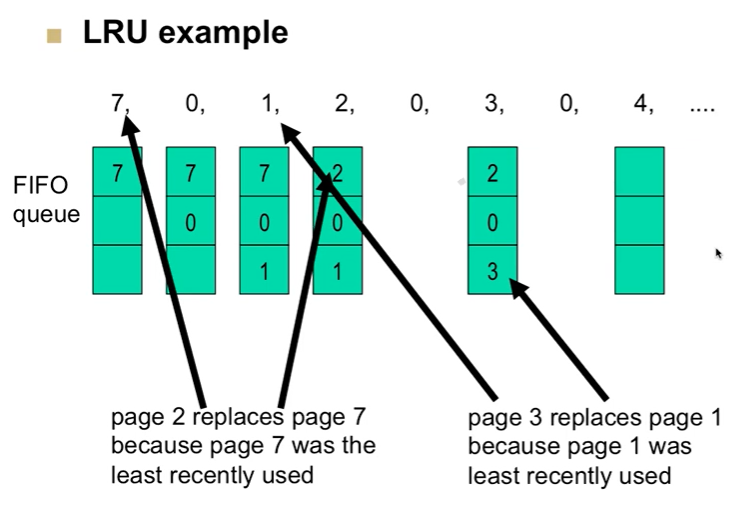

# CSPB-3753 Lab: LRU Algorithm
<figure width=100%>
  
</figure>

    

 
 
 The LRU (Least Recently Used) algorithm is a cache eviction policy used to manage the contents of a cache, ensuring that the most recently accessed items are retained in the cache while evicting the least recently used items when the cache reaches its capacity limit. The basic idea behind the LRU algorithm is to prioritize retaining items that have been accessed most recently, under the assumption that these items are more likely to be accessed again in the near future.

Here's a description of the LRU algorithm:

1. **Initialization**: Initially, the cache is empty.

2. **Accessing an Item**: Whenever an item is accessed (read or written) from the cache, it becomes the most recently used item.

3. **Updating Access Time**: Each time an item is accessed, its access time is updated to reflect the current time or a timestamp.

4. **Cache Hit**: If the accessed item is already present in the cache (cache hit), it is moved to the front of the list of recently used items to indicate that it is the most recently used item.

5. **Cache Miss**:
   - If the accessed item is not present in the cache (cache miss):
     - If the cache is not full, the item is inserted into the cache and becomes the most recently used item.
     - If the cache is full, the least recently used item (at the end of the list) is evicted from the cache to make space for the new item. The new item is then inserted into the cache and becomes the most recently used item.

6. **Eviction Policy**: When the cache reaches its capacity limit and a new item needs to be inserted, the least recently used item (at the end of the list) is evicted from the cache.

7. **Maintaining Access Order**: The order of items in the cache is maintained based on their access time, with the most recently used items positioned at the front of the list and the least recently used items positioned at the end of the list.

8. **Optimizations**: Various optimizations can be applied to improve the efficiency of LRU caching, such as using efficient data structures like doubly linked lists and hash maps, and employing techniques to minimize the time complexity of cache operations.

Overall, the LRU algorithm ensures that the cache retains the most recently accessed items while efficiently managing the cache size by evicting the least recently used items when necessary. It strikes a balance between maximizing cache hit rates and minimizing cache misses, making it a popular choice for cache management in various applications and systems.
 

 
 The objective of this assignment is to implement a data structure for an LRU cache, which supports the following operations:

* `Insertion` of key-value pairs into the cache.
* `Retrieval` of values associated with keys.
* `Eviction` of the least recently used item when the cache is full.
 
Write a program in C programming language to implement an LRU cache. Your implementation should include the following components:

* `LRU Cache Data Structure`: Define a data structure to represent the LRU cache. This structure should efficiently support the required operations.

* `Insertion Operation`: Implement a function/method to insert key-value pairs into the cache. When the cache is full, the least recently used item should be evicted to make space for the new item.

* `Retrieval Operation`: Implement a function/method to retrieve the value associated with a given key from the cache. If the key is not present in the cache, return a specified default value or indicate a cache miss.

* `LRU Policy Management`: Implement the LRU policy to keep track of the most recently accessed items and maintain the order of items according to their access frequency.

* `Testing`: Write test cases to validate the correctness and efficiency of your LRU cache implementation. Test various scenarios, including insertion of new items, retrieval of existing items, eviction of least recently used items, handling cache misses, etc.

 
### Step 1 - Design API to handle the Operations
 Design your API and data structures to handle the operations required.  There are many ways to implement the data structures required to support the required functions.  I suggest starting with the simplest implmentation and make it more complex if needed.
 
 
 
### Step 2 - Process a Sequence of Page Requests
For a given size of memory pages, show the LRU eviction sequence for a given sequence of page requests.

The same sequence of page requests can be used to test different sizes of memory.  I suggest that you pass the memory size and pass the name of a file containing the page request sequence as a program parameters on the command line.
 

    
### Submission

You will capture (copy and paste from terminal window) the output from your testing as part of the submission.
 
***Make sure to `commit` to your local repository and `push` to the remote repository.***    
Grading of your work will be based on the information that you have in your remote repository.

 Your repository should include:  

* code file to handle API for Insertion, Retrevial, and Eviction
* code file to test API for Insertion, Retrevial, and Eviction
* code that is processing return codes of all system calls
* code that is well commented (including file and function headers)
* text file (`results.txt`) with a listing of the terminal window commands and output showing your implementation.
 

Although the grading of your code will be done by accessing your remote repository,  
you must submit the following to the Moodle Assignment:

* Your name:
* CU ID: (4 letters - 4 digits)
* GitHub Username:
* hours to complete lab:

