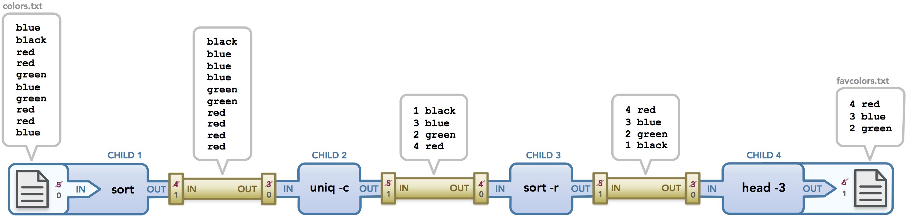
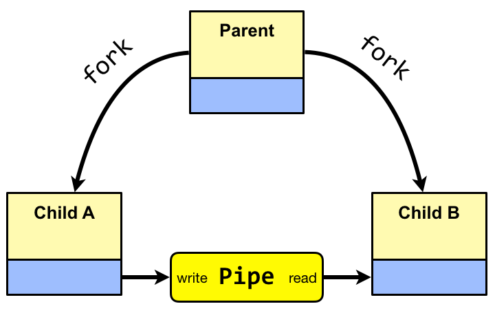
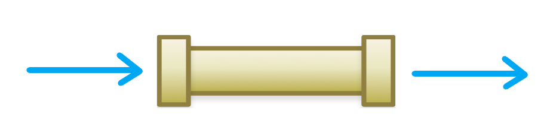
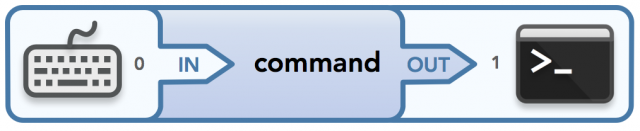
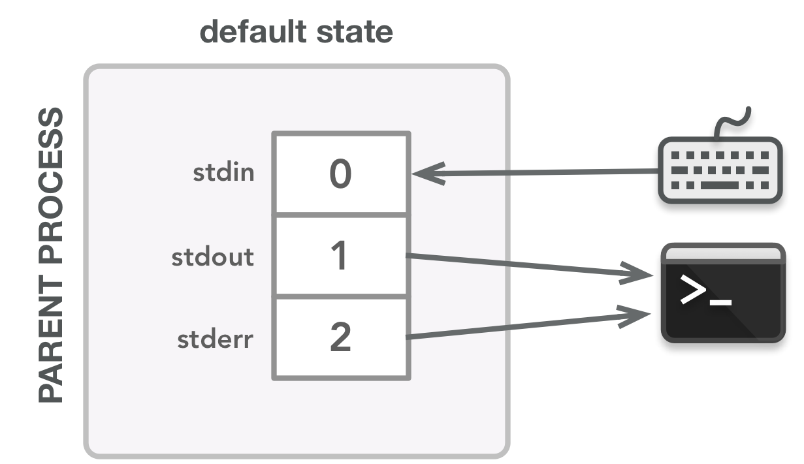
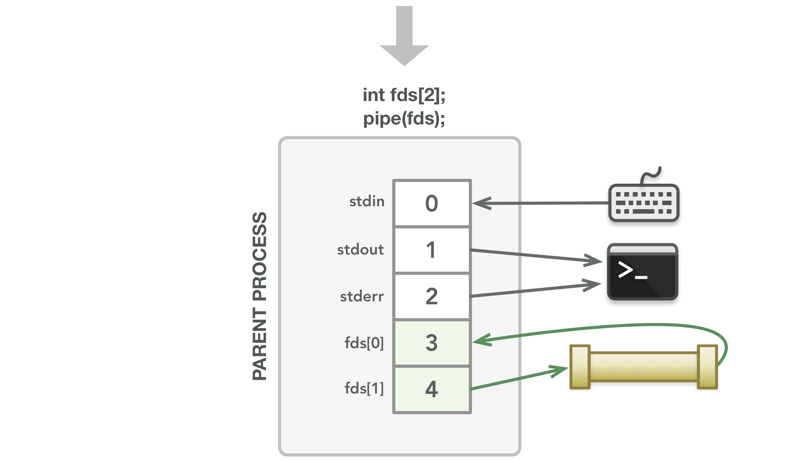
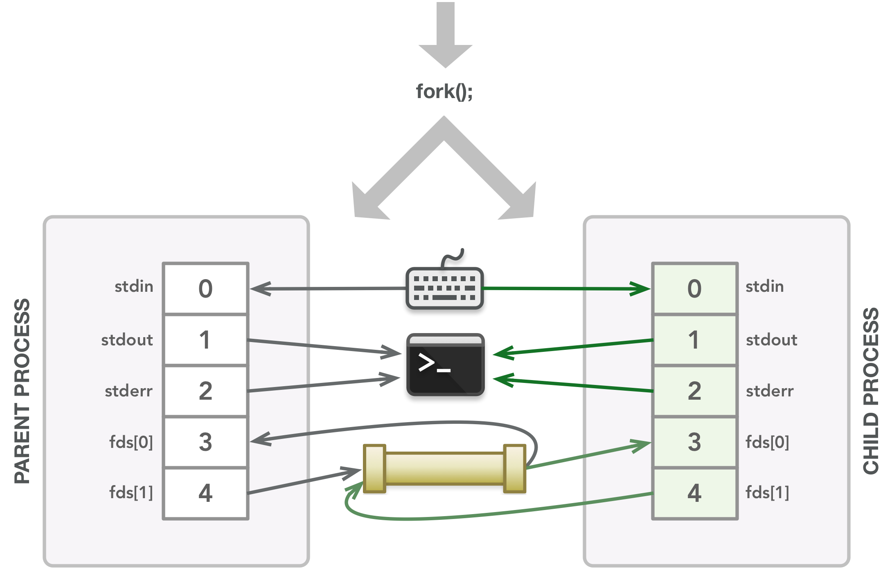

# CSPB-3753 Lab: Pipes
<figure width=100%>
  
</figure>

The concept of a pipe is extremely powerful. Pipes allow data from one process to be passed to another (via unidirectional data flow) so that commands can be chained together by their standard input and output streams. By chaining the flow of data, the commands can work together to achieve a larger goal. 

The chaining of processes can be represented as a pipeline: commands in a pipeline are connected via pipes, where data is shared between processes by flowing from one end of the pipe to the other. Each command in the pipeline is run in a separate process and has a separate memory space, but each command will read from its own standard IO for input, output, and error file descriptors.  By creating pipes and redirecting the file descriptors to access the pipe descriptors as output and input, the flow of data between processes can be managed.

 
The goal of this lab is to create a child process (or two) and redirect the output from one process through a pipe that is used as input for another process.  The code will be written in C and use the system calls for process creation, pipe creation,  and duplication of file descriptors to substitute the pipe for standard file IO.

That means you must:
* create a parent to run one command
* create a child to run the second command
* create a generic pipe between a parent and child process
* redirect the output from the first command into the pipe
* redirect the input of the second command to read from the pipe
* create a parent to start two child processes and redirect output from one to the input of the other

On completion of this lab, you should be able to extend your solution to perform the piping needed in the Shell Assignment. 
  
#### **Objectives**

* review the system calls used for IPC using pipes
* understand the UNIX concept of stdin, stdout, and stderr
* use pipes to allow flow of data from one process to another process
* provide a foundation for implementing the *Shell Programming Assignment*

    

### This lab is still under construction.  
 
 Please report all speeling and grammered issues. 
 Also let us know about any unclear descriptions of work to be performed. 
    

I have taken much of the text and graphics for this lab from a great explanation  of pipes, forks, and dups to manage the flow of data from one process to another. &nbsp; &nbsp;
<a href="https://www.rozmichelle.com/pipes-forks-dups">rozmichelle.com/pipes-forks-dups</a>

<h3><i><b>Pipes, Forks, and Dups: Understanding Command Execution and Input/Output Data Flow</b> by ROSLYN MCCONNELL</i></h3>

Unix has a simple yet valuable design philosophy, as explained by Doug McIlroy, the inventor of the Unix pipe:

>“Write programs that do one thing and do it well. Write programs to work together. Write programs to handle text streams, because that is a universal interface.”

The concept of a pipe is extremely powerful. Pipes allow data from one process to be passed to another (via unidirectional data flow) so that commands can be chained together by their streams. This allows commands to work together to achieve a larger goal. This chaining of processes can be represented by a pipeline: commands in a pipeline are connected via pipes, where data is shared between processes by flowing from one end of the pipe to the other. Since each command in the pipeline is run in a separate process, each with a separate memory space, we need a way to allow those processes to communicate with each other. This is is exactly the behavior that the pipe() system call provides.

Pipes are actually just buffered streams that are associated with two file descriptors where one descriptor handles the reading of data in the pipe and the other handles the writing of data to the pipe.
 

#### **File Descriptors**
Let’s start out with a basic “type something into the keyboard, press enter, and get a result” model of running a single command in the terminal with no input/output redirection.
 Unix associates input with the terminal keyboard and output with the terminal display by default.

 Unix is famous for modeling pretty much everything in the computer as a file, including the keyboard and monitor. 
Thus writing to the “display” is really just writing to the file that manages the display of data on the screen. Similarly, reading data from the keyboard means reading data from the file that represents the keyboard. In the context of this discussion, we’ll refer to input and output as text data that goes into and out of a process.

Data flows via streams that transfer bytes from one area to another.

There are three default input/output (I/O) streams: standard input (stdin), standard output (stdout), and standard error (stderr). By default, these streams each have a specific file descriptor. A file descriptor is an integer that is associated with an open file and processes use file descriptors to handle data.

The three default streams have the following file descriptor numbers: stdin = 0, stdout = 1, and stderr = 2.

File descriptors are stored in a file descriptor table, and every process has its own file descriptor table (with 0, 1, and 2 created and mapped to their appropriate streams by default when the process is created). Each stream has no idea where the data sent to or read from its descriptor comes from or goes to; the streams simply deal with the file descriptors, not the data sources themselves. The process only needs to handle the file descriptor, not the file itself; the kernel safely manages the file.

In addition to 0, 1, and 2, processes use other file descriptors as necessary. The lowest unused (unopen) file descriptor is always used when a new file descriptor is assigned. Thus file descriptor 3 is usually first descriptor assigned when a new file or pipe is opened. 

#### **Data Flow**
Now we are ready to talk about data flow in depth. When we run commands in the terminal, any input and output need to be handled appropriately. The process that gets created for each command needs to know what data, if any, to take in as input and possibly what data to output. Each command’s process needs to know where to send and receive data. By default the flow of data in is via stdin from the keyboard, stdout is directed to the terminal, and stderr (error messages when something goes wrong) is also directed to the terminal. 

(see [/www.rozmichelle.com/pipes-forks-dups/](https://www.rozmichelle.com/pipes-forks-dups/) for more details)

#### Step 1 - Create a Pipe

When the program starts, the parent process is created with the default streams set up in its file descriptor table. The arrows show the flow of data: stdin receives input from the keyboard and stdout and stderr send output to the terminal display.
  
The pipe() system call finds the next two available file descriptors and associates each with the appropriate end of the created pipe. In this case, a process can read via 3 and write via 4.
  

#### Step 1.1 - Create a new Process
Write a function that will create a child process and redirect the output from the parent process as input to the child process.

The fork() call creates the child process, which will copy the parent’s memory and file descriptor table at that point in time. Whatever files are in the parent’s file descriptors are duplicated for the child’s file descriptor table.  The pipe is now used by both the parent and the child processes.
  
To set the pipe as the output from one process and the input to another process, you will need move the file descriptor to the correct stdio  descriptor and then clean up the descriptors by closing the unused descriptors of the pipe.
  

#### Step 1.2 - Redirect Parent's stdout to write to Pipe
The order that the system calls are implemented are important. First you must change the stdout file descriptor to be the same as the pipe's write descriptor and make sure the current stdout descriptor has been closed..  The system call `dup()` will create a copy of the given file descriptor.

The `dup2()` system call performs the same task as `dup()`,
allocates a new file descriptor that refers to the same 
open file description as the descriptor `oldfd`.
But, instead of using the lowest-numbered unused file descriptor, it uses the file descriptor number specified in `newfd`.
In other words, the file descriptor `newfd` is adjusted so that it now refers to the same open file description as `oldfd`.

If the file descriptor `newfd` was previously open, it is closed
before being reused; the close is performed silently (i.e., any
errors during the close are not reported by `dup2()`).

The steps of closing and reusing the file descriptor `newfd` are
performed atomically.  This is important, because trying to
implement equivalent functionality using individual calls to both
`close()` and `dup()` would be subject to race conditions. 

Redirect the parent process's `stdout` to the pipe.

#### Step 1.3 - Clean up Unused Pipe Descriptors
The parent must close the file descriptors it doesn’t need. The parent will write data to the pipe using its `stdout` file descriptor.

The parent process no longer needs the pipe's file descriptors because it will not use the read side of the pipe and the write side has been modified using `dup2()`. Use `close()` to release the file descriptors.

The child process will need to use `dup2()` to set the read side of the pipe into `stdin` file descriptor.  Once that connect is made, the two pipe descriptors are no longer needed by the process and should be closed.

### Step 2 - Create TWO child processes and pipe output from one to input of the other

Write another function that will create a child process and redirect the output from that child into a pipe (make sure to clean up all unused file descriptors).  Create a second child and modify its `stdin` to be the pipe.

The first child process should execute a command that will generate some output.  A command such as `cat test.txt` could be used to copy the file contents to `stdout`.  The second process could be something like `sort` that reads in the input and sorts it before writing to output.

Make sure the function will wait for the child processed to complete before continuing processing.

***Make sure to `commit` to your local repository and `push` to the remote repository.***    
Grading of your work will be based on the information that you have in your remote repository.

Your code should include:
* code to handle parent processing including redirection of stdio
* code to handle child processing
* processing return codes of all system calls
* code that is well commented

  

Your completed code should have two functions that can be called from
them main function.  Each function will create a child process (or two) and redirect the file descriptors to use a pipe.  Make sure that your code will wait for the termination of any of the child processes and clean up any memory allocated (includes any file descriptors created with `pipe()` system calls).

 
Although the grading of your code will be done by accessing your remote repository,  
you must submit the following to the Moodle Assignment:

* Your name:
* CU ID: (4 letters - 4 digits)
* GitHub Username:
* hours to complete lab:

