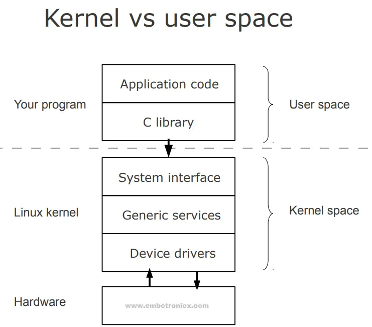

# CSPB-3753 Lab: Creating Simple LKM
<figure width=100%>
  
</figure>
<br>
A Loadable Kernel Module (LKM) is a piece of kernel code that can be dynamically loaded into the Linux kernel at runtime. Kernel modules are commonly used to extend the functionality of the kernel, such as adding support for new devices or implementing features that are not part of the core kernel.
<br><br>
A LKM is a dynamically loadable and unloadable code module that is part of the Linux kernel. The LKMs have access to all the data structures and privledged calls that are available to the kernel.  Kernel modules execute with the same level of privilege as the kernel itself. Writing and loading kernel modules should be done with caution, as poorly written or insecure modules can potentially compromise the stability and security of the system.
<br><br>
A major feature of LKMs is that new functionality can be added to the kernel without the need to rebuid the core kernel or even to reboot the system. LKMs are most commonly used to provide support for new hardware, logical devices, file systems, network protocols, or other features that need to have acess to kernel data structures.
<br><br>

In this lab you will create a simple device driver, dynamically load it into the kernal of the Virtual Machine to which you have been given privledged access.  You need to have super user privledges to load and unload modules in the kernel.  You have been given that access in the VM.

You will learn how to print debug information to the system logs and view those logs.  You will learn how to dynamically allocate kernel memory for use in the device driver.  Finally, you will unload the device driver from the kernel, which must make sure to deallocate any allocated memory.

<hr><br>
The Linux architecture is primarily divided into User Space and Kernel Space. These two components interact through the System Call Interface, which is a predefined set of calls to provide services to user-space applications.   Often developers will create an abstraction to hide the many details some common functionality.  These abstractions and support routines are collected into libraries that make it easier for user applications to access the kernel functionality.

<figure width=100%>

</figure>

* *User Space* is where the user applications are executed (i.e. runs).
* The *C library* plays a crucial role in providing a standardized interface for applications to interact with the underlying operating system services. 
* *Kernel space* is where the kernel executes and provides its services.
* *Device drivers* interface to the hardware to support File Systems on disks, Keyboards, Monitors, Printers, ... and provide access to operations for each particular device.  

In the C programming language, the standard library (C library) provides a set of abstractions and functions to perform various tasks.  The C library is often closely tied to the OS, and it abstracts many low-level details, allowing developers to write portable code that can run on different operating systems. Below are only some of the commonly used abstractions within the C library:

* File I/O Abstractions:
  * a FILE structure represents a file stream and is used for file input/output operations. 
  * Functions like fopen, fclose, fread, and fwrite operate on FILE structure pointers.

* Memory Management Abstractions:
   * malloc, free, calloc, realloc for dynamic memory allocation and deallocation.
   * memcpy, memset, memcmp for manipulating blocks of memory.

* String Manipulation Abstractions:
   * strcpy, strcat, strlen for manipulating strings.
   * strcmp, strncmp for comparing strings.
   * sprintf, snprintf for formatted string output.

* Input/Output Abstractions:
   * printf, scanf for formatted input/output.
   * getchar, putchar for character input/output.
   * fgets, fputs for string input/output.

* Error Handling Abstractions:
   * errno which is a variable indicating the last error that occurred.
   * perror to print a description for the last error.

* Standard I/O Streams Abstractions:
   * stdin, stdout, stderr as predefined file streams for standard input, output, and error.

All of these library functions will ultimately make system calls to perform the functionality.  

<hr>
Here are some key points about Loadable Kernel Modules:

* Dynamic Loading and Unloading: <br>
  LKMs can be loaded into the kernel dynamically, meaning that you can add or remove them while the system is running. This is in contrast to built-in kernel components, which are part of the kernel image and require a recompilation of the kernel and a reboot to install the changes.
The LKM's provide a way to extend the functionality of the Linux kernel without modifying the kernel source code. This is particularly useful for adding support for new hardware, file systems, or other features.

* Isolation of Modules: <br>
By using LKMs, developers can modularize the kernel code, separating different functionalities into distinct modules. This promotes code organization and makes it easier to maintain and update specific components without affecting the entire kernel.
One common use of LKMs is in the development of device drivers. Device drivers are essential for enabling communication between the operating system and hardware devices, and LKMs provide a flexible way to add, update, and debug these drivers.

* LKM's are Kernel code: <br>
Kernel modules execute with the same level of privilege as the kernel itself. Writing and loading kernel modules should be done with caution, as poorly written or insecure modules can potentially compromise the stability and security of the system.
LKMs can make use of symbols (functions, variables, etc.) defined in the kernel, allowing them to interact with the core kernel functionalities. You can read and modify core data structures, so you must use extreme caution when accessing kernel structures.
LKMs need to be compiled for a specific kernel version to ensure compatibility. This is because changes in the kernel interface may affect how modules interact with the kernel.
<br><br>
<hr>


### This lab is still under construction.  
 
 Please report all speeling and grammered issues.<br>
 Also let us know about any unclear descriptions of work to be performed. 
 <br><br><br>
<hr>

**Objectives**

* understand Kernel Programming Concepts
  *  kernel space and user space differentiation.
  *  fundamentals of kernel programming including memory management.
  *  the Kernel Module Lifecycle (compiling, loading, and unloading).
* using and customizing a Virtual Machine
* implement a simple LKM Device Driver.
* learn to allocate and deallocate kernel memory dynamically.
* provide feedback from device driver via tools like printk and dmesg.

<hr>

<!---
## Objectives for LKM Lab and LKM Programming Assignment
### Review these and move some to the LKM Programming Assignment

1. Introduce the purpose (outcome) of the lab
1. Provide a starting point for the simplest of LKM
1. Explain the concepts of init, exit, required macros
1. explain use of `printk()` system function
1. add register and unregister of a device
	* create a device in /proc
1. add dynamic allocation of data structures for the LKM, `kalloc()`
	* allocate a buffer on init, deallocate on exit
	* initial the buffer with generated data
1. add in the read function to access the static generated data
	* explain how to move data from kernel space to user space
	* explain how to update the file position in the FILE structure
1. explain how a circular buffer works.
1. add a write function to copy data into buffer
	* explain how to move data from user space to kernel space
	* explain how to update the file position in the FILE structure
1. use the random IO lab command processor to test the device.
1. add a seek function to manage the file position.
	* explain how validate the location
	* explain how to update the file position in the FILE structure
--->

I have used the tutorial found at https://tldp.org/LDP/lkmpg/2.6/html/c119.html as the starting point for this writeup.
<hr>

In Linux, a Loadable Kernel Module (LKM) is a piece of code that can be dynamically loaded and unloaded into the Linux kernel at runtime. The standard interface for developing Loadable Kernel Modules in Linux involves a set of functions and macros that developers use to interact with the kernel. The primary headers and functions related to LKM development are part of the Linux kernel source tree.

The LKMs are part of the kernel and must be built and installed by using super user privileges.
That means you will need to use your vSphere virtual machine where you have those privileges.  See the [Virtual Machine Customization](VM_Customization.md) instructions for using and customizing your virtual machine.

Here are some key components of the standard interface used for Loadable Kernel Modules in Linux:

#### Header Files:

* linux/module.h: Contains macros and functions for module initialization and cleanup.
* linux/init.h: Defines module initialization and exit macros.

#### Module Initialization and Cleanup Macros:
   * module_init(init_function): specifies the function to be called when the module is loaded.
   * module_exit(exit_function): specifies the function to be called when the module is unloaded.

#### Module Information Macros:
   * MODULE_LICENSE("license"): specifies the license for the module.
   * MODULE_AUTHOR("author"): specifies the author of the module.
   * MODULE_DESCRIPTION("description"): Provides a short description of the module.

#### Module Parameters:
   * module_param(name, type, permissions): declares a module parameter that can be passed during module loading.
   * MODULE_PARM_DESC(name, description): provides a description for a module parameter.

#### Kernel Module Initialization and Cleanup Functions:
   * int init_function(void): the function called when the module is loaded.
   * void exit_function(void): the function called when the module is unloaded.

#### Kernel Module Loading and Unloading:
   * insmod: command-line utility to insert a module into the kernel.
   * rmmod: command-line utility to remove a module from the kernel.
   * lsmod: command-line utility to list the set of modules currently loaded in the kernel.

Developers create their LKMs by implementing the module initialization and cleanup functions, defining module parameters if needed, and interacting with kernel services through the provided macros and functions. The Linux kernel provides a stable API for module development, but it's important to note that kernel interfaces may evolve between different kernel versions. Developers are encouraged to refer to the documentation and headers corresponding to the specific kernel version they are working with.
<hr>

### Step 1 : create a LKM
The code below lists the minimum code required to define a LKM.  The *module_init* and *module_exit* define the code to be called within the LKM when the LKM is loaded and unloaded respectively.
Each module in the kernel is described by a module_t structure.  The structure contains the name of the device, a unique ID number, a pointer to an event handler function and to an argument, which is given to the event handler, as well as some kernel internal data.


#### Step 1.1 : Create the source file for a LKM
Create a file in your repository with the code below and update the comments and strings.

```
/*  
 *  hello-1.c - The simplest kernel module.
 */
#include <linux/module.h>	/* Needed by all modules */
#include <linux/kernel.h>	/* Needed for KERN_INFO */

/*Module's init entry point */
static int __init helloworld_init(void)
{
    printk(KERN_INFO "Hello world (1)\n");
    return 0;
}

/*Module's cleanup entry point */
static void __exit helloworld_cleanup(void)
{
	printk(KERN_INFO "Goodbye world (1)\n");
}

module_init(helloworld_init);
module_exit(helloworld_cleanup);
```

Kernel modules must have at least two functions: a "start" (initialization) function which is called when the module is specified to `insmod` to be loaded into the kernel, and an "end" (cleanup) function  which is called just before it is unloaded.  The functions are passed as parameters to the `module_iit()` and `module_exit()` functions that setup the kernel's use of the module.

Typically, the *module_init* function will either register a handler for a device in the kernel, or it replaces one of the kernel functions with its own code (usually with code to do something new and then call the original kernel function). The *module_exit* function is supposed to undo whatever init_module() did, so the module can be unloaded safely.
<br><br>
####  ***Using `printk` for Kernel Logging***
<br>

You cannot use the standard C library `printf()` when running in kernel mode.  You must use the kernel function `printk()` to place formatted strings into the kernel log(s).
You might think that `printk()` was meant to communicate information to the user and even though we used it for exactly this purpose in our sample LKM, `printk()` is a logging mechanism for the kernel to log information or give warnings. Therefore, each `printk()` statement will specify a priority of the message as well as the formatted message string.The *KERN_ALERT* is one of the  8 priorities available.  The priority is an integer, but the kernel header files have defined names for each of the levels. You can view them (and their meanings) in linux/kernel.h.

<hr><br>

#### Step 1.2 : Add the developer information for the LKM

```
#include<linux/module.h>

/*Module's init entry point */
static int __init helloworld_init(void)
{
    printk(KERN_INFO "Hello world (1)\n");
    return 0;
}

/*Module's cleanup entry point */
static void __exit helloworld_cleanup(void)
{
	printk(KERN_INFO "Goodbye world (1)\n");
}

module_init(helloworld_init);
module_exit(helloworld_cleanup);

MODULE_LICENSE("GPL");
MODULE_AUTHOR("ME");
MODULE_DESCRIPTION("A simple hello world kernel module");
```

The macros for *MODULE_LICENSE*, *MODULE_AUTHOR*, and *MODULE_DESCRIPTION* set the data structure fields for this LKM.
<br><br><hr><br>


#### Step 1.3 :  Compiling Kernel Module
<br>

Kernel modules need to be compiled a bit differently from regular userspace applications. The LKM is compiled for a specific kernel version. The version of your kernel is obtained from the `uname` command that can list all fields of the version or just a specific field. 

```
  $ uname -a
  Linux jupyter-knoxd 4.15.0-197-generic #208-Ubuntu SMP Tue Nov 1 17:23:37 UTC 2022 x86_64 x86_64 x86_64 GNU/Linux
```

####  ***Makefile for a basic kernel module***

```
obj-m += sample_hello.o

all:
	make -C /lib/modules/$(shell uname -r)/build M=$(PWD) modules

clean:
	make -C /lib/modules/$(shell uname -r)/build M=$(PWD) clean
```

From a technical point of view just the first line is really necessary, the "all" and "clean" targets were added for pure convenience.  Now you can compile the module by issuing the command make . You should obtain an output which resembles the following:

```
$ make
make -C /lib/modules/2.6.11/build M=/root/lkmpg-examples/02-HelloWorld modules
make[1]: Entering directory `/usr/src/linux-2.6.11'
  CC [M]  /root/lkmpg-examples/02-HelloWorld/hello-1.o
 Building modules, stage 2.
  MODPOST
  CC      /root/lkmpg-examples/02-HelloWorld/hello-1.mod.o
  LD [M]  /root/lkmpg-examples/02-HelloWorld/hello-1.ko
make[1]: Leaving directory `/usr/src/linux-2.6.11'
```	

Note that kernel modules have a .ko extension which easily distinguishes them from conventional object files. The reason for this is that they contain an additional *.modinfo* section that where additional information about the module is kept. 

<br><hr><br>

#### Step 1.4 : Load the LKM into the kernel
<br>
To insert the module into the kernel, type the following command:

```
    sudo insmod sample_hello.ko
```

The kernel will try to insert your module. If it is successful, the function specified in the `module_init()` will be called and you will see the log message that has been inserted into `/var/logs/system.log`. If you type `lsmod` you will see your module is now inserted in the kernel.

```
    $ lsmod
    Module                  Size  Used by
    sample_hello              12288  0
    vsock_loopback            12288  0
    vmw_vsock_virtio_transport_common    57344  1 vsock_loopback
    vmw_vsock_vmci_transport  45056  2
    binfmt_misc               24576  1
    . . .
```

#### ***Check the System Log***

Check the system log to see the log messages printed by your LKM.  Use `dmesg --help` to see the possible options.  The command below will list out the information the your LKM printed with the `info` level.

```
    sudo dmesg --level info 
    [15090.592089] 3753: Hello world
```

That command will print all the KERN_INFO messages.  You might want to limit it to the last few messages with `dmesg --level info | tail -20` which will list the last 20 messages.

<br><hr><br>

#### Step 1.5 : Unload the LKM into the kernel

After the testing of the LKM is complete, you can remove the LKM from the kernel so it can be updated and reinstalled for the next round of feature testing.
Using `rmmod` you can unload the LKM.  If it is successful, the function specified in the `module_exit()` will be called and you will see the log message that has been inserted into `/var/logs/system.log`.

```
sudo rmmod sample_hello
```
To verify that the module was uninstalled, check the system log and you should see our module exit message. You can also use the `lsmod` command to verify the module is no longer in the system.
<br><hr><br>

#### OPTIONAL: Add the commands used to Makefile

It is often easier to spend the time adding the commands for loading and unloading into the `Makefile` than remembering and typing the commands over and over.

Using `dmesg` is nice because it shows the data in color.  However, we can directly access the log file and extract the lines that are important for your development.  You can add a `3753L` to each log message that you create.

```
    printk(KERN_ALERT "3753: Hello world\n");
```

Now you can access the messages directly with:

```
  $ sudo grep "3753:" /var/log/syslog
  [sudo] password for student: 
  Jan 12 13:33:17 cspb3753-vm1-knoxd kernel: [ 9760.404091] 3753: looks good
  Jan 12 13:33:17 cspb3753-vm1-knoxd kernel: [ 9760.404096] 3753: Hello world
  Jan 12 13:33:42 cspb3753-vm1-knoxd kernel: [ 9785.157997] 3753: Goodbye world
```

These commands can be automated.
Try adding the commands the following commands to the end of the `Makefile`:

```
  load:
    sudo insmod sample_hello.ko

  list:
    lsmod | grep sample_hello

  unload:
    sudo rmmod sample_hello.ko

  log:
    sudo grep "3753:" /var/log/syslog

```


<br><hr><br>

### Step 2 : Dynamically Allocate Kernel Memory
* TODO

Instead of defining a global memory variable to hold data, it is better to dynamically allocate the storage when it is needed.  You have used `malloc()` and `free()` to dynamically allocate and deallocation memory in a user space application's heap.  The kernel has its own memory management to allocate and deallocate kernel memory.   The `kalloc()` and `kfree()` functions are equivilent to the C library memory management.

In the `sample_kalloc` source, a buffer is allocated when the module is loaded and deallocated when the module is unloaded.  The `kmalloc` allocation engine is a powerful tool and easily learned because of its similarity to malloc. The function is fast and does not clear the memory it obtains; the allocated region still holds its previous content. The allocated region is also contiguous in physical memory.  

The return value of `kmalloc` is the same as `malloc`, which means a NULL return indicates a failure of the allocation.  Make sure to check all return codes.  In the example code the allocation is performed when the LKM is loaded.  If the driver is not used, the memory is wasted and could have been used for other tasks.  In the future, the buffer should be allocated when the driver is opened.

```
    . . . 
      // Allocate memory using kmalloc
      dynamic_buffer = kmalloc(SIZE, GFP_KERNEL);

      if (!dynamic_buffer) {
          printk(KERN_ALERT "Failed to allocate memory with kmalloc\n");
          return -ENOMEM;
      }
    . . . 
```

The `kfree()` function will release the previously allocated memory.  The example code does not checkkthe return value because `kfree` does not have a return value (void function).  But it is not a good idea to free memory that is not yours. 

```
      . . . 
      // Free the allocated memory using kfree
      if (dynamic_buffer) {
          kfree(dynamic_buffer);
          printk(KERN_INFO "kmalloc Example: Memory freed\n");
      . . .
```

Update your `sample_hello` code to dynamically allocate a buffer when the LKM is loaded and deallocate the buffer when the LKM is unloaded.

<hr><hr><hr>

***Make sure to `commit` to your local repository and `push` to the remote repository.***    
Grading of your work will be based on the information that you have in your remote repository.
<br><br>

Your completed code should have created a LKM that writes a message to the system log when it is loaded and when it is unloaded from the kernel. Your code will also create a dynamic buffer on startup and will deallocate the buffer on termination.   Make sure the code is well documented.

<br>
Although the grading of your code will be done by accessing your remote repository, <br>
you must submit the following to the Moodle Assignment:

* Your name:
* CU ID: (4 letters - 4 digits)
* GitHub Username:
* hours to complete lab:

<hr><hr><hr>