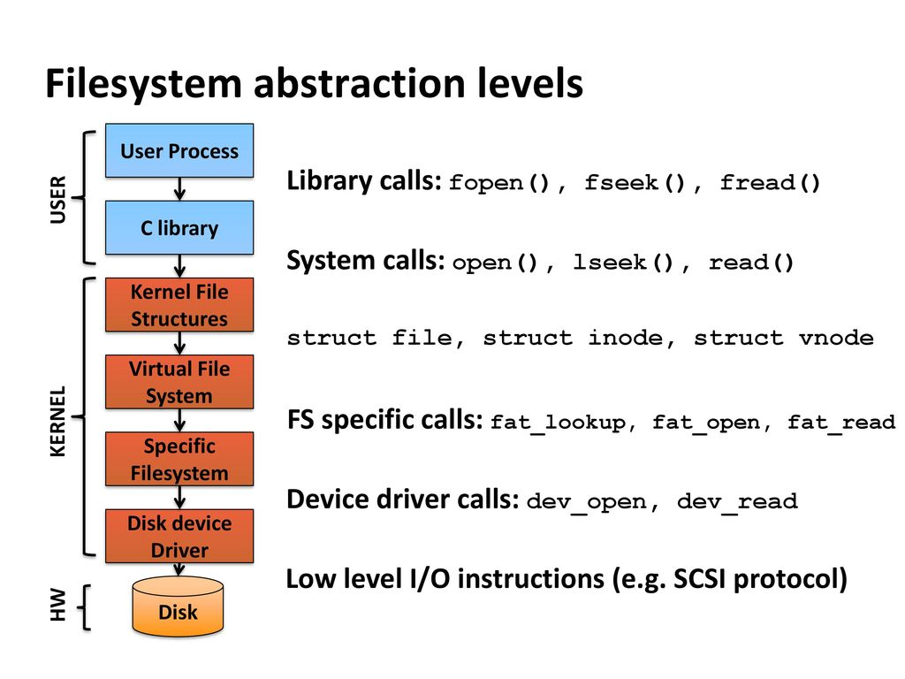

# CSPB-3753 Lab: Using Random I/O
<figure width=100%>
  
</figure>
<br>
When you use a file for reading or writing, the data structure reference by a file descriptor, always knows the current position within the file.  The `fpos` member of the file structure will remember where in the file the next read or write will occur.   Each call to `read()` and `write()` is independent of each other and will use the current file position to know where the data is to be read from or written to and will update the file position depending on the amount of data processed.  The `lseek()` system call is used to navigate within a file.  It does this by repositioning the file offset of an open file descriptor. Often it is used to "rewind" a file so you can re-read a file from the beginning of the file. 
<br><br>

The file *offset* is the position in the file where the next read, write, or relative seek operation will occur. The `lseek()` system call allows you to move the current file position to a specific location within the file.
This lab will let you practice using `lseek()` to move the current file position so the next read or write system call will occur at that position. We have provided some sample code so you can explore its functionality.
<br><br>


### This lab is still under construction.  
 
 Please report all speeling and grammered issues.<br>
 Also let us know about any unclear descriptions of work to be performed. 
 <br><br><br>
<hr>

**Objectives**
	
* read and write at random locations within a file.
* use `lseek()` and `tell()` to set and check the file descriptor position.
* use `read()` and `write()` to manage data within the file.
* provide a `close()` system call for every opened file descriptor.
* use return value checking on all system and library calls
* understand the purpose of the `fpos` variable in a file descriptor.
<hr>

In this example, the program opens a file named "example.txt", writes some content to it, uses `lseek` to move the file offset to the beginning, and then reads and prints the content from the beginning of the file.

The `open()` system call is given a `mode` parameter that can be READ, WRITE, or READ/WRITE.  To allow the file descriptor to be used to both read and write the data in the file, open the file in the READ/WRITE mode.  In the READ/WRITE mode the file data is not modified on open and the current file position is set to the beginning of the file.

By writing first, the current data in the file is overwritten and the file length will be extended to include all the data written.  If the write is smaller than the current file size, the remaining bytes of data in the file are unchanged.

``` 
	#include <stdio.h>
	#include <stdlib.h>
	#include <fcntl.h>
	#include <unistd.h>

	int main() {
		// Open a file for reading and writing 
		int fileDescriptor = open("example.txt", O_RDWR);

		if (fileDescriptor == -1) {
			perror("Error opening the file");
			exit(EXIT_FAILURE);
		}

		// Write some content to the file
		const char *content = "Hello, lseek!";
		write(fileDescriptor, content, strlen(content));

		// Use lseek to move the file offset to the beginning of the file
		off_t offset = lseek(fileDescriptor, 0, SEEK_SET);

		if (offset == -1) {
			perror("Error using lseek");
			close(fileDescriptor);
			exit(EXIT_FAILURE);
		}

		// Read and print the content from the beginning of the file
		char buffer[256];
		ssize_t bytesRead = read(fileDescriptor, buffer, sizeof(buffer));

		if (bytesRead == -1) {
			perror("Error reading from the file");
			close(fileDescriptor);
			exit(EXIT_FAILURE);
		}

		printf("Read from file: %.*s\n", (int)bytesRead, buffer);

		// Close the file
		close(fileDescriptor);

		return 0;
	}
```


Here is the general syntax for the `lseek` and `tell` function:
```
lseek(2)		System Calls Manual	

Name
       lseek, tell - move read or write pointer

Syntax
       #include <sys/types.h>
       #include <unistd.h>

       pos = lseek(d, offset, whence)
       off_t pos;
       int d, whence;
       off_t offset;

       pos = tell(d)
       off_t pos;
       int d;

Description
       The system call moves the file pointer associated with a file or device open for reading or writing.

       The descriptor d refers to a file or device open for reading or writing.
       The system call sets the file pointer of d as follows:
       o  If whence is SEEK_SET, the pointer is set to offset bytes.
       o  If whence is SEEK_CUR the pointer is set to its current location plus offset.
       o  If whence is SEEK_END, the pointer is set to the size of the file plus offset.

       Seeking beyond the end of a file and then writing to the file creates a gap or hole that does not occupy physical space and reads as zeros.

       The system call returns the offset of the current byte relative to the beginning of the file associated with the file descriptor.

Return Values
       Upon successful completion, a long integer (the current file pointer value) is returned.  This pointer is measured in bytes from the begin-
       ning  of  the file, where the first byte is byte 0.  (Note that some devices are incapable of seeking.  The value of the pointer associated
       with such a device is undefined.)  If a value of -1 is returned, errno is set to indicate the error.

Diagnostics
       The system call fails and the file pointer remains unchanged under the following conditions:

       [EBADF]	      The fildes is not an open file descriptor.

       [EINVAL]       The whence is not a proper value.

       [ESPIPE]       The fildes is associated with a pipe or a socket.
```
<hr>

### Step 1 - Add call(s) to determine the file length
Create a code file (in the code subdirectory of your repository) named `example.c`.
Add the code you see above and make the changes and updates listed below.  You must also update the `Makefile` to build your `example` executable.

Add some more code to the end of the `main` function to:
* place file pointer to the end of the file.
* remember the current position.
* write some data - "COMP-3753 was here!", remember return value (*notice the string uses `COMP`, which will be written to the file data and modified in step 2*).
* get the current file position (*changed with the write*).
* print out the number of bytes written in `write()` call and the difference between the current and saved positions (*those values should be the same*).

The `tell()` function will return the current file position.  Where a `read()` or `write()` system call is used, the file pointer will change.  
Note that when you are checking the return values on all system calls (*a requirement in this course*), then you will get updated position from the `lseek()` call.  However, put in an explicit call to `tell()` for this lab.

<hr>

### Step 2 - Overwrite some text in the file data

Add some more code following Step 1 that will:
* reposition the file to the saved position in step 1.  
* write the string "CSPB" at the current position.
* rewind the file to the beginning of the file.
* read all the data and copy to the output.

<hr>

### Step 3 - Create a command line interpreter for testing Read/Write/Seek


Now you have completed a simple use of the Read/Write/Seek functionality.
In this next step, you will complete the example code found in the repository to implement a command line handler.  You must update this code (and comments) to implement the WRITE and SEEK commands and update any other code to support those commands.  There are some tests listed in the `Makefile` provided that will test your implementation.

The image to the right shows that the ```fread(), fwrite(), ...``` are higher level functions that are implemented in the C library and call the low level system calls.  The higher level functions provide file buffering for both read and write.  You will use this higher level abstraction in a future programming assignment to implmentent a device driver.  In that assignment you will implement functions to read, write, and seek in a circular buffer.  You will need to update the FILE data structure (file position) to maintain a current file position offset at all times.

The command processing that you create in this lab can also be used to test the device driver you will create in the LKM programming assignment. For now, you will use the file system to handle the actual storage of the data and focus on the functionality you will need to implement to perform random IO.


Your command interpreter will support the following commands:

| Command| &nbsp; &nbsp; &nbsp; &nbsp; &nbsp; | Description|
| :-- | --- | :-- |
| O *\<filename>* | | Open a file for processing.  Only one file should be open at a time. |
| C | | Close the open file. | 
| R *\<n bytes>*| | Read the number of bytes from the current file position and write them to STDOUT. |
| W *\<string>* | | Write the given string to the current file position. |
| S *\<mode> \<location>* | | Move the file position to the given location based on the mode. |
| Q | | Quit the command interpreter. |

All calls to the system functions must have the return values examined.  Make sure the requests perform the correct function.

Once you have the code working, you should be able to redirect a command file to the interpreter and have it perform a set of commands.
```
	example_cmd_handlers < file.cmd 
```
Below is a sample output from the two sample command files provided.
The handler's error reporting via stderr is being redirected to a file called `log.txt` in the local directory.   The input is being redirected from a file into stdin.  What is shown below is the set of commands given and the output from the commands.  *Open* will open a filename given, *Read* will read a number of bytes and write them to output, *Write* will write the given string to the file, *Tell* prints the current file position, and Seek will reposition the current file position.
	
```
sample_1.cmd:
		Open data.txt
		Read 20
		Tell
		Seek 0 10
		Tell
		Read 10
		Tell
		Q
```
Here is an output to the first sample commands from a solution for the lab. 
```
	[2580:jovyan:code]$ make test1
	cp data_orig.txt data.txt
	./example_cmd_handler < sample_1.cmd 2>log.txt

		3753-Lab-??? > Open data.txt
		3753-Lab-??? > Read 20
		This is a file for t
		3753-Lab-??? > Tell
		TELL ==> [20]
		3753-Lab-??? > Seek 0 10
		SEEK to [0][10] ==> [0]
		3753-Lab-??? > Tell
		TELL ==> [10]
		3753-Lab-??? > Read 10
		file for t
		3753-Lab-??? > Tell
		TELL ==> [20]
		3753-Lab-??? > Q
```
The second sample will write data to the file, which modifies the file:
```
sample_2.cmd:
		Open data.txt
		Read 20
		Seek 0 0
		Read 10
		Write test
		Tell
		Seek 0 0
		Read 20
		Tell
		Q
```
Sample output from a solution (notice that the read from the first 20 characters is defferent after the write command):
```
	[2523:jovyan:code]$ make test2
	cp data_orig.txt data.txt
	./example_cmd_handler < sample_2.cmd 2>log.txt
		3753-Lab-??? > Open data.txt
		3753-Lab-??? > Read 20
		This is a file for t
		3753-Lab-??? > Seek 0 0
		SEEK to [0][0] ==> [0]
		3753-Lab-??? > Read 10
		This is a 
		3753-Lab-??? > Write test
		WRITE[test]==> [4]
		3753-Lab-??? > Tell
		TELL ==> [14]
		3753-Lab-??? > Seek 0 0
		SEEK to [0][0] ==> [0]
		3753-Lab-??? > Read 20
		This is a test for t
		3753-Lab-??? > Tell
		TELL ==> [20]
		3753-Lab-??? > Q
```


<hr>

### Step 4 - Update or Add Comments to the Code
Remember that you must have required comments added to the source and Makefile files.  That includes headers for each source file and function, as well as conveying the algorithms being used.

You will be reusing some of this code for future assignments, so it needs to be documented well to make it easier to use again later.
<hr>

### When you have completed the Lab tutorial 

You were provided a template for the individual recitation lab so that you have a good starting point.  These templates need to be updated with the proper level of documentation expected.

***Make sure to `commit` to your local repository and `push` to the remote repository.*** 
Grading of your work will be based on the information that you have in your remote repository.
	

Although the grading of your code will be done by accessing your <br> remote repository,
you must submit the following to Moodle Assignment:

* Your name:
* CU ID: (4 letters - 4 digits)
* GitHub Username:
* hours to complete lab:

<hr><hr><hr>