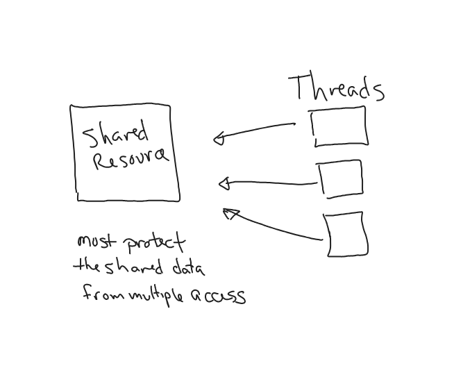
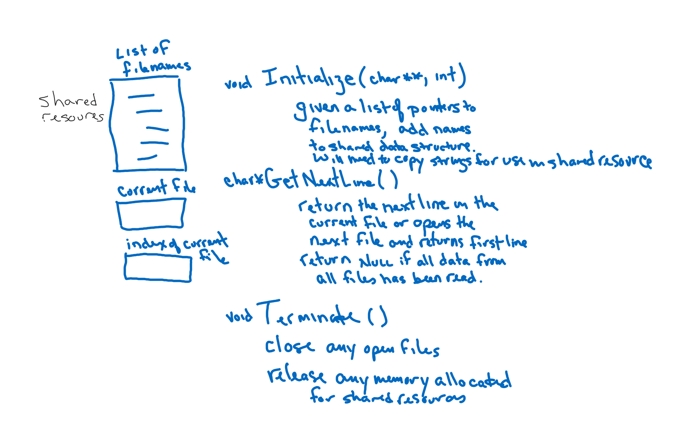

# CSPB-3753 Lab: Synchronizing Threads with a Mutex
<figure width=100%>
  
</figure>
A process is an independent program running in its own memory space, and threads are subunits within a process that share the same resources, such as memory space and file handles. Each thread within a process can execute independently, but shares the same data and resources with other threads in the same process.

Threads are often considered lightweight compared to processes. Creating, switching, and terminating threads is generally faster than doing the same operations with processes.
Each thread has its own program counter, register set, and stack, but shares the same memory space and resources with other threads in the same process..

Multithreading is the concurrent execution of two or more threads in the same process. Multithreading is commonly used to achieve parallelism and improve the responsiveness of applications, particularly in tasks that involve input/output operations.
Threads allow for concurrent execution, meaning multiple threads can run simultaneously on multicore processors. This concurrency can lead to improved performance by utilizing available CPU resources efficiently.

 Threads in the same process share resources, such as global variables, heap memory, and file descriptors. This shared state makes communication and coordination between threads important to avoid conflicts and race conditions.  To avoid data corruption and ensure consistency, threads often need to synchronize their access to shared resources. Mechanisms like locks, mutexes, semaphores, and condition variables are used for thread synchronization.

 Ensuring thread safety is crucial when multiple threads access shared data concurrently. Thread-safe programming involves using synchronization techniques to prevent race conditions and data inconsistencies.


#### **Objectives**

* obtain a working understanding of managing threads and mutexes
* create a shared resource that needs to have synchronized access
* provide an API to access the shared resource that internally uses a mutex to synchronize the access
* provide a foundation for implementing the *Producer-Consumer Programming Assignment*
<hr>

<hr><hr>
Learning about threads and concurrent programming is important for several reasons, particularly in modern software development. Here are some key reasons why learning threads is valuable:

* *Improved Performance:* - Threads allow concurrent execution of tasks, which can lead to improved performance and responsiveness in applications.  Multithreading enables programs to utilize the available resources more efficiently, making it possible to perform multiple tasks simultaneously.

* *Parallelism:* - Threads enable parallelism, where multiple operations or computations can be performed concurrently. This is crucial for taking advantage of multi-core processors and distributed systems.

* *Responsiveness:* - Multithreading is essential for creating responsive user interfaces. Running time-consuming tasks in a separate thread prevents the main thread (responsible for UI) from being blocked and keeps the application responsive to user input.

* *Concurrency and Scalability:* - Understanding threads is crucial for designing concurrent and scalable systems. Applications that can handle multiple tasks simultaneously can better scale to handle increased workloads.

* *Asynchronous Programming:*   - Threads are fundamental for implementing asynchronous programming models, allowing tasks to proceed independently while notifying the main program when they are complete. This is important for handling I/O operations and events efficiently.

* *Concurrency Control:* - In shared-memory environments, threads need to synchronize access to shared resources to avoid race conditions and ensure data consistency. Learning about locks, mutexes, and other synchronization mechanisms is crucial for effective concurrency control.

* *Distributed Computing:*  - In distributed systems, understanding concurrent programming is essential. Threads play a role in designing and implementing distributed algorithms and handling communication between different parts of a system.

Learning threads is fundamental for creating efficient, responsive, and scalable software, and it is a valuable skill for any developer working on a wide range of applications from frontend and backend software to real-time applications.

<hr>

### Synchronization of Threads

A mutex, short for "mutual exclusion," is a synchronization mechanism used in computer science and concurrent programming to control access to shared resources, such as variables or data structures, by multiple threads or processes. The primary purpose of a mutex is to ensure that only one thread or process can access the shared resource at any given time, preventing concurrent or simultaneous access that could lead to data corruption or inconsistent results.

Mutexes provide a way for threads or processes to coordinate and avoid conflicts when accessing shared resources. When a thread wants to access a critical section of code (a part of the program that accesses shared resources), it must first acquire the mutex associated with that critical section. If the mutex is currently held by another thread, the requesting thread will be blocked until the mutex becomes available.

Once a thread has finished using the shared resource, it releases the mutex, allowing other threads to acquire it and access the critical section in a mutually exclusive manner.

Mutexes are essential for managing concurrency in multithreaded or multiprocess applications, ensuring that shared resources are accessed in a controlled and predictable manner, preventing race conditions and data corruption.


Learning about mutexes and concurrent programming concepts is most effectively done through hands-on experience with programming exercises and labs. This example will give you a basic understanding of threading and programming to synchronize those threads using mutexes.

<hr>

### POSIX Thread Library
The pthread library in C (POSIX threads) provides a set of functions for creating and manipulating threads. Threads are lightweight, independent units of execution within a process. The pthread library allows developers to work with multithreading, enabling concurrent execution of tasks and efficient use of available system resources.

#### Thread Creation

When an executable first starts, it is running in what is known as the main thread. 
When you create a new thread, you specify a function to run in that thread.  This is unlike the `fork` system call that creates two versions of the same process.  Immediately upon creation of a thread with its own instruction pointer and stack, the given function is called.  A typical thread function looks like the example below.
```
#include <pthread.h>

void* threadFunction(void* arg) {
    // Thread's code goes here
    return NULL;
}
```
The `pthread_create` function is used to create a new thread. It takes several parameters, including a pointer to a `pthread_t` variable that will store the thread ID, thread attributes, a start routine (the function the thread will execute), and any arguments to pass to the start routine.
```
    pthread_t thread_id;
    pthread_create(&thread_id, NULL, threadFunction, NULL);

    // Other main thread code
    pthread_join(thread_id, NULL);  // Wait for the created thread to finish
    return 0;
}
```
Similarly to the child processes, a thread can wait for another thread to complete.   The function `pthread_join()` will wait for the given thread to exit.


<hr>

### Step 1: Create two threads that share a resource
Implement a simple multithreaded program using a shared resource.  
In this lab you will create a shared resource that is accessed by multiple threads.
Because there is no synchronization, the unsafe version of the thread functions will 
both modify the same variable at the same time causing errors to occur.
The error is seen when the data is checked and then accessed again.  When the thread makes the second access the other thread may have modified the value.
```c
#define LONG_ITERATION 1000000
static volatile int randInt = 0;

void* tf_Unsafe_Printer(void* arg) {
    long i = LONG_ITERATION;
    while (i != 0)
    {
        int was = randInt;
        if ( (randInt % 5) == 0)
        {
            if ((randInt % 5) != 0) {
                int now = randInt;
                if (now != was)
                    printf("Current: %d, previously: %d\n", now, was);
            }
        }
        i--;
    }
}
```
The shared resource modifier thread will just iterate through changing the value of
the shared resource.
```c
void* tf_Unsafe_Modifier(void* arg) {
	int my_id = (long int) arg;
	printf("Started [%s] with %d\n",  __FUNCTION__ , my_id);

    long i = LONG_ITERATION;
    while (i != 0)
    {
        randInt = rand() % 1000;
        i--;
    }
}
```
You can create a thread to run each of those functions:
```c
// Main function will create two threads
    . . .
    // Create threads
    pthread_create(&thread1, NULL, tf_Unsafe_Printer, (void*)1);
    pthread_create(&thread2, NULL, tf_Unsafe_Modifier, (void*)2);
    . . .
```
    
When you create this program and run it you will see that the resource sharing 
    does not work as expected. 
    The resorce being shared needs to be protected in a critical section.
    You should keep the critical section as small as possible in each function.
    
    
### Step 1.1 - Run the example code
Your repository has a nice test program to run different test cases using safe and unsafe threads together.  You should compile and run the first test that uses two unsafe threads.  Evaluate the output and see that the printer code is printing values that are not divisible by 5. 
```
     make
     ./example 1
```
    
#### Why does this happen?
Two threads are independent and running as fast as they can.  Every once in a while the code is interrupted in the printer thread before completing the loop.  That means that the other thread can run and make a modification to the value of the shared resource.  When the printer code runs again, it accesses a modified value.
<hr>

### Step 2: Use a mutex to ensure that only one thread can access the shared resource at a time

Observe how the shared resource is incremented by different threads.  Now use a mutex to ensure proper synchronization.  This lab provides a practical introduction to using mutexes in a multithreaded environment. You can modify and expand upon this example to explore more complex scenarios and gain a deeper understanding of concurrent programming concepts.

Create a mutex and `lock` and `unlock` the mutex around critical section.  In the following function, the access to the share resource is surrounded by a Lock and Unlock.  The same would need to be done for all the functions accessing that resource.
```c
   #include <stdio.h>
   #include <pthread.h>

    ... create a mutex

    int sharedResource = 0;

   void* threadFunction(void* arg) {
       int threadID = *((int*)arg);

       // Example task: Print numbers
       for (int i = 1; i <= 5; ++i) {
           ... lock the mutex before entering critical section
           if (sharedResouce%5 == 0) {
                sharedResource++;
                printf("Thread %ld: Shared Resource = %d\n", (long)arg, sharedResource);
           }
           ... unlock the mutex
       }
       . . .
```
   
The main code would need to follow the following basic flow:
```    
   int main() {
    . . .
    
    // initialize the mutex
    ...

    // Create threads
    ... create thread using one thread function 
    ... create thread using the other thread function 

    // Join threads
    ...

    // release the mutex
    ...

   . . .
   }
```
If you have implemented the code codrrectly, the safe versions together will never have the printer print a line.  

### Step 2.1 - Create Safe Version of the Thread Code
Complete the implementation of the code to use a mutex for synchronization in the "Safe" versions of the thread functions.
    
### Step 2.2 - Create Tests with Mixed Safe and Unsafe Threads Together
Add the calls to handle the two combonations of safe and unsafe.  Will using only one safe function be enough to let the code work correctly?
    
<hr>

### Step 3:  Create an API wrapping access to a shared resource

    
    

Often it is easier to build an interface to a shared resource and embed the mutex in the code for handling the interface.   You will implement a set of functions to return the each line from a set of files.  Once all lines from all files have been read, a NULL pointer will be returned.

The shared resource will need to maintain a list of strings that contain the filenames to be processed, the current file index being processed, and the currently open file.  Each of these functions should protect the shared resource(s) while it is being updated.  *Make sure to keep your critical sections as small as possible*.

The interface will have `Initialize` to add a set of filenames to the internal list, `GetNextLine` to get a dynamically allocated buffer to hold the characters from the next line from one of the files (caller responsible for releasing memory), and `Terminate` to release any memory allocated to maintain the shared resource.


    

#### API
* `int Initialize(char **filename_list, int n_filenames)`<br>
The initialization of the shared resource should allocate needed memory for holding a list as well as copies of the filenames (you must not assume the data passed will still be available later).  If there is an error, a value less than 0 is returned.  Otherwise the function returns the number of files added to the shared resource.

* `char *GetNextLine()` <br> This returns an allocated pointer to the data found in read from file. If there are no more lines in any of the files, the function returns NULL. The caller is responsible for releasing the allocated space for the line.

* `int Terminate()` <br> This will release any memory for the shared resource.  Returns 0 if the call succeeds, otherwise an error code.

I will run test code that will initialize the shared resource using a set of files in my directories.  The strings passed to the initialization will not be available after the call.  A number of threads will be used to access the data in that set of files.  Once all lines have bee read, my code will expect a NULL pointer to be returned.  At that time, all threads will be exited and after joining all threads, the main thread will call terminate function.  Your API will be linked into my code for testing in the CSEL environment.  Make sure your code works there.

<hr>

    


### This lab is still under construction.  
 
 This is the first semester using this lab.  There are most likely updates that should be made.  Let us know what is missing.<br>
 Also let us know about any unclear descriptions of work to be performed. 
 <br><br><br>
<hr>

### Submission

***Make sure to `commit` to your local repository and `push` to the remote repository.***    
Grading of your work will be based on the information that you have in your remote repository.

Your code should include:
* code to handle parent processing including redirection of stdio
* code to handle child processing
* processing return codes of all system calls
* code that is well commented

<br><br>

Your completed code should have three files, `example.c, shared_resource.h, and shared_resource.c`.

<br>
Although the grading of your code will be done by accessing your remote repository, <br>
you must submit the following to the Moodle Assignment:

* Your name:
* CU ID: (4 letters - 4 digits)
* GitHub Username:
* hours to complete lab:

<hr><hr><hr>