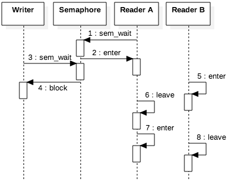

# CSPB-3753 Lab: Synchronizing Threads with a Semaphore
<figure width=100%>
  
</figure>
    
Semaphores are used to control access to shared resources in a multi-threaded or multi-process environment. They are a synchronization mechanism that helps manage the concurrent execution of threads  to avoid data races and ensure the proper order of operations. Semaphores provide a way for threads to signal each other and coordinate their actions.

Mutexes and semaphores are both synchronization methods used in concurrent programming to manage access to shared resources and avoid data races. While they share some similarities, there are key differences between mutexes and semaphores.

A mutex is primarily used to provide mutual exclusion between multiple threads.  A mutex allows only one thread to access a critical section of code at a time and only has two states: locked or unlocked.
Semaphores are more flexible as they can support mutual exclusion as a binary semaphore (0 or 1),  or can handle allowing multiple threads at a time to have access by using a counting semeaphore (integer values greater than or equal to 0).    

In C, the `<semaphore.h>` header provides functions and data types for working with semaphores. Common functions include `sem_init, sem_wait, sem_post, and sem_destroy`. Developers can use these functions to create, manipulate, and destroy semaphores, enabling effective synchronization in concurrent programs.
    
    

Another difference is in the philosophy of these objects.  A mutex is focused on mutual exclusion and 
does not provide signaling capabilities to let a thread know when a shared resource is available.
The semaphore can be used for signaling between threads. For example, a thread can signal another thread that an item in a shared resource is ready for processing once it has been placed into that shared resource.
    
<hr>
<hr>
    
    
Problem set up for Classical Readers Writers Problem:

Consider a situation where we have a shared resource between many people. What if we have a shared drawing that is being read (displayed by browser) by multiple machines.  When a change needs to be made to the drawing, it is best if only one person make those changes at a time.  If they delete and add new information, they need to know that others are not modifying the same items in the drawing.  Allowing multiple changes to the same item would require a merge of the changes.  To keep the drawing in a valid state at all times, we can make the rule that only one person can change the data at a time.  Everyone else needs to pause and wait for the changes.  

The readers of the drawing should be blocked from reading until the write is complete.  Otherwise you may see partial updates when reading the first half of the document was completed before the write and the second half read  was complete after the update, which would result in an invalid display of the drawing.

Therefore we have the situation where a new reader can read the drawing even if there are other readers currently active.  But, only one writer can be active at a time and no readers can currently be processing when the writer begins.

### Problem parameters: 

* One set of data is shared among a number of processes
* If a process is writing, no other process can read it
* If at least one reader is reading, no other process can write
* Readers may not write (only read)
* Once a writer is ready, it performs its write. Only one writer may write at a time

The solution for this problem assumes that there are multiple threads/processes running concurrently.  The code is broken up into specific read and writer functions that would be run as independent threads. The algorithms for processing with multiple readers and writers focuses on critical regions when handling shared resource and mutual exclusion of readers and a single writer.

### Writer process: 

* Writer requests the entry to critical section and keeps on waiting.
* When allowed the Writer performs the write. 
* Writer exits the critical section.
Even though `writer_only` is used for mutual exclusion, 
it must be implemented using a semaphore for this lab.

#### Algorithm for Writer
```
do {

    // writer requests for critical section
    wait(writer_only);  
   
    // performs the write

    // leaves the critical section
    signal(writer_only);

} while(true);
```

### Reader process: 
The Reader has two synchronizations to maintain.  The first is for the global variable
`n_readers` that maintains the number of readers that are currently processing the data.
Because this is a shared resource, the use of the variable must be placed inside about
critical section.


* Reader requests the entry to critical section.
If allowed: 
it increments the count of number of readers inside the critical section. If this reader is the first reader entering, it locks the wrt semaphore to restrict the entry of writers if any reader is inside.
It then, signals mutex as any other reader is allowed to enter while others are already reading.
After performing reading, it exits the critical section. When exiting, it checks if no more reader is inside, it signals the semaphore “wrt” as now, writer can enter the critical section.
If not allowed, it keeps on waiting.

#### Algorithm for Reader
```
do {
    
   // Reader wants to enter the critical section for global variable
   //
   wait(readers_update);

   // The number of readers has now increased by 1
   n_readers++;                          

   // When the first reader enters in the critical section, 
   // the reader must ensure no writer can enter until all 
   // readers have completed.  If there is already atleast one
   // reader currently active, other readers can still enter.
   // This algorithm is giving preference to the readers.
   //
   // Notice that if a writer has the writers_only lock, all
   // readers will be blocked from entering because the 
   // readers_update is locked by this process waiting for 
   // writers_only lock.
   //
   if (n_readers == 1)     
      wait(writer_only);   // request the lock so writers CANNOT enter

   // Other readers can enter while this current reader is inside 
   // the critical section for writers_only. Therefore the lock on
   // updating global variable can be released. 
   //
   signal(readers_update);                   

    //
    // Reading and processing of the data here.
    //

   // Once processing is completed, current reader must update the readers count.
   // Reader needs to enter a global variable critical section.
   //
   wait(readers_update);   // a reader wants to leave

   n_readers--;

   // If this was the last reader to finish reading (no other reader is left),
   // then writers are once again allowed to enter, so the lock is released.
   //
   if (n_readers == 0) 
       signal(writer_only);  // release the lock so writers can enter

   signal(readers_update); // reader leaves global variable critical section

} while(true);
```
    
    
## Create a program to allow multiple readers and writers

### Step 1 - Create Multiple Threads to handle Reading and Writing

### Step 1.1 - Create Thread Functions for a Reader and a Writer
These functions whould simulate the processing using a random number of seconds that will be passed to `sleep()` to simulate the processing time.  Keep the number of seconds low (1-5) to allow the processes to spend most of their time working, but also accessing the shared resource.

Use simple print statements to indicate when each thread enters and exits its processing (or maybe also when signalling and waiting).  That way you can see when a writer us waiting and when the last reader exits.


### Step 1.2 - Read arguments to determine number of readers and writers
The `argc,argv` arguments to the `main` C entrypoint are specifically there to pass data into the program from the command line.  Process the command line to use the first argument as the number of reader threads and the second argument as the number of writer theads.  You will need to convert these arguments from a string into an integer.


### Step 1.3 - Create a thread for each Reader and each Writer
Test your code using a small number of readers with no writers as your first test of your code.  Make sure that you have your mutual exclusion working.

Next add a writer to the mix.  Does the writer ever get to process?  Starvation is when a thread is ready to process, but never gets the resource allocated. The algorithm listed above will be biased towards the readers.  See if you can adjust the sleep times to allow a writer to be serviced. 

### Step 2 - Make the program Eliminate Starvation
The reader-writer problem involves managing access to a shared resource that can be read by multiple threads (readers) simultaneously but can only be written to by one thread (writer) at a time. To ensure no starvation occurs, meaning that no thread is indefinitely prevented from accessing the resource, we can implement a solution using semaphores and mutexes. 

    



### Fairness to Writers- An unfair timing for the writer

The solution to the readers-writers problem as shown above has an important flaw to highlight. This approach fails to achieve fairness, particularly in relation to the writers. Specifically, consider the timing of events shown in the figure. In this scenario, Reader A arrives first and decrements the semaphore. When the writer arrives and tries to do the same, it gets blocked. The writer must then wait until all readers have left. Once Reader B arrives, the two readers take turns leaving and re-entering. Since at least one reader is always in the system, the writer is blocked indefinitely, a situation known as starvation.

The writer’s starvation in this scenario can be fixed by placing a turnstile before the readers can enter as shown in algorithm below. As long as there is no writer attempting to enter the critical section, the readers can each pass through the turnstile and can access the read counter.  However, once a writer arrives, it will lock the turnstile, which blocks new readers from passing through the turnstile. The writer will then gain access to the shared resource as soon as the last reader leaves. Once access to the shared resource is gained, the writer can release the turnstile, allowing readers to pass through again. Once th first reader passes through, it is blocked until the writer leaves.

   A starvation-free readers-writers solution
```
// Global variables
read_count;          // Number of readers currently reading
read_mutex;          // control access to read_count
turstile;            // control access to asking for shared resource
resource_access;     // control access to the shared resource

void *reader (void * _args)
{
    Acquire access to the turnstile
    Release the turnstile

    Acquire access to read_count
    increment read_count
    
    If first reader, 
      acquire access to the shared resource

    Release access to read_count

    Read from the shared resource

    Acquire access to read_count
    decrement read_count
    
    If last reader, 
      release access to the shared resource

    Release access to read_count
}

void *
writer (void * _args)
{
    Acquire access to the turnstile
    Acquire access to the shared resource
    Release the turnstile
  
    Write to the shared resource

    Release access to shared resource
}
```

<hr>
<hr>

    


### This lab is still under construction.  
 
 This is the first semester using this lab.  There are most likely updates that should be made.  Let us know what is missing.<br>
 Also let us know about any unclear descriptions of work to be performed. 
 <br><br><br>
<hr>

### Submission

***Make sure to `commit` to your local repository and `push` to the remote repository.***    
Grading of your work will be based on the information that you have in your remote repository.

Your code should include:
* code to handle reader
* code to handle writer
* processing return codes of all system calls
* code that is well commented

<br><br>

Your completed code should have three files, `example.c, shared_resource.h, and shared_resource.c`.

<br>
Although the grading of your code will be done by accessing your remote repository, <br>
you must submit the following to the Moodle Assignment:

* Your name:
* CU ID: (4 letters - 4 digits)
* GitHub Username:
* hours to complete lab:

<hr><hr><hr>
