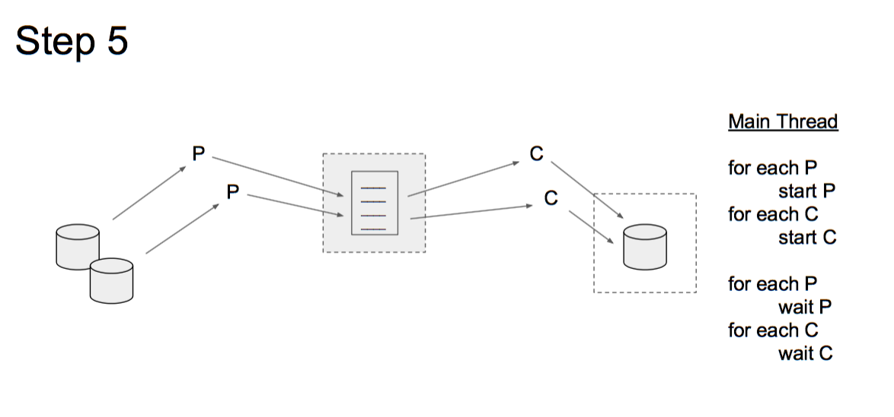

# Multithreaded DNS Lookup

Your task is to design a multithreaded userspace application ``multi-lookup`` that reads domain names from a set of input files and resolves the IP addresses of each domain name. Networking protocols require IP addresses to be able to deliver messages to servers across a network, thus any human-readable domain name for a server (e.g., google.com) must be translated into an IP address. Your application will perform this task and create a single file containing the converted data.  

Each line of each file of the input data must be parsed to extract the domain names. Once a domain name has been extracted, it will need to be resolved. You are provided with source code for a function that can take a domain name and return an IPv4 address of the form ``xxx.xxx.xxx.xxx.``, which you must write to a file.

A naive first approach would be to write a serial program of the following form:
```
for each file
  for each line of file
    parse the line for domain names
    for each domain name
      find IP for domain name
      write domain name, IP to output file
```
This would suffice for a single CPU, but we would be spending lots of cycles waiting for file I/O or waiting for a DNS server to resolve the domain name to an IP address.  We can make the solution more efficient by taking advantage of modern multicore processors and using multiple threads to process the data in parallel.

The application is composed of two sub-systems, `parser` and `converter`. The `parser` will extract a domain name from the input data and pass it on to the `converter`, which will find the IP address and write the information to the output file. The sub-systems communicate with each other using a bounded buffer. To make the application even more efficient, you will design it to support multiple `parser` threads and multiple `converter` threads so that no single input item can cause the system to be blocked, no matter how long it takes its processing to be performed.  See Figure 1 for a visual description.


<table class="image" width=480>
<caption align="bottom">Figure 1: Creation of an application to process data from multiple files using multiple parsing threads that store data into a shared buffer.  Multiple threads will take items out of the shared buffer for processing.  Shared resources will need to be protected from race conditions using synchronization methods. </caption>
<tr><td>
</td></tr>
</table>

## Specification

We have a number of files that list the domain name of a server for which we need an IP address. Your task is to create a program that will process a number of files containing names of servers we want to reach and supply the list of IP addresses matching those domain names. Your program (named: `multi-lookup`) will process each of the given files using a `parser` thread. Each `parser` thread will read each line of the file, parse the domain name, place the name into a shared data area, and record the processing in an output file. You will also create a number of `converter` threads that will take a domain name from the shared data area, find the IP address for that domain name and write the results to another output file.

Once all the lines of all the files have been processed, the `parser` threads will terminate. Once all the names have been processed and there are no `parser` threads running, the `converter` threads will terminate and the program will terminate.

All the status information that needs to be recorded for the `parser` threads will be written to the file name given on the command line. All the status information that needs to be recorded for the `converter` threads will be written to another file name that has also been given on the command line. Just before termination, your program will print (to standard out) the total time that it took to process all the data (time from starting your application until the termination).

### Program Arguments
You will lose points if your program does not take its arguments as follows.

```
NAME
  multi-lookup        resolve a set of domain names to IP addresses

SYNOPSIS
  multi-lookup <# parsing threads> <# conversion threads>
               <parsing log> <converter log> [ <datafile> ...]

DESCRIPTION
     The file names specified by <data file> are passed to the pool of `parser`
     threads which place information into a shared data area. `converter`
     threads read the shared data area and find the corresponding IP address.

  <# parsing threads>    number of parser threads to place into the
                         thread pool.
  <# conversion threads> number of converter threads to place into the
                         thread pool.
  <parsing log>          name of the file into which all the parser status
                         information is written.
  <conversion log>       name of the file into which all the converter
                         status information is written.
  <data file> ...        list of filenames that are to be processed. Each file
                         contains a list of domain names, one per line,
                         that are to be resolved.
```

### Data Files

Your application will take as parameters on the command line, a set of name files to be processed. Each file contains one domain name per line. As per RFC1035 (https://www.ietf.org/rfc/rfc1035.txt), each domain name is at most 253 characters long. Initially, you should design your application so that each name file is assigned a single `parser` thread, noting that the number of `parser` threads may be less than, or more than, the number of input name files. Note that this can cause load balancing issues if one of the input name files is substantially larger than the others. To receive full marks you will need to perform better load balancing (see Step 7 of the Checkpoints section).

### Parser Threads and Log

Your application will take a command line argument to specify the number of `parser` threads. These threads service a set of name files, each of which contains a list of domain names. Each name that is extracted from a line in the file is placed into a shared bounded buffer. If a `parser` thread tries to write to the array but finds that it is full, it should block until a slot opens up in the array. After servicing a name file, a `parser` thread checks if there are any remaining name files to service. If so, it requests one of the remaining name files to process. Once all files have been processed, the thread writes a new line to the parsing log file with its thread id and the number of files it extracted, in the following format:
```
Thread <thread id> serviced ### files.
```
where `<thread id>` is that thread's process id. To get the thread id of a thread on Linux systems, use `pthread_self()`.

### Converter Threads and Log

You will also create a second pool of threads to `converter` process the information provided by the `parser` threads. Each thread in the `converter` thread pool removes a domain name  from the shared buffer and querys its IP address. After the name has been mapped to an IP address, the result is written to a line in the conversion log file in the following format:

```
google.com, 74.125.224.81
```
If a `converter` thread tries to read from the buffer but finds that it is empty, it should block until there is a new item in the array unless all `parser` threads have terminated.

### The Bounded Buffer

The shared buffer should hold 1024 domain names (approximately 250 KB when full). Consult your data-structures and algorithms notes and think about what abstract data type is most appropriate for a shared bounded buffer. You will lose 8 points if your buffer holds more than 1024 domain names.

### Synchronization and Deadlock

Your application must synchronize access to shared resources and avoid any deadlock or busy wait. You should use mutexes, semaphores, and/or condition variables to meet this requirement. There are at least three shared resources that must be protected: the shared array, parsing log, and conversion log. None of these resources are thread-safe by default.

### Termination

Your program must end after all names in each file have been serviced by the application. This means that all the domain names in all the input files have received a corresponding line in the output file. At the end, your program must print the total runtime (in seconds) to standard out. Use `gettimeofday()` system call for this purpose.

### Error Handling

You must handle the following errors in the following manners:

- **Bogus Domain Name**   
Given a domain name that cannot be resolved, your program should output a blank string for the IP address, such that the output file continues the domain name, followed by a comma, followed by a line return. You should also print a message to standard error alerting the user to the bogus domain name.

- **Bogus Output File Path**  
Given a bad output file path, your program should exit and print an appropriate error to standard error.

- **Bogus Input File Path**   
Given a bad input file path, your program should print an appropriate error to standard error and move on to the next file.

All system and library calls should be checked for errors. If you encounter errors not listed above, you should print an appropriate message to standard error, and then either exit or continue, depending upon whether or not you can recover from the error gracefully.

## Provided Code and Data

Some files are included with this assignment for your benefit. You are not required to use these files, but they may prove helpful.

- `util.c` and `util.h` These two files contain the DNS lookup utility function. This function abstracts away a lot of the complexity involved with performing a DNS lookup. The function accepts a domain name as input and generates a corresponding dot-formatted IPv4 IP address string as output. Please consult the `util.h` header file for more detailed descriptions of each available function.

- `input/names*.txt` This is a set of sample name files. They follow the same format as mentioned earlier. Use them to test your program. If you are looking for more test data, OpenDNS hosts a large list of domain names https://github.com/opendns/public-domain-lists (caution: unfortunately some of these domain names are NSFW).

- `results-ref.txt` This result file is a sample output of the IPs for the domain names from the names1.txt file. Note that these results will most likely be different than your results, as IP addresses associated to domain names change and are not in one-to-one correspondence.

## Checkpoints
The cardinal rule of writing multithreaded programs is write the serial version first and then incrementally add more parallelism to your solution, testing along the way. If you write all the code for the whole application and then attempt to debug it, you will most likely fail this assignment. You are strongly encouraged to take the following steps to incrementally develop the application and limit the possible sources of bugs to speed up debugging.

---


Create a simple program to create a parsing thread that will repeatedly read a line from a given file and add an entry into the shared buffer.  You will need to validate that the buffer has the correct number of entries.

---


The next step is to use the parsing thread to create a number of entries in the buffer.  Once that process is complete, start a conversion thread to take items out of the buffer.  You can write the results to the output files.

---


Once you are assured that your application can write and read to the buffer correctly (although serially), then try to make them run concurrently.  Multiple processes accessing and modifying the same data can cause race conditions.  You must protect the critical sections of each thread  with a mutex.

---


We can now run with a single `parsor` and a single `converter` passing information via a shared buffer that is protected by a mutex.  The next step is to create multiple `parsor` threads to read from multiple different files.  Each `parsor` can read single lines from a different file.  The `parsor` will terminate when all lines from the file have been  processed.

---



The next step will create multiple `converter` threads to read from multiple `parsor` threads via a single shared buffer.  The `converter` will wait for data (spin wait is acceptable) but will terminate if there are no active `parsor` and the buffer is empty.  

---


Moving back to the `parsor` threads, each thread must record the data it has processed.  Files are a shared resource and therefore must be protected from multiple processes accessing it.

---


The last step of your implementation is to create a method of handling different numbers of files and parsing threads.  This can be accomplished by creating an API for the parsing threads to access a single line from a file.  This API will abstract the number of files being handled and the mechanism used to manage the files.  The parsing threads only need to request a line from a file and let the API  provide it.  The implementation of the file handling might use a FCFS policy to handle all the lines of one file before going to the next file, or it might use a Round Robin policy that will read the next line from each file before returning to read another line from the first file.


## Submission

You must combine your files into a single zip archive ``<Lastname>_multi-lookup.zip``. If your name is Jane Doe, then you would submit ``Doe_multi-lookup.zip``. Your zip file must contain the following files:

- `multi-lookup.c` Your program, conforming to the above requirements.
- `multi-lookup.h` A header file containing prototypes for any function you write as part of your program.
- `Makefile` A makefile that builds your program as the default target. It should also contain a “clean” target that will remove any files generated during the course of building and/or running your program.
- `README` (Optional) A readme describing how to build and run your program. You may also include any notes about your solution that you would like the instructor(s) to see.

You will lose 5 points if this file is not named correctly or if there is anything else contained in this zip file, e.g., any folders, input data, output data.

## Grading

If your program does not compile or produce an executable called <tt>multi-lookup</tt> after running <tt>make</tt> with the provided <tt>Makefile</tt>, then you will receive a zero. You will be deducted 1 point per <tt>gcc</tt> warning, so do not throw flags to suppress warnings. Below is a detailed rundown of how you will be evaluated on this assignment.

### Documentation & Style (10 points)

If you are unsure about whether your practices in these two areas are acceptable, then defer to the Indian Hill style guidelines for the C programming language, or some other industrial standard that suits your liking. Note that 5 of these points correspond to your weekly updates on the programming assignment (see syllabus).

If you are concerned about losing points here, then you should meet with your instructor during office hours to be sure things look right.

### I/O Formatting (10 points)

If you do not adhere to the input and output formatting conventions or the specified program argument convention, then you will lose points. You are provided with sample input and output, so there should be no ambiguity on the desired input and output.  If you leave debug print statements uncommented in your submission, then you will lose all 10 of these points. 

### Design (10 points)

This assignment is in the C programming language, so we are placing a premium on performance. You will be docked points if you are too cavalier with system resources, or if parts of your implementation are too convoluted or clunky. For example, if you have an unbounded or extraordinarily large shared buffer, then you will lose points here. If there is any unjustified hard-coding, e.g., placing false limits on the sizes of data-structures for processing input data, then you will lose these 10 points, as your program will crash for large enough input. Finally, you will lose some points here if there are any egregious memory leaks. To verify that you do not leak memory, use `valgrind` to test your program. To
install valgrind, use the following command:

```
sudo apt-get install valgrind
```

And to use `valgrind` to monitor your program, use this command:

```
valgrind ./<your executable> <your args>
```

Valgrind should report that you have freed all allocated memory and should not produce any additional warnings or errors.


If you are concerned about losing points here, then you should meet with your instructor during office hours to see if the part of your solution in question should be redesigned/simplified. 

### Correctness (70 points)

The correctness of your program will account for the majority of your grade. To ensure that you maximize this score, you should develop your code with respect to the checkpoints (Steps 1-7) outlined above. The following lists how many points will be awarded upon completing each step.

#### Step 1 (10 points) 

#### Step 2 (20 points) 

#### Step 3 (30 points) 

#### Step 4 (40 points) 

#### Step 5 (55 points)

#### Step 6 (65 points)

#### Step 7 (70 points)

#### Bonus (5 pts) 
Many domain names return more than a single IP address. Add support for listing an arbitrary number of addresses to your program.  You may find it necessary to modify code in the util.h and util.c files to add this functionality. If you do this, please maintain backwards compatibility with the existing `util.h` functions. This is most easily done by adding new functions instead of modifying the existing ones. These addresses should be printed to the output file as additional comma-separated strings after the domain name.

```
                www.google.com, 74.125.224.81, 76.125.232.80, 75.125.211.70
```
